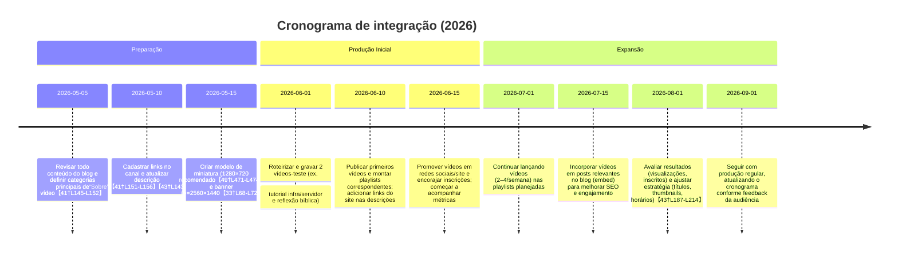

# Sumário Executivo

Integrar o site **pssp.app.br** ao canal **“Vozes da Experiência”** envolve listar nos **links do canal** as páginas-chave do site (até 14 links), transformar conteúdo técnico e reflexivo em vídeos organizados em playlists temáticas e manter a identidade de fé/tecnologia. Sugerimos links para as seções principais do blog (Infraestrutura de TI, Programação, reflexões pessoais), cada um com um rótulo claro e descrição sucinta. Na descrição **“Sobre”** do canal, use palavras-chave como “tecnologia”, “fé”, “família” e destaque o benefício para o espectador【43†L143-L146】. Os passos práticos são: configurar Studio > Personalização > Perfil, adicionar links com título e URL【41†L151-L156】 e publicar. As políticas do YouTube permitem até 14 links (o primeiro fica em destaque junto ao botão “Inscrever-se”【41†L145-L152】). Além disso, recomendamos criar playlists alinhadas aos tipos de conteúdo (e.g. tutoriais, reflexões) e investir em miniaturas e identidade visual consistente (miniaturas 1280×720【49†L471-L474】; avatar quadrado 800×800 com o elemento centralizado por causa do recorte circular【49†L566-L574】; banner ≥2560×1440【33†L68-L72】). Abaixo apresentamos tabelas e diagramas com mapeamento de links, formatos de vídeo, textos de exemplo, cronograma e orientações visuais.

## 1. Páginas do site × links do canal

Preparamos uma tabela com as principais páginas do blog e sugestões de links a incluir no perfil do canal. Para cada link, indicamos o “Título” que aparecerá como label e uma breve descrição (1–2 linhas). Exemplo de formatação em Markdown:  

| **Rótulo do link**               | **URL**                           | **Descrição breve**                                |
|----------------------------------|-----------------------------------|----------------------------------------------------|
| **Blog Pessoal (pssp.app.br)**   | https://pssp.app.br/              | Blog de Paulo Pacheco com artigos de tecnologia e reflexões pessoais. |
| **Infraestrutura de TI**         | https://pssp.app.br/infraestrutura/mapa_do_site.html | Tutoriais e guias sobre servidores, redes e banco de dados Linux. |
| **Programação (JS/TS)**          | https://pssp.app.br/programacao/mapa_do_site.html      | Dicas, códigos e exemplos de JavaScript, TypeScript e linguagens web. |
| **Reflexões Pessoais**           | https://pssp.app.br/comportamentos/mapa_do_site.html   | Artigos sobre fé, hábitos, orações e sabedoria prática para a família. |
| **Agenda do Projeto**            | https://calendar.google.com/...   | Cronograma e compromissos do projeto (Google Calendar). |

Cada link segue a [política do YouTube de links externos](#), pois redireciona ao próprio site do autor (conteúdo educativo). Lembre-se de que o primeiro link cadastrado aparece destacado na página inicial do canal【41†L145-L152】. 

## 2. Playlists e formatos de vídeo

Para aproveitar o arquivo técnico e reflexivo do site, sugerimos organizar o canal por **playlists** temáticas e tipos de vídeo correspondentes:

- **Infraestrutura de TI** – Playlist de *vídeo-aulas técnicas*. Ex.: demonstrações em tela (screencast) de instalação de servidores (Apache, NFS, MariaDB etc.), com narração passo a passo e dicas práticas. O conteúdo pode reutilizar textos tutoriais do site transformando-os em roteiros didáticos.
- **Programação e Código** – Playlist de *tutoriais de programação*. Ex.: vídeos mostrando código no editor, explicando conceitos de JavaScript, TypeScript, Node.js etc. Cada vídeo pode ilustrar exemplos do site (formulários, treeview, EJS, JSON). Legendas automáticas e anotações no vídeo ajudam na compreensão.
- **Reflexões & Espiritualidade** – Playlist de *mensagens inspiradoras e devocionais*. Ex.: leituras ou resumos de artigos bíblicos e motivacionais do blog, com imagens de fundo suaves e trilha sonora calma. Pode ser em formato de “sermão curto” ou slides narrados, conectando fé e experiência de vida (e.g. comentários de versículos de Provérbios, orações, hábitos saudáveis).
- **Estudos Pessoais** – Playlist de *histórias e aprendizados pessoais*. Ex.: vídeos em estilo “storytime” (o criador falando frente à câmera) sobre experiências de carreira ou de fé mencionadas no blog (como lições de erros comuns em TI, ou desafios espirituais superados).
- **Dicas Rápidas (Shorts)** – Conteúdos curtos (Shorts) com lembretes úteis, como “atalhos de Linux” ou versículos bíblicos motivadores em texto e voz sintetizada, para ampliar o alcance. (Lembrete: links em descrições de Shorts não são clicáveis【15†L36-L44】, mas podem ter hashtags.)

Cada playlist deve receber thumbnails personalizadas, com identidade visual do canal. Use títulos atrativos (exemplos abaixo) e descrições que resumam o vídeo, incluindo palavras-chave relevantes para SEO no YouTube【43†L143-L146】. Incentive a inscrição e forneça links úteis (ex: link para artigos relacionados na descrição do vídeo).

## 3. Texto sugerido para “Sobre” do canal e rótulos de links

A seção **“Sobre”** do canal deve apresentar brevemente você (Paulo Pacheco), o propósito do projeto e as vantagens para o espectador. Inclua palavras-chave como “programação”, “tecnologia”, “música cristã” e “família” para melhorar o SEO interno【43†L143-L146】. Exemplo de texto (100–150 caracteres iniciais críticos【43†L152-L160】):

> *“Canal Vozes da Experiência: Paulo Pacheco compartilha reflexões de fé, músicas inspiradoras e tutoriais técnicos. Aqui você encontra aprendizados de vida, dicas de programação e fortalecimento da família em Cristo.”*  

No restante do texto, detalhe: um pouco da sua história (anos de TI, ministério), e convide a inscrição. Exemplo de chamada: *“Inscreva-se para aprender programação e ouvir mensagens que enriquecem a alma. Cada vídeo traz conteúdo prático do meu blog e dos meus estudos espirituais.”*  

Para os **links do canal**, use rótulos curtos, claros e atraentes. Nos exemplos da tabela acima, colocamos em negrito um sugerido como “Infraestrutura de TI”. Evite abreviações vagas; prefira algo direto, e.g. “Programação (Javascript)” ou “Reflexões Pessoais”. Se couber, inclua emojis ou símbolos relevantes (🎵, 💻, 📖) para chamar atenção, mas sem exagero. 

## 4. Passo a passo para adicionar links no canal

1. **Entrar no YouTube Studio** e ir em **Personalização → Perfil** (guia *“Sobre”*).  
2. Na seção **“Links”**, clicar em **“Adicionar link”**.  
3. Preencher o **título** (rótulo do link) e **URL** da página do site (ver tabela acima)【41†L151-L156】. Repita para cada link desejado. Lembre-se: o primeiro link cadastrado será o mais visível junto ao botão “Inscrever-se”【41†L145-L152】.  
4. **Publicar** as alterações. Pode demorar alguns minutos até os links aparecerem ao público.  

Verifique também as **políticas do YouTube** para links externos【41†L145-L152】. Como todas as URLs são do próprio site do canal (conteúdo autoral), não há conflito de direitos autorais. Apenas confira que não haja links para sites bloqueados ou spam. 

## 5. Cronograma e prioridades

Um plano de implantação em etapas com prioridades recomendadas: 

As ações iniciais são focadas na configuração do canal e definição de identidade visual/temática. Em seguida, a prioridade é criar os primeiros vídeos de alta qualidade e divulgar, garantindo consistência no lançamento (por exemplo, sempre às terças e sextas). O engajamento pode crescer ao incorporar conteúdo na homepage do blog e vice-versa.

## 6. Diretrizes para miniaturas, avatar e banner

- **Miniaturas (thumbnails)**: Use dimensão *1280×720 px* (16:9) em JPG/PNG e <2MB【49†L471-L474】. Crie um layout reconhecível (mesmas cores e fonte), incluindo texto curto descritivo e uma imagem relevante (e.g. captura do vídeo, foto do apresentador, ícone). Evite excesso de texto para não ficar ilegível quando reduzido. Uma boa thumbnail convida ao clique【49†L464-L472】. Padronize as miniaturas de todas as séries (por exemplo, um canto com logotipo do canal).
- **Imagem de Perfil (Avatar)**: Envie imagem quadrada *800×800 px*【49†L571-L574】. Lembre-se: o YouTube irá mostrar em formato circular (avatar redondo), então centralize o elemento principal do logo/foto e deixe margens seguras【49†L566-L574】. No avatar, pode usar a capa com a Bíblia e luz sugerida, pois ela reflete bem o tema espiritual; apenas garanta contraste suficiente (por exemplo, inserir silhueta de cabeça ou texto “VP” pequeno). Formatos aceitos: JPG, PNG, etc.
- **Banner do canal**: Imagem maior (mínimo *2560×1440 px*)【33†L68-L72】. Use este espaço para mostrar o tema do canal: por exemplo, um cenário sereno (paisagem com luz suave) misturado a elementos de programação (código ou circuito transparente). Inclua o nome “Vozes da Experiência” em fonte legível e uniforme com o branding das miniaturas. Você pode inserir também uma frase de efeito ou cronograma (ex.: “Novos vídeos às terças e sextas”). Atenção à “área segura” (cerca de 1546×423 px central) para que texto/logos não sejam cortados em diferentes telas. O banner deve harmonizar cores e estilo com o avatar/miniaturas para reforçar a identidade visual consistente【33†L68-L72】.

## 7. Exemplos de títulos de vídeo (templates)

Alguns modelos de títulos atraentes (em português), adequados aos temas mapeados:

- **“Como configurar [Tecnologia] no Linux – Passo a passo”**  
  *Ex.: “Como instalar o servidor Apache2 no Debian – Passo a Passo”*  
- **“O que é [Conceito] e como funciona”**  
  *Ex.: “O que é JSON? Guia básico de JavaScript”*  
- **“Tutorial: Criando [Aplicação/Projeto] em [Linguagem]”**  
  *Ex.: “Tutorial: Criando uma calculadora simples em TypeScript”*  
- **“[Tema] na prática – Aprendizado e Reflexão”**  
  *Ex.: “Sabedoria de Provérbios: Escolhas que transformam sua vida”*  
- **“[Dica/Tema] em 5 minutos”** ou **“3 dicas de [assunto]”** para vídeos curtos/Shorts.  

Esses títulos usam palavras-chave (como “Como”, “Tutorial”, tecnologia relevante) no início, o que melhora a encontrabilidade no YouTube【43†L187-L196】. Acompanhe sempre com miniatura e descrição convincentes.

**Referências:** Guias oficiais do YouTube sobre personalização de canal【41†L145-L152】, dicas de SEO em descrições de canal【43†L143-L146】 e recomendações para imagens (miniaturas 1280×720【49†L471-L474】; avatar 800×800 circular【49†L566-L574】; banner 2560×1440【33†L68-L72】). Estas orientações garantem conformidade com as políticas da plataforma e facilitam a integração coerente do conteúdo do site com o novo canal “Vozes da Experiência”.