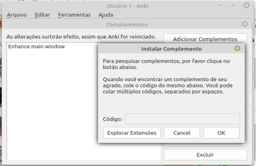

<div class="header" id="myHeader">
  <div class="navbar" w3-include-html="/menu.inc"> </div>
</div>
<div class="title"><script> document.write(document.title);</script></div>  
<main>

<span id="topo"><span>

# Estudo do programa Anki <a href="index.html" target="_blank" title="Pressione aqui para expandir este documento em nova aba." >  ➚

## **1. INDEX**

---

1. **Introdução**
   1. [Objetivo.](#id_objetivo)
   2. [Pre-requisitos.](#id_pre_requisitos)
   3. [benefícios.](#id_beneficios)
2. [Descrição.](#id_Descricao)
3. **Como instalar o Anki**
   1. [_Como instalar o software Anki no Linux - distribuição ubuntu e derivadas_](#id_instalar_ubuntu);
   2. [Instalando a versão atual](https://apps.ankiweb.net/)
   3. [_Como instalar o software Anki no android_](#id_instalar_android).
4. [Como instalar extensões do pacote anki](#id_extensoes)
5. [Exemplos](#id_exemplos)
6. [Referências](#id_referencias)
7. [Histórico](#id_historico)

## **2. CONTEÚDO**

---

1. **Introdução**
   1. <span id="id_objetivo"><span>**Objetivo:**
      1. Este documento contém tudo que estudei do programa anki.
      2. Anki é um programa usado para memorizar palavras, conteúdos estudados e tudo que você precisa gravar na memória de longo prazo.
      3. O anki usa o estudo do psicólogo alemão [Hermann Ebbinghaus](https://pt.wikipedia.org/wiki/Hermann_Ebbinghaus) no final do século XIX onde ele criar a função [curva do esquecimento](https://estudoesquematizado.com.br/curva-do-esquecimento/) baseado em sua memória.
      4. <button onclick="history.back()">🔙</button>
   2. <span id="id_pre_requisitos"></span>**Pre-requisitos:**
      1. Para instalar o programa anki é necessário saber como instalar um aplicativo no sistema operacional usado. É possível instalar nos seguintes SO:
         1. Linux ubuntu e derivados;
         2. Android;
         3. IOS;
         4. Windows.
      2. <button onclick="history.back()">🔙</button>
   3. <span id="id_beneficios"></span>**Benefícios:**
      1. Registrar na memória de longo prazo palavras novas de um idioma.
      2. Gravar textos de músicas.
      3. Gravar conteúdos que precisam estar na memória por não poder consultar em livros.
      4. Aprender um novo idioma.
      5. <button onclick="history.back()">🔙</button>
2. <span id=id_Descricao></span>**Descrição**
   1. O programa usa o algorítimo SRS (Spaced repetition System ) onde o aplicativo faz várias vezes uma pergunta do que se quer gravar, em seguida registra se o usuário aprendeu a palavra no dia e checa nos dias seguintes se o conteúdo foi registrado na memória.
   2. Veja os [conceitos chaves](https://mizerablebr.github.io/anki-manual/#/getting-started?id=conceitos-chave) do anki para melhor compreensão.
   3. <button onclick="history.back()">🔙</button>
3. **Como instalar anki**
   1. Como instalar o software Anki no Linux - distribuição ubuntu e derivadas:
      1. <span id=id_instalar_ubuntu></span>Selecione o terminal de comandos pressionando as teclas **control+alt+t**:
         1. Antes de instalar o Anki é necessário instalar os pacotes abaixo:

            ```bash
               sudo -i
               apt update
               apt upgrade
               apt install mplayer
               apt install mpv
               apt install lame
            ```

         2. Para instalar a versão do anki que acompanha a distribuição linux:

            ```bash
               sudo -i
               apt update
               apt upgrade
               apt install anki                    

            ```

         3. <button onclick="history.back()">🔙</button>

   2. <span id=id_instalar_android></span>**Como instalar o software Anki no android**:
      1. Selecione o programa **AnkiDroid** na Play Store;
         1. Click no botão instalar.
      2. <button onclick="history.back()">🔙</button>

4. <span id=id_extensoes></span>**Como instalar extensões do pacote anki.**
   1. No linux usando o código divulgado no site:
      1. Selecione a opção **/ferramentas/complementos**;
         1. Digite o [código do complemento](https://ankiweb.net/shared/addons/);
         2. Pressione no botão ok.
            1. Veja imagens:
               1. 

      2. <button onclick="history.back()">🔙</button>

   2. No android não achei opção para instalar complementos.
      1. ????

      2. <button onclick="history.back()">🔙</button>

5. [Extensões do Anki](https://ankiweb.net/shared/addons/) usadas no me dia a dia:
   1. [AwesomeTTS - Adicione voz aos seus flashcards](https://ankiweb.net/shared/info/1436550454 "Obs: Este complemento não está disponível para o anki que vem no Linux Mint versão 20.0, é preciso baixar a última versão do site anki download.")
      1. [Vídeo de como configurar AwesomeTTS](https://www.youtube.com/watch?v=4nIxrqGK6gI)
   2. [Código: 877182321 - Enhance main window](https://ankiweb.net/shared/info/877182321 "Na opção baralhos adiciona algumas opções úteis.")
   3. [Código: 516643804 - Frozen Fields](https://ankiweb.net/shared/info/516643804 "Congela conteúdo do lado 01 da carta.")
   4. [Add Hyperlink](https://ankiweb.net/shared/info/318752047)
   5. [Pop-up Dictionary (beta)](https://ankiweb.net/shared/info/153625306)
   6. <button onclick="history.back()">🔙</button>

6. <span id=id_exemplos></span>**Exemplos.**
      1. item 01.
      2. item 02.

      3. <button onclick="history.back()">🔙</button>

7. <span id=id_referencias></span>**REFERÊNCIAS**
   1. [anki-manual](https://mizerablebr.github.io/anki-manual/#/)
   2. [Como funcionam os Flashcards e a configuração inicial do ANKI, para aumentar a velocidade de estudo](https://www.youtube.com/watch?v=cM2wxh95KOc)
   3. [Lista de complementos](https://ankiweb.net/shared/addons/)
  
   4. <button onclick="history.back()">🔙</button>

8. <span id="id_historico"><span>**HISTÓRICO**

   1. 13/04/2021 <!--TODO: HISTÓRICO -->
      - [x] Criar este documento baseado no modelo02.md ;
      - [x] Escrever tópico Objetivos;
      - [x] Escrever tópico Pre-requisitos
      - [x] Escrever tópico Benefícios
      - [x] Escrever tópico Descrição

      - <button onclick="history.back()">🔙</button>

   2. 14/04/2021 <!--FIXME: Falta fazer os item abaixo: -->
      - Escrever tópico Exemplos
      - [ ] Escrever tópico Conteúdo 01
      - [ ] Escrever tópico Referências
      - [ ] Atualizar o histórico deste documento.
      - [ ] Ler no dia seguinte este documento para checar os erros de português.

      - <button onclick="history.back()">🔙</button>

</main>

<!-- markdownlint-disable-next-line -->
<script>  includeHTML(); FixHeader(window,"myHeader"); </script>
[🔝🔝](#topo "Retorna ao topo")