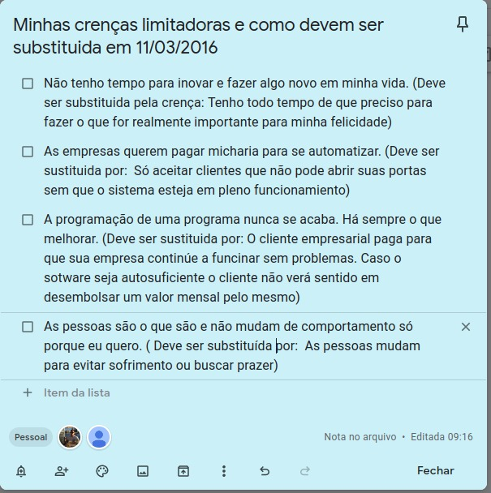

  
 

  
<main>
<!-- markdownlint-disable-next-line -->

# Minhas crenças limitadoras em 2016

Olhando esse texto que escrevi em 2016, percebo que a mudança não é fácil, é por isso que as pessoas tem dificuldade para largarem seus vícios.

Mesmo sabendo o que precisa ser feito, a pessoa continua a fazer o que sempre fez.

Mais deixei de fumar um dia, e poderei fazer diferente hoje. Basta que eu faça o que fiz para abandonar o vício do cigarro.

Vou refletir sobre esse assunto.

Paulo Pacheco, 02/12/2020

</main>

<!-- markdownlint-disable-next-line -->
