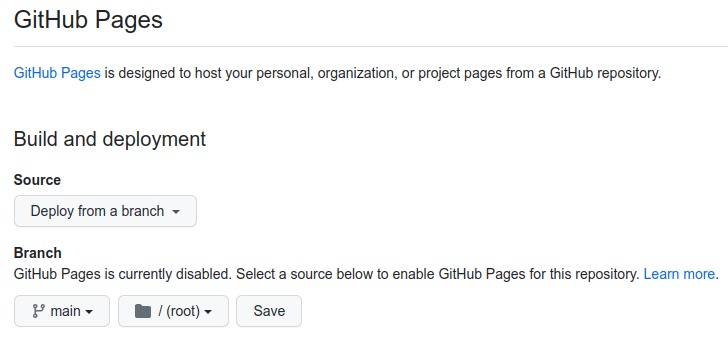

<!-- markdownlint-disable-next-line -->
<nav>

</nav>

<!-- markdownlint-disable-next-line -->
#### Como hospedar um site estático no github page <a href="como_hospedar_um _site_estático_no_github_page.html"  target="_blank"  title="Pressione aqui para expandir este documento em nova aba.">➚</a>

1. [**O que é o github pages?**](https://docs.github.com/pt/pages/getting-started-with-github-pages/about-github-pages)
   1. O [Github Pages](https://pages.github.com) é o serviço de hospedagem de sites estáticos do Github. Ele usa arquivos HTML, CSS e Javascript diretamente de um repositório, executa os arquivos por meio de um processo e publica um site. [Veja mais...](https://www.alura.com.br/artigos/como-colocar-projeto-no-ar-com-github-pages?gclid=Cj0KCQjw4NujBhC5ARIsAF4Iv6dbm7av5hMLVRnxwGMvOuu5SEhwwQ3yHfFQ3k0uIVfKIkCfRGQxo8QaAsSoEALw_wcB)

2. **PASSO A PASSO**
   1. [Crie um repositório](https://docs.github.com/pt/pages/getting-started-with-github-pages/creating-a-github-pages-site#creating-a-repository-for-your-site) com o nome do site no github;
   2. Clone o repositório do github em sua máquina local;
   3. Copie seus dados para o repositório local clonado;
   4. Execute o comando commit para o repositório github;
   5. Execute o comandos git push para enviar as alterações para a nuvem github;
   6. **Vá em [configurações (Settings)](https://github.com/paulosspacheco/blog.pssp.app.br/settings). Na seção code e automation, clique em [Pages](https://github.com/paulosspacheco/blog.pssp.app.br/settings/pages). Na opção _Source_, abra o menu suspenso e selecione uma _fonte de publicação_  (Deploy from a branch), ou seja, a branch que desejar.**
      1. 
      2. Selecione a pasta que deseja publicar.
         1. 
         2. Pressione o botão _save_ para confirmar as alterações.

   7. **Domínio personalizado:**
      1. Os domínios personalizados permitem que se veicule o site a partir de um domínio diferente do domínio _paulosspacheco.github.io_.
      2. No campo que pede para informar o nome do domínio deve ser digitado o nome de um domínio válido.
         - 
      3. Após editar o nome do domínio válido pressione no botão _save_.
      4. Aguarde até que seja checado se o domínio é válido. Se for ele avisará quando terminar.

3. **REFERÊNCIAS**
   1. [Início rápido para o GitHub Pages](https://docs.github.com/pt/pages/quickstart)

<!-- markdownlint-disable-next-line -->
      