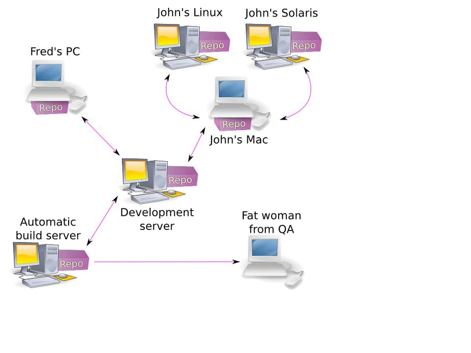

<!-- markdownlint-disable-next-line -->
### Como instalar e configurar um servidor git  remoto <a href="como_instalar_servidor_git.html" target="_blank" title="Pressione aqui para expandir este documento em nova aba." > ➚ </a>

#### Introdução

1. **Objetivo:**

   1. O _git_ é um projeto criado por , [_Linus Torvalds_](https://pt.wikipedia.org/wiki/Linus_Torvalds) cujo objetivo é criar um repositório de arquivos que possa ser mantido por várias pessoas. O _git_ pode reproduzir várias versões de um projeto onde uma versão anterior possa ser gerada a qualquer momento caso seja necessário.

   2. Basicamente, na maioria dos casos, o _Git_ roda em um servidor que pode ser na _rede local_ ou na _Web_. Nesse servidor mantemos um _repositório central_, o que vamos chamar de _Servidor Git_. Localmente, na sua estação de trabalho, por exemplo, é mantido um _repositório local_, ou seja, um _clone do repositório do Servidor Git_.

   3. Nos arquivos dentro desse _repositório local_ você realiza suas modificações e, ao concluí-las, as envia para o _servidor git_. Aquilo que modificou e seus comentários sobre suas mudanças são armazenados para consulta posterior.

   4. Caso outras pessoas possuam um clone desse repositório, bastará rodar o comando _git pull_ para obter as mudanças que você realizou e que já estarão armazenadas no _servidor git_.
      - **Nota**: Executar _git pull_ antes de enviar modificações para o _servidor git_.

   5. Na imagem abaixo podemos ver um exemplo de um time que pode ser de desenvolvimento, onde todos trabalham em um repositório local e enviam e recebem mudanças do  repositório central (_servidor git_):
      - 

2. **Pre-requisitos**
   1. Sistema operacional Linux;
   2. Conhecimento do projeto [_Servidor OpenSSH_](https://ubuntu.com/server/docs/service-openssh) para entender como funciona as _chaves ssh_ necessárias para que o servidor acesse a máquina local cliente sem necessidade de pedir senha a cada atualização.

#### Instalando _Git Server_ no Debian ou derivados

```bash

   # Atualiza sistema lista do apt-get
   sudo apt-get update

   # Instala o git
   sudo apt-get install git-all

```

#### Configurações do repositório no servidor

1. **Criar um _usuário git_ no servidor que será o proprietário dos repositórios a serem compartilhados com os clientes. Na prática, poderia ser qualquer usuário, mas para não ter que criar um usuário, no servidor, para cada cliente, é interessante usar o _usuário git_. Para criar esse usuário utilizamos o comando _useradd_:.**

   ```bash

      sudo useradd --comment "Git user" --home-dir /home/git --groups users --shell $(which git-shell) git


   ```

   - **Notas:**
     1. Nesse exemplo o grupo do nosso _usuário git_ é _users_. Esse grupo é o grupo padrão para a distribuição Debian. Caso seu servidor seja de outra distribuição coloque o respectivo grupo. Caso não saiba qual é esse grupo, verifique o do seu usuário e utilize-o.
     2. Nesse exemplo a opção _--shell_ sendo atribuída ao utilitário _git-shell_. Fazemos isso para proibir o usuário git de se logar no nosso servidor. Ele somente consegue executar operações do programa _git_. Nada além disso. Isso garante que mesmo que um _hacker roube a senha_ desse usuário ele jamais ganharia um _shell no servidor_.

2. **Após criar o usuário, deve-se criar a pasta _home_ dele, em seguida alterar o dono e grupo da pasta _/home/git_ .**

   ```bash

      # Cria a pasta inicial para o usuário git
      sudo mkdir -p /home/git

      # Conceda permissões de diretório ao usuário git
      sudo chown -R git:users /home/git

   ```

3. **Criar uma senha para o _usuário git_. Para isso iremos utilizar o _comando passwd_. Esse comando irá lhe pedir via prompt de comandos a nova senha:**

   ```bash

      # Definir senha do usuário git
      sudo passwd git

   ```

4. [**Configurar nome e e-mail do _usuário git_ globalmente**](https://git-scm.com/book/pt-br/v2/Come%C3%A7ando-Configura%C3%A7%C3%A3o-Inicial-do-Git):

   ```bash

      #  Definindo nome do usuário
      git config --global user.name "paulosspacheco"

      #  Definindo e-mail do usuário
      git config --global user.email "paulosspacheco@yahoo.com.br"

   ```

   - **Nota**
     - Se em algum momento desejar alterar as informações para um projeto específico, basta reescrever os comandos sem a opção _--global_ dentro da pasta do projeto.

5. **Configurando o protocolo ssh:**

   1. O programa git, utiliza internamente alguns protocolos para se comunicar com o servidor. Sua máquina cliente quando executa, por exemplo, um _git clone git@github.com:paulosspacheco/blog.pssp.app.br.git_, ele está utilizando o protocolo ssh para clonar um repositório remoto. O protocolo HTTP também pode ser utilizado, mas não necessariamente essa comunicação estaria criptografada, autenticada e autorizada. O próprio Github assim como nosso servidor, preferencialmente, irão utilizar o protocolo ssh;

   2. Instalar o [servidor ssh](<https://www.vivaolinux.com.br/dica/Instalando-e-configurando-servidor-SSH-(Ubuntu)>);
   3. Para tal, vamos então configurar o _ssh_ do nosso servidor. O processo _sshd_ é um _daemon_ em nosso servidor com a responsabilidade de receber as conexões vindas das máquinas clientes e garantir que esteja m devidamente autorizadas a logar na máquina. Para configurá-lo, vamos editar o arquivo _/etc/ssh/sshd_config_. Nesse arquivo existe uma instrução chamada _AllowUsers_. Ele define quais usuários estão permitidos a se logar através do _ssh_. Iremos adicionar o usuário _git_ a essa configuração:

      ```bash

         # Authentication:
         #   LoginGraceTime 2m
         #   PermitRootLogin yes
         #   StrictModes yes
         #   MaxAuthTries 6
         #   MaxSessions 10
         AllowUsers root git

      ```

      1. **Notas**

         1. Ao adicionar essa configuração, deve-se reiniciar o serviço no sistema operacional para que as modificações tenham efeito. Cada distribuição adota um gerenciador de serviços. A seguir são mostrados algumas formas de se reiniciar o _ssh_ através do Systemctl ou o utilitário _service_:

         ```bash

             # System D
             sudo systemctl restart sshd.service

             # Service
             sudo service sshd restart

         ```

   4. Para acessar o repositório sem necessidade de digitar senha a todo momento é necessário seguir os seguintes passos:

      1. Em cada _máquina cliente_ que for acessar o servidor, executar os passos abaixo:

         1. Executar o programa _ssh-keygen_ para criar um par de chaves (privada e publica ) para poder enviar para o servidor a chave pública gerada.

            ```bash
                
               # Move-se para a pasta invisível ~/.ssh 
               cd ~/.ssh

               # O comando ssh-keygen criar o par de chave de 4096 bits cujo protocolo é rsa
               ssh-keygen -t rsa -b 4096 -C "your_email@example.com"
               # Em seguida, você vai ser solicitado a Inserir arquivo no qual salvar a chave.
               # Você pode especificar um local de arquivo ou pressionar “Enter” para aceitar o local padrão do arquivo.

               > Enter a file in which to save the key (/.ssh/id_rsa): [Press enter]

               # O próximo prompt vai solicitar uma frase secreta.
               # A frase secreta vai adicionar uma camada adicional de segurança ao SSH e vai ser necessária sempre
               # que a chave SSH for usada. Se alguém obtiver acesso ao computador em que as chaves privadas estão armazenadas,
               # também vai poder obter acesso a qualquer sistema que use essa chave. Adicionar uma frase secreta às
               # chaves vai evitar esse cenário.

               > Enter passphrase (empty for no passphrase): [Type a passphrase]
               > Enter same passphrase again: [Type passphrase again]

               # Pronto: Nesse ponto, vai ser gerada nova chave SSH no caminho do arquivo especificado mais atrás.

            ```

            - **Natas:**
              - Esse comando vai criar novo par de chaves SSH usando o e-mail como categoria.
              - O comando _ssh-keygen_ sugere que vai criar a chave na pasta _~/.ssh/id_rsa_, porém salva o arquivo na pasta corrente. Passei um tempão para entender.

         2. Executar o programa _ssh-add_ para adicionar as chaves geradas pelo programa _ssh-keygen_ em uma lista de chaves privadas. Além de manter chaves privadas, ele também controla solicitações ao assinar solicitações _SSH_ para que elas sejam transmitidas com insegurança. O projeto _ssh-agent_ através do programa _ssh-add_ cria um socket e então checa a conexão do _ssh_. Todo aquele que é capaz de se conectar a este socket, também tem acesso ao _ssh-agent_. As permissões são definidas em um sistema Linux. Quando o agente é iniciado, ele cria um nova pasta em _/tmp_ com permissões restritivas. O socket está localizado nesta pasta.

            1. Antes de adicionar a nova chave _SSH_ ao _ssh-agent_, primeiro verifique se o _ssh-agent_ está sendo executado ao executar:

               ```bash

                  eval "$(ssh-agent -s)"
                  > Agent pid 19895


               ```

               - **Nota**
                 - Se a resposta for _> Agent pid x_ onde x é o número do processo, é porque está tudo ok.

            2. _ssh-add_ - Adiciona identidades de chave privada ao agente de autenticação _OpenSSH_

               ```bash
    
                 ssh-add ~/.ssh/id_rsa
                 > Enter passphrase for /home/paulosspacheco/.ssh/id_rsa:   # Obs: A senha é a digitada em ssh-keygen 
                 > Identity added: /home/paulosspacheco/.ssh/id_rsa (paulosspacheco@yahoo.com.br)

               ```

               - **Nota**

                 - A nova _chave SSH_ agora está registrada e pronta para uso.
                 - Entre as duas chaves geradas, uma tem extensão _.pub_, é essa que deve ser enviada para o servidor.
                 - O servidor deve adicionar a chave _id_rsa.pub_ recebida do cliente no arquivo _/home/git/.ssh/authorized_keys_

                   ```bash

                      # Loga-se como root
                      sudo -i

                      # Adicionar no final do arquivo /home/git/.ssh/authorized_keys o arquivo ~/Downloads/clientes_git_keys/id_ed25519.pub
                      cat /home/git/.ssh/authorized_keys ~/Downloads/id_rsa.pub >> /home/git/.ssh/authorized_keys


                   ```

      2. Na _máquina servidora git_ seguir os passos abaixo, para poder acessar a máquina cliente sem pedir uma senha:

         1. Criar a pasta _ssh_ para o _usuário git_:

            ```bash

               sudo mkdir -p /home/git/.ssh/

            ```

         2. Alterar o _nome do usuário_ e do _grupo_ para _git:users_ na pasta invisível _./ssh_:

            ```bash

               sudo chown -R git:users /home/git/.ssh

            ```

         3. Altere as permissões da pasta _/home/git/.ssh_ para que somente o _usuário git_ possa ler, gravar e executar na pasta:

            ```bash

               sudo chmod 700 /home/git/.ssh

            ```

         4. Cria o arquivo _authorized_keys_ na pasta _/home/git/.ssh_ para cadastrar todas as chaves púbicas das máquinas clientes com acesso aos repositórios:

            ```bash

               sudo touch /home/git/.ssh/authorized_keys

            ```

         5. Altera o _nome do usuário_ e do _grupo_ para _git:users_ do arquivo _authorized_keys_ da pasta _/home/git/.ssh_:

            ```bash

               sudo chown -R git:users /home/git/.ssh/authorized_keys

            ```

         6. Altere as permissões do arquivo _/home/git/.ssh/authorized_keys_ para que somente o _usuário git_ possa ler e gravar no arquivo:

            ```bash

               sudo chmod 600 /home/git/.ssh/authorized_keys

            ```

         7. **Notas:**

            1. Além de criarmos a pasta _.ssh_ e o arquivo _authorized_keys_, demos as devidas permissões a eles.
            2. Feito os passos acima, podemos publicar o serviço para que nossos usuários possam contribuir nos repositórios remotos.
            3. Para saber os parâmetros de autenticação do _git_ execute o comando abaixo:

               ```bash

                  # Pega os parâmetro de acesso ao git
                  git config --list

                  # Resposta do comando acima:
                  > user.name=paulosspacheco
                  > user.email=paulosspacheco@yahoo.com.br
                  > core.autocrlf=input
                  > core.safecrlf=warn


               ```

   5. Como registrar o _cliente git_ no _servidor git_?

      1. Criar pasta _/home/git/.ssh/clientes_ para salvar as chaves publicas dos clientes:

         ```bash

            # Cria a pasta de clientes na pasta .ssh
            sudo mkdir -p ~/Downloads/clientes_git_keys

         ```

      2. Solicitar a _chave pública ssh_ da máquina cliente e salvar na pasta _/home/git/.ssh/clientes_, em seguida execute os passos abaixo:

         1. Suponha que se tenha recebido a chave publica cujo o nome do arquivo seja _id_ed25519.pub_, então:

            ```bash

               # Loga-se como root
               sudo -i

               # Adiciona no final do arquivo /home/git/.ssh/authorized_keys o arquivo ~/Downloads/clientes_git_keys/id_ed25519.pub
               cat /home/git/.ssh/authorized_keys ~/Downloads/clientes_git_keys/id_ed25519.pub >> /home/git/.ssh/authorized_keys


            ```

6. Criando um repositório do zero:
   1. A primeira coisa a se fazer é criar um repositório no servidor com a opção _--bare_ do _git_. Isso irá criar um repositório com apenas as referências dos objetos e da árvore _git_. Vamos então logar no servidor e criar um novo repositório:

      ```bash

         # Dentro do servidor, execute
         cd /home/git/
         
         # Crie a pasta test.git
         sudo mkdir test.git

         # MOva-se para  a pasta test.git 
         cd test.git

         # Inicializar repositório simples
         sudo git init --bare

         # Dê a propriedade do git aos arquivos do repositório porque os criamos com root
         sudo chown -R git:users /home/git/test.git

      ```

      - **Notas:**
        - Url para o repositório test.git:
          - nome: origin
          - url: git@192.168.15.3:/home/git/test.git

7. Como saber o link que o _cliente git_ deve usar para clonar o repositório do _servidor git_?
   1. ?
