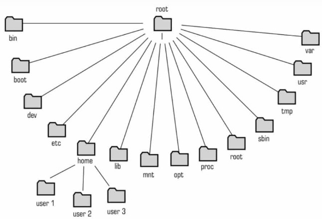

<!-- markdownlint-disable-next-line -->
#### <span id="topo"><span>Comandos básico do Shell do Linux <a href="comandos_basico.html" target="_blank" title="Pressione aqui para expandir este documento em nova aba." >  ➚ </a>

<!-- markdownlint-disable-next-line -->
#### INDEX

1. [Introdução](#id_introducao)
2. [Atalho para criar um terminal de comandos](#id_Ctrl_Alt_T)
3. [**Comandos de Gestão de Arquivos e Pastas**](#id_cmd_gestao_arquivo_pastas)
   1. [_ls_ - Comando para listar arquivos e pastas](#id_ls)
   2. [_which_ -  mostra o caminho completo dos comandos](#id_which)
   3. [_cd_ - Comando para mover-se entre os diretórios](#id_cd)
   4. [_ln_ - Comando para criar links simbólico](#id_ln)
   5. [_cp_ - Comando para copiar arquivos ou pastas](#id_cp)
   6. [_dd_ - Clona um dispositivo de bloco, convertendo e formatando de acordo com os operandos.](#id_dd)
   7. [_e2image_ - Clona um dispositivo de bloco cujo o formato de arquivo seja ext2, ext3 e ext4](#id_e2image)
   8. [_gparted_ - Programa usado para criar partição, pode ser usado para clonar partição de forma muito simples e visual](#id_gparted)
   9. [_mount_ - monta um sistema de arquivos](#id_mount)
  
4. [**Comandos de Ajuda e Documentação**](#id_cmd_ajuda_documentacao)
5. [**Comandos de Comunicações**](#id_comandos_comunicacoes)
6. [**Comandos de Edição de Texto**](#id_Cmd_edicao_de_texto)
7. [**Comandos de Transferência de Arquivos**](#id_cmd_transferencia_arquivos)
   1. [_rsync_ - Sincroniza de forma rápida e flexível dados entre dois computadores.](#id_cmd_rsync)
8. [**Comandos de Notícias ou Rede**](#id_cmd__noticias_Rede)
9. [**Comandos de Controle de Processos**](#id_cmd_controle_processos)
10. [**Comandos de Informação de Estado**](#id_cmd_informacao_estado)
11. [**Comandos de Processamento de Texto**](#id_cmd_processamento_texto)
12. [**Web**](#id_web)
13. [REFERÊNCIAS](#id_referencias)

<!-- markdownlint-disable-next-line -->
#### CONTEÚDO

1. <!-- markdownlint-disable-next-line -->
   <span id='id_introducao'></span>**Introdução:**
   - Este documento descreve com exemplos os comandos que costumo usar no dia a dia para a manutenção do sistema.
   - A estrutura do sistema de arquivos do Linux é definida por um padrão de mercado chamado Filesystem Hierarchy Standard ou FHS, criado pela comunidade Linux em 1994 e mantida pela Linux Foundation. Atualmente a FHS está na versão 3.0. As distribuições não são obrigadas a seguir este padrão, mas elas entendem a importância da localização dos arquivos e diretórios padronizados. [Veja mais...](https://www.certificacaolinux.com.br/diretorios-e-arquivos/)

     

   - Para compreender a expressão _nome do arquivo fonte_ ou _nome do arquivo destino_ é necessário seguir a sintaxe de nome de arquivo para a arquitetura linux.
   - Use qualquer caractere na página de código atual para um nome, incluindo caracteres Unicode e caracteres no conjunto de caracteres estendido (128–255), exceto os seguintes caracteres porque são interpretados de forma especial:
     - **_\<_ (menor que)**
       - Apesar de permitido, não deve ser usado porque é usado por aplicativos tipo shell para redirecionar entrada, quando o aplicativo aceita entrada padrão;

     - **_\>_ (maior que)**
       - Apesar de permitido, não deve ser usado porque é usado para _redirecionar a saída_ de um comando;

     - **_\:_ (dois-pontos)**
       - Apesar de permitido, o mesmo deve _ser evitado_ porque o outros sistemas operacionais no qual o linux interage usa como separador de dispositivo ;

     - **_\"_ (aspas duplas)**
       - Apesar de permitido, não deve ser usado, porque é usado para separar o nome do arquivo, quando o mesmo tem caracteres especiais no nome do arquivo;

     - **_\/_ (barra)**
       - Não é permitido porque é usada como separar o caminho na arvore de diretórios;

     - **_\|_ (barra vertical ou pipe)**
       - Apesar de permitido no nome de arquivo, o mesmo deve ser evitado, porque define redirecionamento de software em aplicativos tipo shell;

     - **_\?_ (ponto de interrogação)**
       - Apesar de permitido deve ser evitado porque o shell usa como caractere coringa que representa qualquer caractere na posição onde o mesmo apareça na linha de comandos de aplicativos tipo shell;

     - **_*_ (Asterisco)**
       - Apesar de permitido no linux, o mesmo deve ser evitado, porque é usado como coringa, ou seja: representa uma sequência de caracteres antes ou depois que ele aparece no nome do arquivo nos parâmetros de entrada dos programas tipo shell.

     - **_._ (Ponto)**
       - É permitido, porém deve ser evitado porque quando usado na primeira posição o arquivo será interpretado como invisível, outros sistemas operacionais que o linux interage usa o ponto para separar o nome do arquivo e o nome da extensão do arquivo;

     - _" "_ **(Espaço em branco)**
       - É permitido, mas como também é um separador de parâmetros de linha de comando, deve-se delimitar o nome com aspas (") para diferenciar dos parâmetros dos aplicativos tipo shell. [Veja a vídeo aula...](https://www.youtube.com/watch?v=QZ2nyxzZXPY&t=406s)

   - O comprimento de uma especificação de arquivo é limitado.
     - O comprimento máximo de um nome de arquivo é _255 bytes_. O comprimento máximo combinado de nome de arquivo (nome de todas as pastas anteriores a pasta no qual o arquivo pertença) é de _4096 bytes_. Esse comprimento corresponde ao _PATH_MAX_ que é suportado pelo sistema operacional. A representação _Unicode_ de um caractere pode ocupar _vários bytes_, de modo que o número máximo de caracteres que englobam um caminho e nome de arquivo possa variar. A limitação real é o número de bytes nos componentes de caminho e arquivo, que pode corresponder a um número igual de caracteres.

     - Para operações de recuperação e arquivamento, o comprimento máximo que pode ser especificado para um caminho e nome de arquivo (combinado) permanecerá em _1024 bytes_.

   - **Importante:**
       - Os caracteres _<>|\:()&;#?*_ apesar de aceitos,  normalmente precisam ser "escapados" com barra invertida, ou delimitados com aspas em linha de comando:
       - Os caracteres _espaço em branco_ e os _caracteres acentuados_ apesar de serem permitidos, é bom evitar, porque quando o arquivo é visualizado em outro idioma, esses caracteres podem aparecer de forma errada se a página de código do gerenciador de arquivo for diferente da página de código no qual o mesmo foi criado.
       - Apesar de permitir quase todos os caracteres, é bom usar somente os seguintes caracteres abaixo para evitar incompatibilidade quando se usa o sistema de arquivos _NTFS_:
       - a-z
       - A-Z
       - 0-9
       - underline (_)
       - traço (-)
       - ponto (.)

   - **Exemplo de nome de arquivos**:
     - _./bkp.sh_
     - _../bkp.sh_
     - _~/bkp.sh_
     - _/home/paulosspacheco/bkp.sh_

   <!-- markdownlint-disable-next-line -->
2. <span id='id_Ctrl_Alt_T'></span>**Atalho para criar um terminal de comandos:**
   1. Teclas _Ctrl+Alt+T_

   <!-- markdownlint-disable-next-line -->
3. <span id='id_cmd_gestao_arquivo_pastas'></span>**Comandos de Gestão de Arquivos e Pastas**

   <!-- markdownlint-disable-next-line -->
   1. <span id='id_ls'></span> **_ls_ - O comando [_ls_](https://man7.org/linux/man-pages/man1/ls.1.html) é usado para listar arquivos ou diretórios (pastas):**
      1. Sintaxe: $ _ls -opções_

         ```bash
               # EXEMPLOS

               # Lista nome dos arquivos, nome dos links e nome das pastas em várias colunas
               ls

               # Lista o atributos, nome do dono, nome do grupo, data, hora e nome do arquivo.
               ls -l

         ```

   2. <!-- markdownlint-disable-next-line -->
      <span id='id_which'></span>  [_which_ -  **Mostra o nome do aquivo e local (pasta) onde o arquivo foi localizado**](https://linux.die.net/man/1/which)
      1. Sintaxe: $ _which nome_arquivo_no_path_

         ```bash
               # EXEMPLO

               # Mostra o nome da pasta onde o jva está instalado.
               which java
               > /usr/lib/jvm/java-1.11.0-openjdk-amd64/bin/java
               
         ```

         - **Nota**:
           - Só procura nas pastas registrados em [/etc/environment](/etc/environment) ou [~/.bashrc](~/.bashrc).

   3. <!-- markdownlint-disable-next-line -->
      <span id='id_cd'></span> **_cd_ - O comando [_cd_](https://man7.org/linux/man-pages/man1/cd.1p.html) é usado para mover-se entre os diretórios ou seja: sair de um diretório e ir para o destino passado pelo parâmetro:**
      1. Sintaxe: _$ cd NomeDaPastaDestino_

            ```bash
                # EXEMPLOS

                # move-se para a pasta ~/ ou seja: Pasta raiz do usuário.
                cd

                # Move-se para a pasta passado por NomeDir.
                # Para nome dia igual ~ (Pasta raiz do usuário) então:
                cd ~

         # Move para a pasta /usr/lib
         cd cd /usr/lib

            ```

      <!-- markdownlint-disable-next-line -->
   4. <span id='id_ln'></span>**_ln_ - O comando _ln -s_ cria um links simbólico para simplificar o acesso a arquivos que estão com nome da pasta muito grande ou esteja em um hd diferente.**
      1. **Sintaxe:** _ln_ _-s_ _"target file"_ _"Symbolic filename"_

         ```bash
            # EXEMPLO: 

            # Cria o link pastaRaisDoUsuarioLogado para a pasta ~/ 
            ln -s ~/ pastaRaisDoUsuarioLogado

            # Criar o link lib para a pasta /usr/lib
            ln -s /usr/lib lib

            # Cria o link environment.txt para o arquivo ~/.bashrc
            ln -s ~/.bashrc environment.txt


         ```

      2. **Notas**:
         1. O segundo parâmetro _"target file"_ precisa ser um nome de arquivo ou pasta válido;
         2. O terceiro parâmetro  _"Symbolic filename"_ precisa ser um nome diferente de vazio e não pode existe um arquivo ou pasta com mesmo nome do link a ser criado;
         3. Ao apagar um link os dados apontados por ele não será apagado;
         4. Caso o link seja copiado para uma pasta de nome diferente da pasta no qual o mesmo foi criado, esse link se torna inválido;
         5. O modo de acesso ao link criado, será: _leitura_, _gravação_ e _execução_ para o _usuário dono_, _grupo_ e _outros usuários_, porém o modo de acesso para onde ele aponta, não é alterado.

   4. <!-- markdownlint-disable-next-line -->
      <span id='id_cp'></span>**_cp_ - O comando [_cp_](https://linux.die.net/man/1/cp) copia um arquivo ou pasta para outra pasta ou arquivo.**      
      1. **Parâmetros**:
         1. O atributo do arquivo é levado para a cópia;
         2. _-R_ : jj
         3. _-r_ : Copia diretórios recursivamente;
         4. _-i_ : Pergunta se quer subscrever caso o arquivo existe.
            1. Caso exista pressione _y_ para confirmar ou enter para não gravar;

         5. _-uprR_ : Usado para atualizar o diretório destino com os novos arquivos do diretório de origem.;
         6. _-p_ : Usado para preservar quando possível o atributo de origem;
         7. _-v_ : (verbose) explica o que está sendo feito

            ```bash
                # EXEMPLOS

                # Copia o arquivo ~/.bashrc para o arquivo ~/.bashrc.txt
                cp ~/.bashrc ~/.bashrc.txt   

                # Copia o arquivo ~/.bashrc para a pasta ~/tmp
                cp ~/.bashrc ~/tmp
            
                # copiar diretórios recursivamente
                sudo cp -R /etc ~/tmp

                # Copia a toda a pasta /etc e subpastas para a pasta ~/tmp perguntado se 
                # quer subscrever caso algum arquivo já exista.
                # Caso exista pressione y para confirmar ou enter para não gravar
                sudo cp -i -R /etc ~/tmp

                # O parâmetro -f é usado caso um arquivo de destino existente não puder ser aberto, remove-o e tente novamente (redundante se a opção -n for usada
                cp -f ~/.bashrc ~/tmp

                # Atualiza o diretório ~/tmp com os arquivos diferentes da pasta /etc criado depois da ultima cópia. Cópia incremental.
                # Resumindo: Só será copiado os arquivos com data superior a data da cópia ou se a cópia não existe o arquivo de origem.           
                sudo cp -upvR /etc ~/tmp

            ```

      2. Script [_bkp.sh_](./bkp.sh) para fazer backup incremental, onde é passado nome de origem (param 1) e destino (param 2):

         ```bash
            #!/bin/bash
            # Program bkp.sh
            # Exemplo de uso
            #  $ ./bkp.sh /Documentos /tmp
         
            origem="$1"
            destino="$2"

            echo "Atualiza o diretório $destino com os arquivos diferentes da "
            echo "pasta $origem criado depois da ultima cópia."
            echo "Cópia incremental".               
            sudo cp -upvrR $origem $destino

         result_cp="$?"
         if [ $result_cp != 0 ]; then
            echo "algo errado na cópia"
            exit 1;
         fi
         ```

      3. O exemplo de uso do script acima para copiar a pasta ~/Documentos para o destino passado pelo parâmetro 1

         ```bash

            # Copia a pasta Documentos para a pasta temporária na área do usuário.   
            ./bkp.sk ~/Documentos ~/tmp

         ```

      4. O script [_bkpdocs.sh_](./bkpdocs.sh) executa a mesma tarefa que o script do item 3 acima.

         ```bash

            #!/bin/bash
            # Program bkpDocs.sh
            # Exemplo de uso:
            #   ./bkpdocs.sh /PastaDestino
            
            origem="~/Documentos"
            destino="$1"
            if [-z $destino ]; then
            echo "O destino precisa ser informado"
            exit 1
            fi  

            echo "Atualiza o diretório $destino com os arquivos diferentes da "
            echo "pasta $origem criado depois da ultima cópia."
            echo "Cópia incremental".         
            sudo cp -upvR $origem $destino
            
            result_cp="$?"
            if [ $result_cp != 0 ]; then
            echo "Algo errado na cópia"
            exit 1;
            fi
         

         ```

      5. [Vídeo aula sobre o comando cp...](https://www.youtube.com/watch?v=QZ2nyxzZXPY&t=685s)

   5. <!-- markdownlint-disable-next-line -->
      <span id='id_dd'></span> - **[_dd_](https://man7.org/linux/man-pages/man1/dd.1.html) :  Clona um dispositivo de bloco, convertendo e formatando de acordo com os operandos. [Veja mais...](https://www.linuxdescomplicado.com.br/2016/11/alguns-exemplos-de-que-o-comando-dd-pode-ser-considerado-umas-das-ferramentas-mais-versateis-do-linux.html)**
      1. Parâmetros:
         1. ‘if=/dev/sdax‘ : Representa o disco de origem a ser copiado;
         2. ‘of=/dev/sdbx‘ : Representa o disco de destino que vai receber a cópia;
         3. _'bs=4096'_ : Representa o tamanho do bloco (número de bytes a serem lidos/gravados de cada vez).
         4. _conv=noerror,sync_ representa o parâmetro de conversão.
            1. A opção ‘noerror’ : permite que a ferramenta continue copiando os dados mesmo que encontre erros.
            2. E a opção ‘sync’ : permite usar operações de Entrada/Saída sincronizadas.
         5. '_status=progress_' : Mostra em que posição está a cópia.

      2. Exemplos de backup de todo o disco rígido para uma outra unidade:

         ```bash

           # ‘if=/dev/sda‘ : representa o disco de origem a ser copiado;
           # ‘of=/dev/sdb‘ : representa o disco de destino que vai receber a cópia;           
           sudo dd if=/dev/sda of=/dev/sdb bs=4096 conv=noerror,sync status=progress

         ```

      3. Exemplos de backup da partição _sda1_ para _sdb1_:

         ```bash

            # Copia a partição sda1 para sdb1 mantendo a mesma formatação.            
            sudo dd if=/dev/sda1 of=/dev/sdb1 status=progress
            
            # Copia a partição sda1 para sdb1 usando os parâmetros 4096 e noerror,sync:
            sudo dd if=/dev/sda1 of=/dev/sdb1 bs=4096 conv=noerror,sync status=progress

         ```

      4. Exemplos de backup da partição _sda1_ para o arquivo sda1.iso:

         ```bash

            # Copia a partição sda1 para sdb1 mantendo a mesma formatação.            
            sudo dd if=/dev/sda1 of=sdb1.iso status=progress
            
            # Copia a partição sda1 para sdb1 usando os parâmetros 4096 e noerror,sync:
            sudo dd if=/dev/sda1 of=sdb1.iso bs=4096 conv=noerror,sync status=progress

         ```

   6. <!-- markdownlint-disable-next-line -->
      <span id='id_e2image'></span> **_[e2image](http://rpm.pbone.net/manpage_idpl_25428807_numer_8_nazwa_e2image.html)_ - Clona um dispositivo de bloco cujo o formato de arquivo seja: _ext2_, _ext3_ e _ext4_** 
      1. O objetivo do programa _e2image_ é salvar metadados críticos do sistema de arquivos _ext2/ext3/ext4_ em um arquivo de imagem do dispositivo.
      2. Para clonar uma partição não montada usa-se as opções _-ra_ e _-p_. Veja o exemplo de como clonar a partição não montada _/dev/sdb1_ para _/dev/sdb2_:

        ```bash

            # A opção -a copia os arquivos também além 
            sudo e2image -ra -p '/dev/sdb1' '/dev/sdb2'

        ```

   7. <!-- markdownlint-disable-next-line -->
      <span id='id_gparted'></span> **_[gparted](https://gparted.org/display-doc.php%3Fname%3Dhelp-manual)_ - Programa usado para criar partição, pode ser usado para clonar partição de forma muito simples e visual.** 
      1. Para clonar uma partição siga os seguintes passos:
         1. Instale o programa _gparted_ com o comando abaixo:

            ```bash

              # Atualiza a lista do apt-get
              sudo apt update

              # Instala o programa gparted
              sudo apt install gparted             

            ```

         2. Executa o programa _gparted_ com o comando abaixo

      ```bash
            

      ```

   8. <!-- markdownlint-disable-next-line -->
      <span id='id_mount'></span> _mount_ - **Monta um sistema de arquivos** 
      1. Exemplo de montagem de pasta compartilhada usando o protocolo samba do windows:
         1. **Com domínio:**

            ```bash

                # mount -t cifs <ORIGEM> <DESTINO> -o user=<USUARIO>,password=<SENHA>,domain=<DOMINIO>
                mount -t cifs //192.168.15.3/publico /mnt/backup/ -o user=paulosspacheco,password=1234,domain=itms

            ```

         2. **Sem domínio:**

            ```bash

                # mount -t cifs <ORIGEM> <DESTINO> -o user=<USUARIO>,password=<SENHA>
                mount -t cifs //192.168.15.3/publico /mnt/backup/ -o user=paulosspacheco,password=1234

            ```

      2. **Notas:**
         1. _mount_: Comando utilizado para realizar montagens no Linux.
         2. _-t_: Tipo de montagem. No nosso exemplo para acessar as pastas compartilhadas no Windows, utilizamos o tipo cifs.
         3. _origem_: O caminho de origem do compartilhamento de rede. Ex: //maquina01/publico ou //192.168.50.3/publico.
         4. _destino_: O ponto de montagem onde será montado o compartilhamento Ex: /mnt/backup.
         5. _-o_: Parâmetro utilizado para passar outras opções ao comando mount como por exemplo:
            1. _user_: Nome do usuário do domínio que tem permissão de leitura e gravação na pasta de origem compartilhada.
            2. _password_: Senha do usuário informado.
            3. _domain_: Nome do Domínio em que a máquina de origem esta inserida.

      3. **Exemplo de montagem de pasta compartilhada usando o protocolo _NFS_**:
         1. **Usando o usuário logado na máquina local e no servidor com mesmo login e senha:**

            ```bash

                # sudo mount <ORIGEM> <DESTINO> 
                # sudo mount host_ip:/var/nfs/share ~/LnxMint_Server_Share
                sudo mount 192.168.15.3:/var/nfs/share ~/LnxMint_Server_Share
                

            ```

         2. **Notas:**
            1. _mount_: Comando utilizado para realizar montagens no Linux.
            2. _origem_: O caminho de origem do compartilhamento de rede. Ex: 192.168.15.3:/var/nfs/share.
            3. _destino_: O ponto de montagem onde será montado o compartilhamento Ex: ~/LnxMint_Server_Share

   9. [_setuid_](https://man7.org/linux/man-pages/man2/setuid.2.html) : Define a identidade do usuário

        ```bash
        
        ```

   10. _chgrp_: Mudar o grupo de um arquivo ou diretório

        ```bash
        
        ```

   11. _chown_: Mudar o dono ou grupo de um arquivo ou diretório, vem de change owner

        ```bash
        
        ```

   12. _chgrp_: Mudar o grupo de um arquivo ou diretório

       ```bash
        
       ```

   13. _cmp_: Compara dois arquivos

       ```bash
      
       ```

   14. _comm_: Seleciona ou rejeita linhas comuns a dois arquivos selecionados

        ```bash
        
        ```

   15. _crypt_: Encripta ou Descripta arquivos (apenas CCWF)

        ```bash
        
        ```

   16. _diff_: Compara o conteúdo de dois arquivos ASCII

        ```bash
        
        ```

   17. _file_: Determina o tipo de arquivo

        ```bash
        
        ```

   18. _grep_: Procura um arquivo por um padrão, sendo um filtro muito útil e usado, por exemplo um cat a.txt | grep ola irá mostrar-nos apenas as linhas do arquivo a.txt que contenham a palavra “ola”

        ```bash
        
        ```

   19. _gzip_: Comprime ou expande arquivo

       ```bash

       ```

   20. _lsof_: Lista os arquivos abertos, vem de list open files

       ```bash

       ```

   21. _mkdir_: Cria uma diretório, vem de make directory”

       ```bash

       ```

   22. _mv_: Move ou renomeia arquivos ou diretórios

       ```bash

       ```

   23. _pwd_: Mostra-nos o caminho por inteiro da diretório em que nos encontramos em dado momento, ou seja um pathname

       ```bash

       ```

   24. _quota_: Mostra-nos o uso do disco e os limites

       ```bash

       ```

   25. _rm_: Apaga arquivos, vem de remove, e é semelhante ao comando del no MS-DOS, é preciso ter cuidado com o comando rm * pois apaga tudo sem confirmação por defeito

       ```bash

       ```

   26. _rmdir_: Apaga diretório, vem de remove directory

       ```bash

       ```

   27. _stat_: Mostra o estado de um arquivo, útil para saber por exemplo a hora e data do último acesso ao mesmo

       ```bash

       ```

   28. _sync_: Faz um flush aos buffers do sistema de arquivos, sincroniza os dados no disco com a memória, ou seja escreve todos os dados presentes nos buffers da memória para o disco

       ```bash

       ```

   29. _sort_: Ordena, une ou compara texto, podendo ser usado para extrair informações dos arquivos de texto ou mesmo para ordenar dados de outros comandos como por exemplo listar arquivos ordenados pelo nome

       ```bash

       ```

   30. _tar_: Cria ou extrai arquivos, muito usado como programa de backup ou compressão de arquivos

       ```bash

       ```

   31. _tee_: Copia o input para um standard output e outros arquivos

       ```bash

       ```

   32. _tr_: Traduz caracteres

       ```bash

       ```

   33. _umask_: Muda as proteções de arquivos

       ```bash

       ```

   34. _uncompress_: Restaura um arquivo comprimido

       ```bash

       ```

   35. _uniq_: Reporta ou apaga linhas repetidas num arquivo

   36. _wc_: Conta linhas, palavras e mesmo caracteres num arquivo

       ```bash

       ```

   37. **Redirecionares**
       1. _\>>_ Transfere a saída de um comando para a entrada do comandos após ele.

          ```bash

            ls -l >> ""Lista de arquivo.txt""

          ```

          1. [Vídeo aula sobre o comando >>...](https://www.youtube.com/watch?v=QZ2nyxzZXPY&t=334s)

       2. ...

   38. _apropos_: Localiza comandos por pesquisa de palavra-chave

       ```bash

       ```

   39. _find_: Localiza arquivos, como por exemplo: _find . -name *.txt -print_, para pesquisa de arquivos de texto a partir da pasta atual
       1. Sintaxe
          1. find ./ -type d -iname 'NomeDaPasta'  

                ```bash

                   # find <startingdirectory> <opções> <termo de busca>
                   find ./ -type d -iname 'shell' 
                    
                ```

       2. Para configurar o comando _finddir_ para que faça pesquisa a partir da pasta atual:
          1. Editar o arquivo _~/.bashrc_

             ```bash

               Editar o arquivo
               xed ~/.bashrc

             ```

          2. No final do arquivo adicionar a linha a seguir:

             ```bash

                alias finddir="find './' -type d -iname"
                     
             ```

       3. Referências
          - [Comandos Linux: Find e Locate – Como Usar](https://www.hostinger.com.br/tutoriais/find-locate-comandos-linux#:~:text=Para%20descobrir%20seu%20diret%C3%B3rio%20atual,utilizar%20para%20procurar%20seu%20arquivo.)

   40. _info_: Abre o explorador de informações

       ```bash

       ```

4. <!-- markdownlint-disable-next-line -->
   <span id='id_cmd_ajuda_documentacao'></span> **Comandos de Ajuda e Documentação**

   1. _man_: Manual muito completo, pesquisa informação acerca de todos os comandos que necessitemos de saber, como por exemplo man find

        ```bash

        ```

   2. _whatis_: Descreve o que um determinado comando é/faz

        ```bash

        ```

   3. _whereis_ : Localizar a página de ajuda (man page), código fonte, ou arquivos binários, de um determinado programa

        ```bash

        ```

5. <!-- markdownlint-disable-next-line -->
   <span id='id_comandos_comunicacoes'></span>**Comandos de Comunicações**
   1. _mail_: Enviar e receber emails

       ```bash

       ```

   2. _mesg_: Permitir ou negar mensagens de terminal e pedidos de conversação (talk requests)

       ```bash

       ```

   3. _pine_: Outra forma de enviar e receber emails, uma ferramenta rápida e prática

       ```bash

       ```

   4. _talk_: Falar com outros utilizadores que estejam logados no momento

       ```bash

       ```

   5. _write_: Escrever para outros utilizadores que estejam logados no momento

       ```bash

       ```

6. <!-- markdownlint-disable-next-line -->
   <span id='id_Cmd_edicao_de_texto'>**Comandos de Edição de Texto**
   1. _emacs_: Editor de texto screen-oriented

       ```bash

       ```

   2. _pico_: Editor de texto screen-oriented, também chamado de nano

       ```bash

       ```

   3. _sed_: Editor de texto stream-oriented

       ```bash

       ```

   4. _vi_: Editor de texto full-screen

       ```bash

       ```

   5. _vim_: Editor de texto full-screen melhorado (vi improved)

       ```bash

       ```

7. <!-- markdownlint-disable-next-line -->
   <span id='id_exibicao_impressao_arquivos'></span>**Exibição ou Impressão de Arquivos**
   1. _cat_: Mostra o conteúdo de um arquivo, como o comando type do MD-DOS, e é muito usado também para concatenar arquivos, como por exemplo fazendo _cat a.txt b.txt > c.txt_ para juntar o arquivo _a.txt_ e _b.txt_ num único de nome _c.txt_

       ```bash
       
         cat a.txt b.txt > c.txt

       ```

   2. _fold_: Encurta, ou seja, faz um fold das linhas longas para caberem no dispositivo de output

       ```bash

       ```

   3. _head_: Mostra as primeiras linhas de um arquivo, como por exemplo com head -10 a.txt, ou usado como filtro para mostrar apenas os primeiros x resultados de outro comando

       ```bash

       ```

   4. _lpq_: Examina a spooling queue da impressora

       ```bash

       ```

   5. _lpr_: Imprime um arquivo

       ```bash

       ```

   6. _lprm_: Remove jobs da spooling queue da impressora

       ```bash

       ```

   7. _more_: Mostra o conteúdo de um arquivo, mas apenas um ecrã de cada vez, ou mesmo output de outros comandos, como por exemplo ls | more

       ```bash

       ```

   8. _less_: Funciona como o more, mas com menos features, menos características e potenciais usos

       ```bash

       ```

   9. _page_: Funciona de forma parecida com o comando more, mas exibe os ecrãs de forma invertida ao comando more

       ```bash

       ```

   10. _pr_: Pagina um arquivo para posterior impressão

       ```bash

       ```

   11. _tail_: Funciona de forma inversa ao comando head, mostra-nos as últimas linhas de um arquivo ou mesmo do output de outro comando, quando usado como filtro

       ```bash

       ```

   12. _zcat_: Mostra-nos um arquivo comprimido

       ```bash

       ```

   13. _xv_: Serve para exibir, imprimir ou mesmo manipular imagens

       ```bash

       ```

   14. _gv_: Exibe arquivos ps e pdf

       ```bash

       ```

   15. _xpdf_: Exibe arquivos pdf, usa o gv

       ```bash

       ```

8. <!-- markdownlint-disable-next-line -->
   <span id='id_cmd_transferencia_arquivos'></span>**Comandos de Transferência de Arquivos**
   1. _ftp_: Vem de file transfer protocol, e permite-nos, usando o protocolo de transferência de arquivos ftp, transferir arquivos entre vários hosts de uma rede, como a um servidor de ftp para enviar ou puxar arquivos

       ```bash

       ```

   2. <!-- markdownlint-disable-next-line -->
      <span id='id_cmd_rsync'></span> - _[rsync](https://www.hostinger.com.br/tutoriais/comando-rsync-linux)_: Sincroniza de forma rápida e flexível dados entre dois computadores. [Veja mais...](https://linux.die.net/man/1/rsync)
      1. **Parâmetros:**  
         1. _-r_ : Copia a pasta ~/duplicate/ para a pasta ~/original/* recursivamente
         2. _-R_ : Copia deve ter o nome original e não o nome relativo
         3. _-z_ : Comprime os dados dos arquivos antes de enviá-los
         4. _-v_ : Mostra a versão do _rsync_ ao iniciar a cópia.
         5. _-h_ : output num formato legível para humanos.
         6. _-a_ : Indica que se trata de arquivo e quer dizer que deve copiar permissões, mudanças de horário e outros dados.
         7. _-l_ : Quando links simbólicos forem encontrados, recrie o link simbólico no destino.
         8. _-u_ : Não sobrescreve nenhum arquivo no destino da transferência que possua uma data posterior (mais recente) à data do arquivo correspondente, na origem.
         9. _-n_ : Modo “dry run” – executa uma tentativa de copiar dados sem realmente copiar qualquer arquivo.
         10. _-P_ ou _--progress_ : Esta opção diz ao _rsync_ para imprimir informações mostrando o progresso da transferência.

            ```bash

                # Copia todas as pastas do local ~/original/* para a pasta ~/duplicate/
                # -r Copia a pasta ~/duplicate/ para a pasta ~/original/* recursivamente
                # -z Comprimir os dados dos arquivos antes de enviá-los
                rsync -zrvhalu --progress ~/original/* ~/duplicate/

                # Copia todas as pastas do local ~/original/* para a pasta ~/duplicate/
                # -R Copia deve ter o nome original e não o nome relativo
                # -r Copia a pasta ~/duplicate/ para a pasta ~/original/* recursivamente
                # -z Comprimir os dados dos arquivos antes de enviá-los
                rsync -zrRvhalu --progress ~/original/* ~/duplicate/


            ```

      2. **Referências:**
         1. [rsync_options](https://ss64.com/bash/rsync_options.html)
         2. [10 exemplos do comando rsync para backup e sincronismo de arquivos no Linux](http://www.bosontreinamentos.com.br/linux/10-exemplos-do-comando-rsync-para-backup-e-sincronismo-de-arquivos-no-linux/)
   3. _scp_: Versão segura do rcp

       ```bash

       ```

9. <!-- markdownlint-disable-next-line -->
   <span id='id_cmd__noticias_Rede'></span>**Comandos de Notícias ou Rede**
   1. _netstat_: Mostra o estado da rede

       ```bash

       ```

   2. _rsh_: Um shell em outros sistemas UNIX

       ```bash

       ```

   3. _ssh_: Versão segura do rsh

       ```bash

       ```

   4. _nmap_: Poderoso port-scan, para visualizarmos portas abertas num dado host

       ```bash

       ```

   5. _ifconfig_: Visualizar os ips da nossa máquina, entre outras funções relacionadas com ips

       ```bash

       ```

   6. _ping_: Pingar um determinado host, ou seja, enviar pacotes icmp para um determinado host e medir tempos de resposta, entre outras coisas

       ```bash

       ```

10. <!-- markdownlint-disable-next-line -->
    <span id='id_cmd_controle_processos'></span>**Comandos de Controle de Processos**
    1. _kill_: Mata um processo, como por exemplo kill -kill 100 ou kill -9 100 ou kill -9 %1

       ```bash

       ```

    2. _bg_: Coloca um processo suspenso em background

       ```bashid_cmd_controle_processos

       ```

    3. _fg_: Ao contrário do comando bg, o fg traz de volta um processo ao foreground

       ```bash

       ```

    4. _jobs_: Permite-nos visualizar jobs em execução, quando corremos uma aplicação em background, poderemos ver esse job com este comando, e termina-lo com um comando kill -9 %1, se for o job número 1, por exemplo

       ```bash

       ```

    5. _top_: Lista os processos que mais cpu usam, útil para verificar que processos estão a provocar um uso excessivo de memória, e quanta percentagem de cpu cada um usa em dado momento

       ```bash

       ```

    6. _htop_  : A mesma finalidade o top ao listar os processos ativos, porém contém mais recursos, podendo até matar um processo.

       ```bash

          htop

       ```

       - [Vídeo aula sobre o comando htop...](https://www.youtube.com/watch?v=QZ2nyxzZXPY&t=24m50s)

    7. _^y_: Suspende o processo no próximo pedido de input

       ```bash

       ```

    8. _^z_: Suspende o processo actual

       ```bash

       ```

11. <!-- markdownlint-disable-next-line -->
    <span id='id_cmd_informacao_estado'></span>**Comandos de Informação de Estado**
    1. _clock_: Define a hora do processador

       ```bash

       ```

    2. _date_: Exibe a data e hora

       ```bash

       ```

    3. _df_: Exibe um resumo do espaço livre em disco

       ```bash

          df -h

       ```

    4. _blkid_ : utilitário de linha de comando para localizar/imprimir atributos do dispositivo de bloco.

       ```bash

          blkid

       ```

    5. _du_: Exibe um resumo do uso do espaço em disco

       ```bash

       ```

    6. _ncdu_ : Lista em ordem decrescente quais diretórios estão usando o espaço em disco. 

       ```bash

         ncdu

       ```

       - [Vídeo aula sobre o comando ncdu...](https://www.youtube.com/watch?v=QZ2nyxzZXPY&t=1780s)

    7. _mc_ Midnight Commander : Gerenciador de arquivos modo texto. Útil quando operando o servidor não possa usar modo gráfico.

       ```bash

         ncdu

       ```

       - [Vídeo aula sobre o comando mc...](https://www.youtube.com/watch?v=rddUniuHuWM)

    8. _env_: Exibe as variáveis de ambiente

       ```bash

       ```

    9. _finger_: Pesquisa informações de utilizadores

       ```bash

       ```

    10. _history_: Lista os últimos comandos usados, muito útil para lembrar também de que comandos foram usados para fazer determinada acção no passado ou o que foi feito em dada altura

        ```bash

        ```

    11. _last_: Indica o último login de utilizadores

        ```bash

        ```

    12. _lpq_: Examina a spool queue

        ```bash

        ```

    13. _manpath_: Mostra a path de procura para as páginas do comando man

         ```bash

         ```

    14. _printenv_: Imprime as variáveis de ambiente

         ```bash

         ```

    15. _ps_: Lista a lista de processos em execução, útil para saber o pid de um processo para o mandar abaixo com o comando 

         ```bash

         ```

    16. _kill_, entre outras coisas

         ```bash

         ```

    17. _pwd_: Mostra-nos o caminho por inteiro do diretório em que nos encontramos em dado momento, ou seja um pathname

         ```bash

         ```

    18. _set_: Define variáveis da sessão, ou seja, da shell, na C shell, na bash ou na ksh

         ```bash

         ```

    19. _spend_: Lista os custos ACITS UNIX até à data

         ```bash

         ```

    20. _time_ Mede o tempo de execução de programas

         ```bash

         ```

    21. _uptime_: Diz-nos há quanto tempo o sistema está funcional, quando foi ligado e o seu uptime

         ```bash

         ```

    22. _w_: Mostra-nos quem está no sistema ou que comando cada job está a executar

         ```bash

         ```

    23. _who_: Mostra-nos quem está logado no sistema

         ```bash

         ```

    24. _whois_: Serviço de diretório de domínios da Internet, permite-nos saber informações sobre determinados domínios na Internet, quando um domínio foi registado, quando expira, etc

         ```bash

         ```

    25. _whoami_: Diz-nos quem é o dono da shell

         ```bash

         ```

12. <!-- markdownlint-disable-next-line -->
    <span id='id_cmd_processamento_texto'></span>**Comandos de Processamento de Texto**
    1. _abiword_: Processador de Texto Open Source
    2. _addbib_: Cria ou modifica bases de dados bibliográficas
    3. _col_: Reverte o filtro a line feeds
    4. _diction_: Identifica sentenças com palavras
    5. _diffmk_: Marca diferenças entre arquivos
    6. _dvips_: Converte arquivos TeX DVI em arquivos PostScript
    7. _explain_: Explica frases encontradas pelo programa diction
    8. _grap_: Preprocessador pic para desenhar gráficos, usado em tarefas elementares de análises de dados
    9. _hyphen_: Encontra palavras com hífens
    10. _ispell_: Verifica a ortografia de forma interativa
    11. _latex_: Formata texto em LaTeX, que é baseado no TeX
    12. _pdfelatex_: Para documentos LaTeX em formato pdf
    13. _latex2html_: Converter LaTeX para html
    14. _lookbib_: Encontra referências bibliográficas
    15. _macref_: Cria uma referência cruzada listando arquivos de macros nroff/troff
    16. _ndx_: Cria uma página de indexação para um documento
    17. _neqn_: Formata matemáticas com nroff
    18. _nroff_: Formata texto para exibição simples
    19. _pic_: Produz simples imagens para troff input
    20. _psdit_: Filtra um output troff para a Apple LaserWriter
    21. _ptx_: Cria uma indexação permutada mas não em CCWF
    22. _refer_: Insere referências de bases de dados bibliográficas
    23. _roffbib_: Faz o run off de uma base de dados bibliográfica
    24. _sortbib_: Ordena uma base de dados bibliográfica
    25. _spell_: Encontra erros de ortografia
    26. _style_: Analisa as características superficiais de um documento
    27. _tbl_: Formata tabelas para nroff/troff
    28. _tex_: Formata texto
    29. _tpic_: Converte arquivos pic source em comandos TeX
    30. _wget_: Permite-nos fazer o download completo de páginas web, com todos os arquivos, de forma fácil e não interactiva, sem exigir por isso presença do utilizador, respeitando também o arquivorobots.txt

13. <!-- markdownlint-disable-next-line -->
    <span id='id_web'></span>**Web**
    1. _html2ps_: Conversor de html para ps
    2. _latex2html_: Conversor de LaTeX para html
    3. _lynx_: Navegador web baseado em modo de texto, ou seja, é um web browser que nos permite abrir todo o tipo de páginas visualizando apenas os textos elinks, não vendo assim as imagens, e sendo por isso bastante rápido, mas requere prática para ser manuseado
    4. _Chromium_ é um projeto de navegador web de código aberto desenvolvido pela Google, no qual o Google Chrome baseia o seu código-fonte.
    5. [sitecopy](https://linux.die.net/man/1/sitecopy): Aplicação que nos permite manter fácil e remotamente web sites
    6. _weblint_: Verificador de sintaxes e de estilos html

   <!-- markdownlint-disable-next-line -->
14. <span id='id_referencias'></span>**REFERÊNCIAS**        
    1. [Manual Linux](https://man7.org/linux/man-pages/man1/ln.1.html)
    2. <https://www.hostinger.com.br/tutoriais/como-criar-link-simbolico-linux/>
    3. <https://canaltech.com.br/linux/aprenda-a-usar-links-simbolicos-e-hardlinks-no-linux/>
    4. [cp = Copy one or more files to another location](https://ss64.com/bash/cp.html).
    5. [30 comandos mais usados do Linux](https://www.youtube.com/watch?v=QZ2nyxzZXPY)
    6. [Comandos Importantes Linux](https://www.devmedia.com.br/comandos-importantes-linux/23893)
    7. [10 exemplos do comando rsync para backup e sincronismo de arquivos no Linux](http://www.bosontreinamentos.com.br/linux/10-exemplos-do-comando-rsync-para-backup-e-sincronismo-de-arquivos-no-linux/)
    8. [rsync_options](https://ss64.com/bash/rsync_options.html)

<!-- markdownlint-disable-next-line -->
#### **HISTÓRICO** <span id='id_historico'></span>
<!--TODO: HISTÓRICO -->

- _23/05/2023 a 25/05/2023_
  - [ ] Catalogar os principais comandos do sistema operacional linux.

- _22/05/2023_ 
  - [x] Concluir documento: introdução descrevendo como o documento foi criado.

- _19/05/2023_
  - [x] Criado documento do comando _cp_;
  - [x] Iniciar o documento: introdução descrevendo como o documento foi criado.

- _18/05/2023_
  - [x] Criado documento do comando _ln_ (link simbólico)

- _17/03/2023_
  - [x] Criado documento dos comandos _ls_ e _cd_;

- _15/05/2021_
  - [x] Criado este documento;
