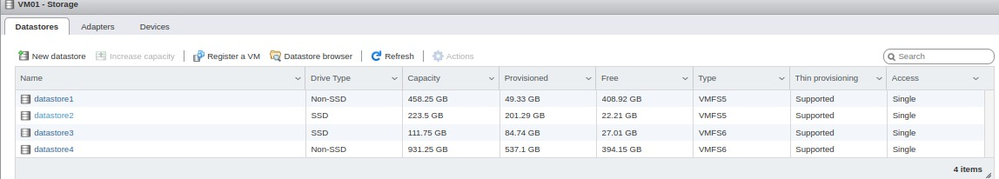

# DOCUMENTAÇÃO DO SERVIDOR 01

1. **Host virtualização - VMWARE**
   1. **Localização:**
      1. Primeira máquina ao lado esquerdo da porta de entrada.

   2. **Hardware**

      1. Hds e SSDs
         1. hd 500 gb com sistema de virtualização vmware (Obs: Us);
         2. ssd 240 gb para a máquina virtual hd_Fortes;
         3. ssd 120 gb para a máquina virtual hd_Governo;
         4. hd Eterno de 500 gb para backup.
         5. Imagem do DataStore
            1. 

      2. Memória 16 gb
      3. Tipo da memória: ddr3
      4. Slot pci: ?

   3. **Virtualização : [hypervisor](https://www.vmware.com/topics/glossary/content/hypervisor.html#:~:text=A%20hypervisor%2C%20also%20known%20as,such%20as%20memory%20and%20processing.)  “Tipo 1”**:
      1. **VmWare: versão exsi 6.5**
         1. **É Licenciado?**
            1. Temos um número de série válido mais não é em nome da Servcont.

         2. **Versão obtida pelo console ssh**:

            ```sh
               root@VM01:/bin] uname -a
               VMkernel VM01 6.5.0 #1 SMP Release build-8294253 Apr 17 2018 19:05:39 x86_64 x86_64 x86_64 ESXi
            ```

      2. **Cliente usado para gerenciar o servidor?**
         1. **Browser**
            1. host: [https://192.168.25.254/ui/#/host](https://192.168.25.254/ui/#/host)
            2. Usuário: root
            3. Senha:32532000servcontt

## Máquinas Virtuais em host

1. **HD_Governo**
   1. **Hardware**
      1. Processador:  [Intel® Core™ i7-2600](https://www.intel.com.br/content/www/br/pt/products/sku/52213/intel-core-i72600-processor-8m-cache-up-to-3-80-ghz/specifications.html)
      2. Ram: 3 Gb
      3. Core: 2
      4. Tarefas: 2
      5. Partição 01 : 80 gb
      6. Partição 02 : 50 gb
      7. Localização física: DataStore3

   2. **Sistema Operacional**:
      1. Windows server 2019 standard

   3. **Serviços**:
      1. **Active directory**
         1. ? _Falta inserir as estações no active directory para que os dados das estações sejam copiados para o servidor_

      2. **Terminal server**
         1. Obs: Licença de 120 dias e a cada 120 dia é inicializada.
         2. _Pendência_: Pedir para o Ivan documentar essa tarefa.

      3. **Compartilhamento de arquivos**;
         1. _Pendência_: Falta o Ivan compartilhar as pastas comuns e integra-las ao active directory;

   4. IP: 192.168.25.2:3389
      1. Protocolo: RDP
      2. Usuário: administrador
      3. Senha: Srv.c0nt22
      4. Domínio: servcont.local

2. **HD_Fortes**
   1. **Hardware**
      1. Processador:  [Intel® Core™ i7-2600](https://www.intel.com.br/content/www/br/pt/products/sku/52213/intel-core-i72600-processor-8m-cache-up-to-3-80-ghz/specifications.html)
      2. Ram: 8 Gb
      3. Core: 4
      4. Tarefas: 4
      5. Partição 01 : 80 gb
      6. Partição 02 : 120 gb
      7. Localização física: DataStore2

   2. **Sistema Operacional:**
      1. Windows
         1. versão: server 2019 standard

   3. **Serviços:**
      1. Aplicação Fortes
      2. Terminal server p/ Acesso remoto rdp clientes externos

   4. **Número do IP para acesso**
      1. IP: 192.168.25.69:3391 - Local
      2. IP: servcontt.ddns.net.net:3391
         1. Protocolo: RDP
            1. Usuário: administrador
            2. Senha: Srv.c0nt22
            3. Domínio: servcont.local

3. **svrweb**
   1. **Hardware**
      1. Processador:  [Intel® Core™ i7-2600](https://www.intel.com.br/content/www/br/pt/products/sku/52213/intel-core-i72600-processor-8m-cache-up-to-3-80-ghz/specifications.html)
      2. Ram: 2 Gb
      3. Core: 4
      4. Tarefas: ??
      5. Partição 01 : 20 gb
      6. Partição 02 : 100 gb
      7. Localização física: Hd de 500 gb

   2. **Sistema Operacional:**
      1. Linux Mint
         1. versão: 21 64 bits

   3. **Serviços:**
      1. Servidor samba
         1. Configuração no arquivo _smb.conf_

            ```conf

            # [Modified by CID]
            #
            # This file has been modified by the CID (Closed In Directory) program.
            # A copy of its previous state was saved in /var/lib/cid/backups/ori/etc/samba/smb.conf
            # and in /var/lib/cid/backups/mod/etc/samba/smb.conf if the program has made a
            # reconfiguration in the file.
            # For more details, see: https://cid-doc.github.io.

            [global]
               # SMB settings
               workgroup = SERVCONT
               netbios name = srvweb
               security = ADS
               load printers = No
               disable spoolss = Yes

               # Kerberos settings
               realm = SERVCONT.LOCAL

               # Winbind settings
               apply group policies = Yes
               winbind expand groups = 1
               winbind enum users = yes
               winbind enum groups = yes
               winbind use default domain = Yes
               winbind separator = +
               winbind refresh tickets = Yes
               winbind offline logon = Yes
               template homedir = /home/%U
               template shell = /usr/bin/bash
               idmap config * : range = 10000-1009999
               idmap config * : backend = autorid
               idmap config * : rangesize = 100000


            [dat]
               
               path = /home/database/dat/
               writeable = yes
               read only = no
               browseable = yes 
               admin users = @"SERVCONT+ti" root  
               valid users = @"SERVCONT+dat"
               

               # As 2 linhas abaixo permite link simbólico nos compartilhamentos:
               follow symlinks = yes
               wide links = yes

            [publico]

            path = /home/ivan.rocha/Público/
               writeable = yes
               read only = no
               browseable = yes    
               valid users = @"Domain Users"


            ```

         2. ...

      2. xrdp = Terminal server p/ Acesso remoto rdp clientes externos
      3. servidor web apache - falta instalar.

   4. **Número do IP para acesso**
      1. IP: 192.168.25.5:3389 - Local
      2. IP: servcontt.ddns.net.net:3389
         1. Protocolo: RDP
            1. Usuário: administrador
            2. Senha: 32532000servcontt
            3. Domínio: servcont.local

## OBSERVAÇÕES

   1. Se possível evitar acessar utilizando o usuário administrador,  concedi permissão de administrador para o seu usuário ( paulo.pacheco )

   2. Endereço para  acessar fortes remoto via rdp:
      1. servcontt.ddns.net:3391
      2. E por segurança, caso precise acessar com frequência remotamente, podemos criar uma instância VPN (openvpn) para você.
