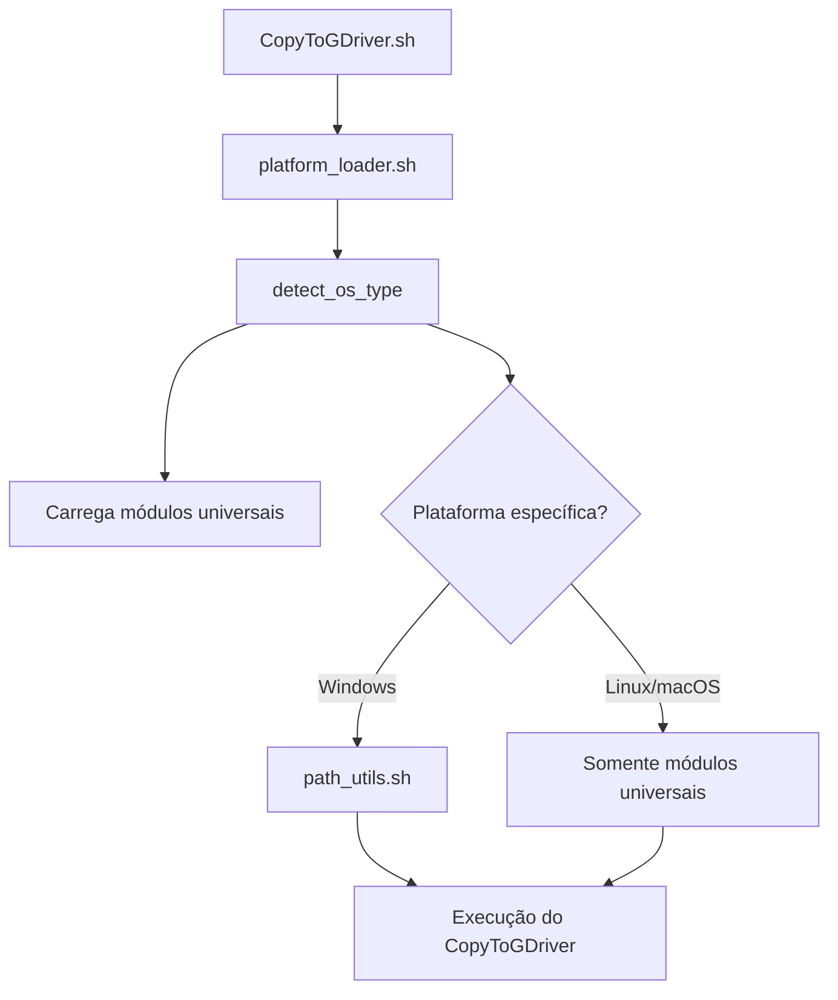

# 📘 Documentação – platform_loader.sh (v1.2.0)

## 🧭 Visão Geral

O script **`platform_loader.sh`** é o **carregador inteligente de módulos** do projeto **CopyToGDriver**.  
Ele detecta automaticamente o sistema operacional e inclui apenas os módulos necessários, garantindo total compatibilidade entre **Linux**, **macOS** e **Windows (Git Bash / WSL / Cygwin)**.

---

## ⚙️ Função Principal

O script executa a função:

```bash
load_platform_modules
````

Essa função:

* Identifica o sistema operacional atual (`Linux`, `macOS`, `Windows`, `WSL`);
* Carrega **módulos universais** sempre presentes na pasta `includes/crossplatform`;
* Inclui **módulos específicos** somente se existirem (ex: `path_utils.sh` no Windows).

---

## 📁 Estrutura Esperada

A organização de diretórios recomendada é a seguinte:

```
CopyToGDriver/
├── CopyToGDriver.sh
├── includes/
│   ├── crossplatform/
│   │   ├── crossplatform_utils.sh
│   │   ├── crlf_protect.sh
│   │   ├── disk_utils.sh
│   │   ├── platform_loader.sh   ← ✅ ESTE SCRIPT
│   │   └── (outros utilitários universais)
│   ├── windows/
│   │   └── path_utils.sh
│   ├── linux/
│   │   └── (opcional)
│   ├── macos/
│   │   └── (opcional)
│   └── docs/
│       └── platform_loader.md
```

---

## 🧩 Módulos Carregados

### 🔹 Módulos Universais (sempre carregados)

| Arquivo                  | Função                                                      | Local                     |
| ------------------------ | ----------------------------------------------------------- | ------------------------- |
| `crlf_protect.sh`        | Corrige automaticamente problemas de CRLF em ambientes Unix | `includes/crossplatform/` |
| `crossplatform_utils.sh` | Ferramentas gerais: logging, normalização e validação       | `includes/crossplatform/` |
| `disk_utils.sh`          | Utilitários de disco universais (Linux/macOS/Windows)       | `includes/crossplatform/` |

### 🔹 Módulos Específicos (carregados apenas se existirem)

| Sistema          | Módulo                           | Função                                      |
| ---------------- | -------------------------------- | ------------------------------------------- |
| 🪟 Windows / WSL | `path_utils.sh`                  | Conversão entre caminhos Windows e Git Bash |
| 🐧 Linux         | *(nenhum específico por padrão)* | Usa apenas os universais                    |
| 🍎 macOS         | *(nenhum específico por padrão)* | Usa apenas os universais                    |

---

## 🧠 Lógica de Detecção de Plataforma

A função `detect_os_type` usa `uname -s` e padrões simples para identificar o ambiente:

```bash
Linux*     → Linux ou WSL
Darwin*    → macOS
CYGWIN*|MINGW*|MSYS* → Windows (Git Bash/Cygwin)
```

No caso do WSL, a detecção adicional é feita com:

```bash
grep -qi microsoft /proc/version
```

---

## 🚀 Exemplo de Uso no Script Principal

Dentro do `CopyToGDriver.sh`, adicione o seguinte bloco logo após definir `SCRIPT_DIR`:

```bash
# -----------------------------------------------------------
# 🔧 Inicialização de módulos universais
# -----------------------------------------------------------
if [[ -f "$SCRIPT_DIR/includes/crossplatform/platform_loader.sh" ]]; then
    source "$SCRIPT_DIR/includes/crossplatform/platform_loader.sh"
    load_platform_modules
else
    echo "❌ ERRO: platform_loader.sh não encontrado!"
    exit 1
fi
```

---

## 🧪 Teste Autônomo

O script pode ser executado sozinho para teste:

```bash
$ bash includes/crossplatform/platform_loader.sh
=====================================================
🔧 Iniciando carregamento de módulos (plataforma: Linux)
=====================================================
✅ Módulo carregado: crlf_protect.sh
✅ Módulo carregado: crossplatform_utils.sh
✅ Módulo carregado: disk_utils.sh
=====================================================
✅ Carregamento de módulos concluído.
=====================================================
```

---

## 🧩 Fluxo de Carregamento Interno



---

## 🧰 Funções Internas

| Função                  | Descrição                                                     |
| ----------------------- | ------------------------------------------------------------- |
| `detect_os_type`        | Identifica o sistema operacional (Linux, macOS, Windows, WSL) |
| `load_module <arquivo>` | Carrega um módulo se o arquivo existir                        |
| `load_platform_modules` | Função principal que executa todo o carregamento automático   |

---

## ⚙️ Requisitos

* `bash` ≥ 4.0
* Utilitários padrão (`uname`, `grep`, `awk`, `sed`, `df`, `du`)
* Permissões de leitura nas pastas `includes/*`

---

## 🧩 Histórico de Versões

| Versão    | Data           | Alterações Principais                                                                                       |
| --------- | -------------- | ----------------------------------------------------------------------------------------------------------- |
| **1.0.0** | Inicial        | Primeira versão básica de carregamento                                                                      |
| **1.1.0** | + OS Detection | Adicionada detecção WSL + modularização                                                                     |
| **1.2.0** | Atual          | Versão universal: usa `crossplatform/disk_utils.sh` fixo e só carrega módulos específicos quando necessário |

---

## 🧩 Créditos

**Autores:**

* 👤 Paulo SSPacheco
* 🤖 ChatGPT (GPT-5)

**Licença:** MIT – Uso livre com atribuição.

---

> 💡 *“Carregue apenas o que for necessário — e carregue bem.”*
>
> — *CopyToGDriver Philosophy, 2025*

```

---

