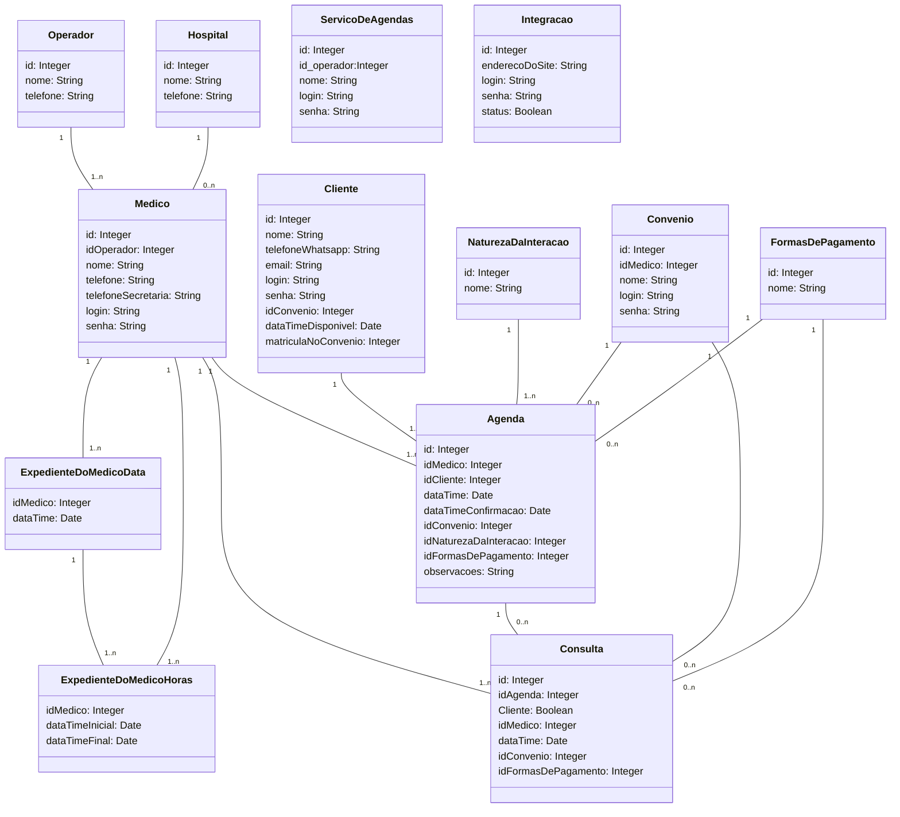

<div class="header" id="myHeader">
  <div class="navbar" w3-include-html="/menu.inc"> </div>
</div>
<div class="title"><script> document.write(document.title);</script></div>  
<main>
<!-- markdownlint-disable-next-line -->
<span id="topo"><span>

<script type="application/x-javascript" src="/js/mermaid.min.js"></script>

# Banco de dados do projeto

## Cadastros do projeto

1. [Operadores](./operadores.md)
2. [hospitais](./hospitais.md).
3. [natureza da interação](./natureza_da_iinteracao.md)
4. [medicos](./medicos.html)
5. [serviços de agenda](./servicos_de_agenda.html)
6. [convênios](./convenios.html)
7. [clientes](./clientes.index)
8. [Integração](./integracao.html)
9. [Expediente_do_medico_data](./expediente_do_medico_data)
10. [Expediente_do_medico_horas](./expediente_do_medico_horas.html)
11. [Agenda](./agenda.html)
12. [Formas_de_Pagamento](./formas_de_pagamento.html)
13. [Consulta](./consulta.html)

## Diagrama do Entidade e Relacionamentos (DER) 

<pre><code class="language-mermaid"><div class="mermaid">

classDiagram

class Operador {
  id: Integer
  nome: String
  telefone: String
}

class Hospital {
  id: Integer
  nome: String
  telefone: String
}

class NaturezaDaInteracao {
  id: Integer
  nome: String
}

class Medico {
  id: Integer
  idOperador: Integer
  nome: String
  telefone: String
  telefoneSecretaria: String
  login: String
  senha: String
}

class ServicoDeAgendas {
  id: Integer
  id_operador:Integer
  nome: String
  login: String
  senha: String
}

class Convenio {
  id: Integer
  idMedico: Integer
  nome: String
  login: String
  senha: String
}

class Cliente {
  id: Integer
  nome: String
  telefoneWhatsapp: String
  email: String
  login: String
  senha: String
  idConvenio: Integer
  dataTimeDisponivel: Date
  matriculaNoConvenio: Integer
}

class Integracao {
  id: Integer
  enderecoDoSite: String
  login: String
  senha: String
  status: Boolean
}

class ExpedienteDoMedicoData {
  idMedico: Integer
  dataTime: Date
}

class ExpedienteDoMedicoHoras {
  idMedico: Integer
  dataTimeInicial: Date
  dataTimeFinal: Date
}

class Agenda {
  id: Integer
  idMedico: Integer
  idCliente: Integer
  dataTime: Date
  dataTimeConfirmacao: Date
  idConvenio: Integer
  idNaturezaDaInteracao: Integer
  idFormasDePagamento: Integer
  observacoes: String
}

class FormasDePagamento {
  id: Integer
  nome: String
}

class Consulta {
  id: Integer
  idAgenda: Integer
  Cliente: Boolean
  idMedico: Integer
  dataTime: Date
  idConvenio: Integer
  idFormasDePagamento: Integer
}

Operador "1" -- "1..n" Medico
Hospital "1" -- "0..n" Medico
Medico "1" -- "1..n" ExpedienteDoMedicoData
ExpedienteDoMedicoData   "1" -- "1..n" ExpedienteDoMedicoHoras
Medico   "1" -- "1..n" ExpedienteDoMedicoHoras
Medico "1" -- "1..n" Agenda
Cliente "1" -- "1..n" Agenda
NaturezaDaInteracao  "1" -- "1..n" Agenda
Convenio  "1" -- "0..n" Agenda
FormasDePagamento  "1" -- "0..n" Agenda

Medico "1" -- "1..n" Consulta
Agenda "1" -- "0..n" Consulta
Convenio "1" -- "0..n" Consulta
FormasDePagamento  "1" -- "0..n" Consulta

</div></code></pre>

- **Explicação do diagrama**
  - O diagrama de entidade de relacionamento (DER) mostra as relações entre as entidades de um sistema. No caso deste diagrama, as entidades são:
    - Operador
    - Hospital
    - NaturezaDaInteração
    - Medico
    - ServiçoDeAgendas
    - Convenio
    - Cliente
    - Integração
    - ExpedienteDoMedicoData
    - ExpedienteDoMedicoHoras
    - Agenda
    - FormasDePagamento
    - Consulta

  - A simbologia usada para indicar os relacionamentos são:
    - _1_ : Indica o lado do relacionamento que só pode conter uma ocorrência.

    - _1..1_ : Indica que o identificador de ambas a tabelas devem ser iguais;
      - Exemplo:
        - Código da _agenda.idCliente_  é obrigatório ser igual a _cliente.id_.

    - _1..n_ : Indica que pelo menos _um_ (1) identificador de uma das tabelas devem ser igual o identificador da outra;
      - Exemplo:
        - O identificador _agenda.idNaturezaDaInteracao_ é obrigatório ser igual ao identificador _NaturezaDaInteracao.id_ e _NaturezaDaInteracao.id_ pode existir mais de uma ocorrência na agenda.
    - _0..n_ : Indica que o relacionamento entre as tabelas é opcional e que pode haver mais de referência de uma tabela na outra;
      - Exemplo:
        - O identificador _Consulta.idAgenda_ é opcional ser igual ao identificador _Agenda.id_ porque o médico pode atender um paciente sem que o mesmo tenha sido agendado.

</div></code></pre>

## Diagrama do projeto que deu origem ao gráfico acima



## Script SQL PostgresSQl do projeto

```SQL
CREATE TABLE operador (
  id SERIAL PRIMARY KEY,
  nome VARCHAR(255) NOT NULL,
  telefone VARCHAR(255) NOT NULL
);

CREATE TABLE hospital (
  id SERIAL PRIMARY KEY,
  nome VARCHAR(255) NOT NULL,
  telefone VARCHAR(255) NOT NULL
);

CREATE TABLE natureza_da_interacao (
  id SERIAL PRIMARY KEY,
  nome VARCHAR(255) NOT NULL
);

CREATE TABLE medico (
  id SERIAL PRIMARY KEY,
  id_operador INTEGER NOT NULL,
  nome VARCHAR(255) NOT NULL,
  telefone VARCHAR(255) NOT NULL,
  telefone_secretaria VARCHAR(255) NOT NULL,
  login VARCHAR(255) NOT NULL,
  senha VARCHAR(255) NOT NULL
);

CREATE TABLE servico_de_agendas (
  id SERIAL PRIMARY KEY,
  id_operador INTEGER NOT NULL,
  nome VARCHAR(255) NOT NULL,
  login VARCHAR(255) NOT NULL,
  senha VARCHAR(255) NOT NULL
);

CREATE TABLE convenio (
  id SERIAL PRIMARY KEY,
  id_medico INTEGER NOT NULL,
  nome VARCHAR(255) NOT NULL,
  login VARCHAR(255) NOT NULL,
  senha VARCHAR(255) NOT NULL
);

CREATE TABLE cliente (
  id SERIAL PRIMARY KEY,
  nome VARCHAR(255) NOT NULL,
  telefone_whatsapp VARCHAR(255) NOT NULL,
  email VARCHAR(255) NOT NULL,
  login VARCHAR(255) NOT NULL,
  senha VARCHAR(255) NOT NULL,
  id_convenio INTEGER NOT NULL,
  data_time_disponivel DATE NOT NULL,
  matricula_no_convenio INTEGER NOT NULL
);

CREATE TABLE integracao (
  id SERIAL PRIMARY KEY,
  endereco_do_site VARCHAR(255) NOT NULL,
  login VARCHAR(255) NOT NULL,
  senha VARCHAR(255) NOT NULL,
  status BOOLEAN NOT NULL
);

CREATE TABLE expediente_do_medico_data (
  id_medico INTEGER NOT NULL,
  data_time DATE NOT NULL
);

CREATE TABLE expediente_do_medico_horas (
  id_medico INTEGER NOT NULL,
  data_time_inicial DATE NOT NULL,
  data_time_final DATE NOT NULL
);

CREATE TABLE agenda (
  id SERIAL PRIMARY KEY,
  id_medico INTEGER NOT NULL,
  id_cliente INTEGER NOT NULL,
  data_time DATE NOT NULL,
  data_time_confirmacao DATE NOT NULL,
  id_convenio INTEGER NOT NULL,
  id_natureza_da_interacao INTEGER NOT NULL,
  id_formas_de_pagamento INTEGER NOT NULL,
  observacoes VARCHAR(255)
);

CREATE TABLE formas_de_pagamento (
  id SERIAL PRIMARY KEY,
  nome VARCHAR(255) NOT NULL
);

CREATE TABLE consulta (
  id SERIAL PRIMARY KEY,
  id_agenda INTEGER NOT NULL,
  cliente BOOLEAN NOT NULL,
  id_medico INTEGER NOT NULL,
  data_time DATE NOT NULL,
  id_convenio INTEGER NOT NULL,
  id_formas_de_pagamento INTEGER NOT NULL
);


```

- **Observações**:

  - Essas tabelas representam as classes do diagrama de classes, com as seguintes correspondências:
    - Operador -> operador
    - Hospital -> hospital
    - NaturezaDaInteracao -> natureza_da_interacao
    - Medico -> medico
    - ServicoDeAgendas -> servico_de_agendas
    - Convenio -> convenio
    - Cliente -> cliente
    - Integracao -> integracao
    - ExpedienteDoMedicoData -> expediente_do_medico_data
    - ExpedienteDoMedicoHoras -> expediente_do_medico_horas
    - Agenda -> agenda

## Além das tabelas, você também precisará criar as seguintes chaves estrangeiras para representar as relações entre as classes:

```sql

ALTER TABLE medico
ADD CONSTRAINT fk_medico_operador
FOREIGN KEY (id_operador)
REFERENCES operador (id);

ALTER TABLE expediente_do_medico_data
ADD CONSTRAINT fk_expediente_do_medico_data_medico
FOREIGN KEY (id_medico)
REFERENCES medico (id);

ALTER TABLE expediente_do_medico_horas
ADD CONSTRAINT fk_expediente_do_medico_horas_medico
FOREIGN KEY (id_medico)
REFERENCES medico (id);

ALTER TABLE agenda
ADD CONSTRAINT fk_agenda_medico
FOREIGN KEY (id_medico)
REFERENCES medico (id);

ALTER TABLE agenda
ADD CONSTRAINT fk_agenda_cliente
FOREIGN KEY (id_cliente)
REFERENCES cliente (id);

ALTER TABLE agenda
ADD CONSTRAINT fk_agenda_natureza_da_interacao
FOREIGN KEY (id_natureza_da_interacao)
REFERENCES natureza_da_interacao (id);

ALTER TABLE agenda
ADD CONSTRAINT fk_agenda_formas_de_pagamento
FOREIGN KEY (id_formas_de_pagamento)
REFERENCES formas_de_pagamento (id);

ALTER TABLE consulta
ADD CONSTRAINT fk_consulta_agenda
FOREIGN KEY (id_agenda)
REFERENCES agenda (id);

ALTER TABLE consulta
ADD CONSTRAINT fk_consulta_medico
FOREIGN KEY (id_medico)
REFERENCES medico (id);

ALTER TABLE consulta
ADD CONSTRAINT fk_consulta_convenio
FOREIGN KEY (id_convenio)
REFERENCES convenio (id);

ALTER TABLE consulta
ADD CONSTRAINT fk_consulta_formas_de_pagamento
FOREIGN KEY (id_formas_de_pagamento)
REFERENCES formas_de_pagamento (id);

```

- **Observações**:
  - Essas chaves estrangeiras garantem a integridade referencial das tabelas, o que significa que os dados nas tabelas relacionadas serão consistentes.
  - Por exemplo, a chave estrangeira fk_medico_operador na tabela medico garante que o valor da coluna id_operador em uma linha da tabela medico sempre existirá em uma linha da tabela operador.
  - Após criar as tabelas e as chaves estrangeiras, você poderá inserir dados nas tabelas. Os dados que você insere devem corresponder aos atributos das classes no diagrama de classes.
  - Por exemplo, para inserir um médico na tabela medico, você precisará fornecer os valores para os seguintes atributos:
    - id (auto-incrementado)
    - id_operador
    - nome
    - telefone
    - telefone_secretaria
    - login
    - senha
  - Exemplos de consultas que você pode usar para trabalhar com os dados no banco de dados:
    - Para obter uma lista de todos os médicos:

       ```sql

         SELECT *
         FROM medico;

       ```

    - Para obter uma lista de todos os médicos de um determinado hospital:

       ```sql

        SELECT *
        FROM medico
        WHERE id_hospital = 1;

       ```

    - Para obter uma lista de todas as consultas de um determinado paciente:

       ```sql

        SELECT *
        FROM consulta
        WHERE id_cliente = 1;

       ```

    - Para obter uma lista de todas as consultas de um determinado médico:

       ```sql

        SELECT *
        FROM consulta
        WHERE id_medico = 1;

       ```

## Ferramenta que pode ser usada para executar os scripts acima?

- Para executar os scripts acima usando o _psql_, você precisará conectar-se ao banco de dados PostgreSQL. Você pode fazer isso usando o comando psql:

  ```bash

    psql -h <host> -p <port> -d <database> -U <username>

  ```

- Por exemplo, para conectar-se ao banco de dados PostgreSQL chamado _mydatabase_ no host _localhost_ na porta _5432_, você usaria o seguinte comando:

  ```bash

    psql -h localhost -p 5432 -d mydatabase -U myuser

  ```

- Uma vez conectado ao banco de dados, você pode executar os scripts acima usando o comando \i:

  ```bash

    \i create_tables.sql

  ```

  - Nota:
    - Este comando irá executar o script _create_tables_.sql, que criará as tabelas necessárias para o diagrama de classes.

## Usando uma ferramenta GUI _pgAdmin_

- O _pgAdmin_ é uma ferramenta de gerenciamento de banco de dados que permite criar tabelas, inserir dados, consultar dados e realizar outras tarefas administrativas.
- Para executar os scripts acima usando o pgAdmin, você precisará abrir o pgAdmin e conectar-se ao banco de dados PostgreSQL. Em seguida, você pode clicar com o botão direito do mouse no banco de dados e selecionar "Importar". Na caixa de diálogo "Importar", selecione o arquivo create_tables.sql e clique em "Abrir". O pgAdmin irá então importar o script e criar as tabelas necessárias para o diagrama de classes.
- A escolha da ferramenta para executar os scripts acima depende de suas preferências pessoais. Se você estiver familiarizado com a linha de comando, o psql é uma boa opção. Se você preferir uma ferramenta GUI, o pgAdmin é uma boa opção.

## Compartilhar o  acesso ao banco de dados

- Conceder acesso ao banco de dados:

  ```sql

    GRANT ALL PRIVILEGES ON DATABASE mydatabase TO mypartner;
  
  ```

  - Este comando concederá ao seu parceiro todos os privilégios no banco de dados mydatabase.
  - 

## Referências

1. [Gráfico criado com projeto mermaid](https://mermaid.js.org/syntax/flowchart.html)

<!-- markdownlint-disable-next-line -->
</main>
[🔝🔝](#topo "Retorna ao topo")

