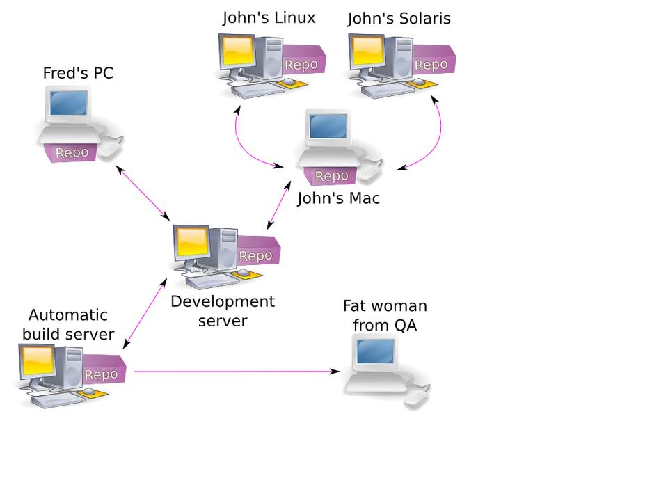

# **Configurando um servidor de Git no ubuntu**

O Git é um sistema de versionamento largamente utilizado por profissionais de TI, principalmente por Sysadmins, desenvolvedores e devops.

Basicamente, com ele podemos armazenar arquivos e controlar modificações. Isso nos possibilita restaurar versões prévias de tais arquivos, saber quando determinada alteração foi realizada, entre outros. O Git possibilita um mesmo repo ser utilizado por mais de uma pessoa. Por isso é utilizado em larga escala em times de desenvolvimento.

Neste artigo explicarei como configurar um git server, de forma que esse repositório do Git poderá ser utilizado em mais de um local, como abordado no exemplo anterior.

## **Como funciona**

Antes de instalarmos e configurarmos o Git, precisamos entender onde aplica-se seu uso.

Basicamente, na maioria dos casos, o Git roda em um servidor que pode ser na rede local ou na Web. Nesse server mantemos um repositório central, o que vamos chamar de Git Server.
Localmente, na sua estação de trabalho, por exemplo, é mantido um repositório local, ou seja, um
clone do repo central. Nos arquivos dentro desse repo local você realiza suas modificações e, ao concluí-las, as envia para o git server. Aquilo que modificou e seus comentários sobre suas mudanças são armazenados para consulta posterior.

Caso outras pessoas possuam um clone desse repo, bastará rodar o comando `git pull` para obter as mudanças que você realizou e que já estarão armazenadas no git server.

Inclusive, recomendo rodar `git pull` antes de enviar modificações para o git server.

Na imagem abaixo podemos ver um exemplo de um time que pode ser de desenvolvimento. Todos trabalham com um repositório local e enviam e recebem mudanças de um repositório central:



## **Instalando e configurando um Git Server:**

No passo a passo abaixo instalaremos o Git em um servidor com Debian.

**Configurações feitas no servidor:**

1 – Primeiramente é preciso instalar o pacote “git” no servidor. Para isso, execute o comando abaixo:

```shellscript  
    sudo apt-get update
    sudo apt-get install git
```

2 – Agora é preciso criar o usuário que utilizaremos para acessar o repositório do Git.

```shellscript
    sudo useradd git -s -d /home/git
```

3 – Agora criaremos o diretório home do usuário ‘git’ (/home/git) e nele o path onde armazenaremos o repositório do nosso primeiro repo que se chamará ‘lab’:

```shellscript
    sudo mkdir -p /home/git/repos/lab.git
```

4 – Agora ajustaremos o owner:group dos diretórios que criamos:

```shellscript
    sudo chown -R git:git /home/git
```

5 – Vamos usar o usuário ‘git’ para configurar o repo. Assim não precisaremos ajustar owner:group novamente:

```shellscript
    sudo git -l
```

6 – Agora entre no path onde manteremos a estrutura do repo:

```shellscript
    cd repos/lab.git
```

7 – Por fim, vamos iniciar um repo aqui. Para isso, utilizaremos o comando abaixo:

```shellscript
    sudo git --bare init
```

8 – Deslogue do usuário “git” e volte com o usuário “root”.

Daqui para frente pouco utilizará o usuário “git”. Portanto, vamos aumentar a segurança do user trocando seu shell default.

9 – Altere o shell do usuário “git” para deixar seu repo mais seguro:

```shellscript
    sudo usermod -s /usr/bin/git-shell
```

Com isso, ao tentarmos logar com o usuário “git”, receberá a mensagem abaixo:

```shellscript
    sudo su git -l

    fatal: Interactive git shell is not enabled.
    hint: ~/git-shell-commands should exist and have read and execute access.
```

**Configurações feitas no desktop:**

Agora vamos configurar nosso desktop.

1 – Crie um diretório onde manterá o repo local:

```shellscript
    sudo mkdir ~/Git/
```

2 – Entre nesse diretório:

```shellscript
    sudo cd ~/Git/
```

3 – Agora clone o repositório remoto para o seu desktop com o comando:

```shellscript
    sudo git clone git@host-ou-ip-do-servidor:~/repos/lab.git
```

Obviamente, troque “host-ou-ip-do-servidor” pelo Host ou IP do servidor onde está o git server, mas isso você já sabe…

4 – Se tudo der certo, terá criado um diretório chamado “lab”. Entre nele.

5 – Faremos agora o primeiro commit. Primeiro, crie um arquivo em branco:

```shellscript
    touch la_vai_meu_teste.txt
```

6 – Adicione esse arquivo ao Git:

```shellscript
    git add la_vai_meu_teste.txt
```

7 – Comente esta inclusão:

```shellscript
    git commit -am "Meu primeiro commit uhull" la_vai_meu_teste.txt
```

8 – E por fim, suba a alteração para o git server:

```shellscript
    git push
```

## **Conclusão:**

???

## REFERÊNCIAS

1. [Configurando-um-servidor-de-git-no-debian](https://www.blogporta80.com.br/2015/09/24/artigos-configurando-um-servidor-de-git-no-debian/)

## HISTÓRICO

### Data: 02/12/2020

* [x] Estudar como usar repositórios que guarde todas as versões dos arquivos ao serem gravados em disco.
  * A melhor opção no meu ponto de vista é usar o projeto [git](https://en.wikipedia.org/wiki/Git) criado por Linus Torvalds.
  * Criei [documento de como criar um servidor git no linux](programacao/controle_de_versões/git/como_instalar_servidor_git.md).

* [x] Criar documento [./como_instalar_servidor_git.md](como_instalar_servidor_git.md).
* [ ] ..
