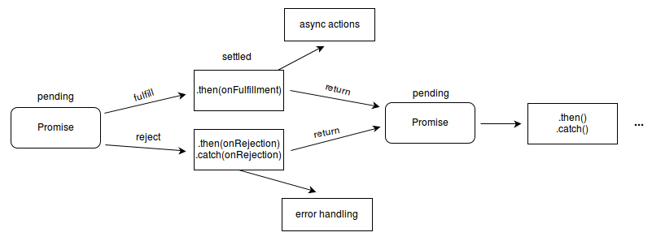

# <span id="topo"><span>JAVASCRIPT - Funções assíncronas<a href="function_async.html" target="_blank" title="Pressione aqui para expandir este documento em nova aba." >↵</a><a href="function_async.pdf" target="_blank" title="Pressione aqui para visualizar o PDF deste documento em nova aba.">℘</a>

## **1. INDEX**

---

   1. **Introdução**

      1. [Objetivo.](#id_objetivo)
      2. [Pre-requisitos.](#id_pre_requisitos)
      3. [benefícios.](#id_beneficios)
      4. [Expressão da função async](https://developer.mozilla.org/pt-BR/docs/Web/JavaScript/Reference/Operators/async_function)

   2. [**Descrição.**](#id_Descricao)

   3. **Exemplos**
      1. [Promise](#id_exemplos)
      2. [Exemplos de uso das palavras reservadas Async/await](#id_Async_await)
      3. [Promessa de retorno](#id_Promessa_retorno)
      4. [Expressão de função assíncrona](#id_Expressao_assincrona)

   4. [**Referências.**](#id_referencias)

   5. [**Histórico.**](#id_historico)

## **2. CONTEÚDO**

---

   1. [Introdução](https://developer.mozilla.org/pt-BR/docs/Web/JavaScript/Reference/Global_Objects/Promise)

      1. <span id="id_objetivo"><span>Objetivo:
         1. Promise é um objeto usado para processamento assíncrono. Um Promise (de "promessa") representa um valor que pode estar disponível agora, no futuro ou nunca.
         2. As promessas nos fornecem uma maneira mais fácil de lidar com a assincronia em nosso código de maneira sequencial.

         3. <text onclick="goBack()">[🔙]</text>

      2. <span id="id_pre_requisitos"></span>Pre-requisitos:
         1. Conhecimento da [linguagem html.](https://developer.mozilla.org/pt-BR/docs/Glossario/HTML).
         2. Conhecimento de [funções javascript.](https://developer.mozilla.org/pt-BR/docs/Web/JavaScript/Reference/Global_Objects/Function).
         3. [Callback function.](https://developer.mozilla.org/pt-BR/docs/Glossario/Callback_function)
            1. [Usando_promises.](https://developer.mozilla.org/pt-BR/docs/Web/JavaScript/Guide/Usando_promises)

         4. <text onclick="goBack()">[🔙]</text>

      3. <span id="id_beneficios"></span>Benefícios:
         1. A nova adição com ES2017 (ES8), adicionou na linguagem javascript as funções **Async/await** com objetivo de nos ajudar a escrever código de aparência completamente síncrona, enquanto realizamos tarefas assíncronas nos bastidores.

         2. <text onclick="goBack()">[🔙]</text>

   2. <span id=id_Descricao></span>[**Descrição**](https://developer.mozilla.org/pt-BR/docs/Web/JavaScript/Reference/Global_Objects/Promise#descri%C3%A7%C3%A3o)
      1. Uma **Promise** representa um proxy para um valor que não é necessariamente conhecido quando a promessa é criada. Isso permite a associação de métodos de tratamento para eventos da ação assíncrona num caso eventual de sucesso ou de falha. Isto permite que métodos assíncronos retornem valores como métodos síncronos: ao invés do valor final, o método assíncrono retorna uma promessa ao valor em algum momento no futuro.
         1. Um **Promise** está em um destes estados:
            1. **pending** (pendente): Estado inicial, que não foi realizada nem rejeitada.
            2. **fulfilled** (realizada): sucesso na operação.
            3. **rejected** (rejeitado):  falha na operação.

      2. Uma promessa pendente pode se tornar realizada com um valor ou rejeitada por um motivo (erro). Quando um desses estados ocorre, o **método then** do **Promise** é chamado, e ele chama o método de tratamento associado ao estado (rejected ou resolved). Se a promessa foi realizada ou rejeitada quando o método de tratamento correspondente for associado, o método será chamado, deste forma não há uma condição de competição entre uma operação assíncrona e seus manipuladores que estão sendo associados.

      3. Como os métodos **Promise.prototype.then** e **Promise.prototype.catch**  retornam promises, eles podem ser encadeados — uma operação chamada composição.
         1. 

      4. <text onclick="goBack()">[🔙]</text>

   3. <span id=id_exemplos></span>**Exemplos.**
      1. **Promise**:
         1. [Criando uma Promise](https://developer.mozilla.org/pt-BR/docs/Web/JavaScript/Reference/Global_Objects/Promise#criando_uma_promise)
         2. [Carregando uma imagem com XHR](https://developer.mozilla.org/pt-BR/docs/Web/JavaScript/Reference/Global_Objects/Promise#carregando_uma_imagem_com_xhr)
            1. [Código fonte carregar imagens usando Promise](https://github.com/mdn/js-examples/blob/master/promises-test/index.html)
            2. [Código fonte sendo executado](https://mdn.github.io/js-examples/promises-test/).

         3. <text onclick="goBack()">[🔙]</text>

      2. <span id="id_Async_await"></span>**Exemplos de uso das palavras reservadas Async/await**.
         1. **Exemplo de funções assíncronas**.
            1. No exemplo a seguir, primeiro declaramos uma função que retorna uma promessa que resolve para um valor após 2 segundos. Em seguida, declaramos um assíncrono função e aguardam para que a promessa seja resolvida antes de registrar a mensagem no console:
               1. Código JavaScript

                  ```javascript
                        /**
                           * test_function_async_1.js
                           * 
                        */
                        function palhaço_assustador() {
                           return new Promise(
                                          resolve => {setTimeout(() => { resolve('🤡');}, 2000);});
                        }

                        async function msg() {
                           const msg = await palhaço_assustador();
                           console.log('Message:', msg);
                        }

                        msg(); // Message: 🤡 <-- after 2 sec    

                  ```

                  1. Nota: **await** é um novo operador usado para esperar por uma promessa para resolver ou rejeitar. Só pode ser usado dentro de uma função assíncrona..

            2. O poder das funções assíncronas se torna mais evidente quando há várias etapas envolvidas:
               1. Código JavaScript

                  ```javascript

                     /**
                      * Exemplo de function assíncrona
                        * test_function_async_2.js
                        * O poder das funções assíncronas se torna mais evidente quando 
                        * há várias etapas envolvidas.
                        */            
                     function who() {
                        return new Promise(
                           resolve => {setTimeout(() => {resolve('🤡');}, 200);});
                     }

                     function what() {
                        return new Promise(
                           resolve => {setTimeout(() => {resolve('espiona');}, 300);});
                     }

                     function where() {
                        return new Promise(
                           resolve => {setTimeout(() => {resolve('nas sombras');}, 500)});
                     }

                     async function msg() {
                        const a = await who();
                        const b = await what();
                        const c = await where();

                        console.log(`${ a } ${ b } ${ c }`);
                     }

                     msg(); // 🤡 espiona nas sombras <- após 1 segundo

                  ```

            3. Uma palavra de cautela, no entanto, no exemplo acima, cada etapa é realizada sequencialmente, com cada etapa adicional aguardando a etapa anterior para ser resolvida ou rejeitada antes de continuar. Se você quiser que as etapas ocorram em paralelo, você pode simplesmente usar _Promise.all_ esperar que todas as promessas tenham sido cumpridas:
               1. Código JavaScript:

                  ```javascript

                     async function msg() {
                        const [a, b, c] = await Promise.all([who(), what(), where()]);

                        console.log(`${ a } ${ b } ${ c }`);
                     }

                     msg(); // 🤡 espiona nas sombras <- após 500ms

                  ```

               2. _Promise.all_ retorna uma matriz com os valores resolvidos assim que todas as promessas passadas forem resolvidas.
               3. Acima, também usamos uma boa desestruturação de array para tornar nosso código sucinto.

         2. <text onclick="goBack()">[🔙]</text>

      3. <span id="id_Promessa_retorno"></span>**Promessa de retorno**.
         1. As funções assíncronas sempre retornam uma promessa, portanto, o seguinte pode não produzir o resultado que você deseja:
            1. Código JavaScript:

            ```javascript

               async function hello() {
               return 'Hello Alligator!';
               }

               const b = hello();

               console.log(b); // [object Promise] { ... }

            ```

         2. Como o que é retornado acima é uma promessa, é necessário usar o método **b.then** para imprimir o resultado da função **hello()** e não a promessa.
            1. Código JavaScript.

            ```javascript

                  async function hello() {
                  return 'Hello Alligator!';
                  }

                  const b = hello();

                  b.then(x => console.log(x)); // Hello Alligator!

            ```

         3. <text onclick="goBack()">[🔙]</text>

      4. <span id="id_Expressao_assincrona"></span>**Expressão de função assíncrona**

         1. O exemplo abaixo é a função assíncrona do nosso primeiro exemplo, mas definida como uma expressão de função:
            1. Código JavaScript:

            ```javascript

                  function palhaço_assustador() {
                     return new Promise(
                                 resolve => {setTimeout(() => { resolve('🤡');}, 2000);});
                  }
                  const msg = async function() {  
                                    const msg = await palhaço_assustador();
                                    console.log('Message:', msg);
                                 }

                  console.log(msg().then);              

            ```

         2. [**Arrow function - async**](https://developer.mozilla.org/pt-BR/docs/Web/JavaScript/Reference/Functions/Arrow_functions) assíncrona
            1. Aqui está o mesmo exemplo mais uma vez, mas desta vez definido como uma função de seta:
               1. Código JavaScript:

               ```javascript

                     function palhaço_assustador() {
                        return new Promise(
                                    resolve => {setTimeout(() => { resolve('🤡');}, 2000);});
                     }
                     const msg = async () => {  
                                       const msg = await palhaço_assustador();
                                       console.log('Message:', msg);
                                    }

                     console.log(msg().then);              

               ```

      5. <text onclick="goBack()">[🔙]</text>

   4. <span id=id_referencias></span>**REFERÊNCIAS**
      1. [Expressão da função async](https://developer.mozilla.org/pt-BR/docs/Web/JavaScript/Reference/Operators/async_function)
      2. [Exploring Async/Await Functions in JavaScript](https://www.digitalocean.com/community/tutorials/js-async-functions#:~:text=await%20is%20a%20new%20operator,used%20inside%20an%20async%20function.)
      3. [HTML](https://developer.mozilla.org/pt-BR/docs/Glossario/HTML)
      4. [Function javascript](https://developer.mozilla.org/pt-BR/docs/Web/JavaScript/Reference/Global_Objects/Function)
      5. [Função Callback](https://developer.mozilla.org/pt-BR/docs/Glossario/Callback_function)
      6. [Usando promises](https://developer.mozilla.org/pt-BR/docs/Web/JavaScript/Guide/Usando_promises)
      7. [Descrição de Promise](https://developer.mozilla.org/pt-BR/docs/Web/JavaScript/Reference/Global_Objects/Promise#descri%C3%A7%C3%A3o)
      8. [Criando uma Promise](https://developer.mozilla.org/pt-BR/docs/Web/JavaScript/Reference/Global_Objects/Promise#criando_uma_promise)
      9. [Carregando uma imagem com XHR](https://developer.mozilla.org/pt-BR/docs/Web/JavaScript/Reference/Global_Objects/Promise#carregando_uma_imagem_com_xhr)
      10. [Arrow functions](https://developer.mozilla.org/pt-BR/docs/Web/JavaScript/Reference/Functions/Arrow_functions)
      11. [#](##)
      12. [#](##)
      13. [#](##)

      14. <text onclick="goBack()">[🔙]</text>

   5. <span id="id_historico"><span>**HISTÓRICO**

      1. 16/02/2021 <!--TODO: HISTÓRICO -->
         - [x] Criar este documento baseado no function_async.md ;
         - [x] Escrever tópico Objetivos;
         - [x] Escrever tópico Pre-requisitos;
         - [x] Escrever tópico Benefícios;
         - [x] Escrever tópico Descrição;
         - [x] Escrever tópico Exemplos;
         - [x] Escrever tópico Referências

         - <text onclick="goBack()">[🔙]</text>

      2. 17/02/2021 <!--FIXME: Falta fazer os item abaixo: -->
         - [ ] Ler este documento para checar os erros de português.

         - <text onclick="goBack()">[🔙]</text>

[🔝🔝](#topo "Retorna ao topo")

<script>function goBack() { window.history.back()}</script>
