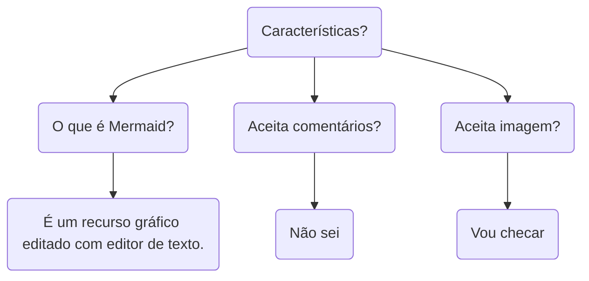
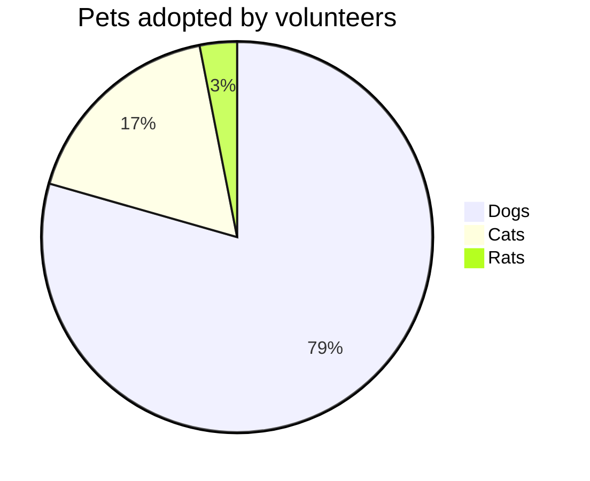

  
 

  
<main>

# Editor de diagrama, fluxogramas e vários tipos de gráficos mermaid em markdown

## Exemplos graph TD

## Exemplos pie

## Referências

1. [Mermaid Live](https://mermaid.live/edit#pako:eNp10VFrwyAQB_CvIvfc9APkrUQZgXUZJi0UfHF6XYUkFqeFEfPdZ5aErR3zzeN3_5NzAGU1Qg7oqJHvTnaiJ-kUh7qp9oyTMW63cSCUPZdHxk_ZjlLO6prk5CI_HmyMWWYHUnGaLjm5tlLhP6Z8OVZlwZIS0Br51iI5Wydg1n-mPSQ7VGhua_aaNaH4g5S9oVvIXPsNsrJh-6RMr9qg16hXXtFD0WTFrmFPFT-tLUv9O7X30vT3_u59a7IA6zQ61GmGANhAh66TRqdlD1O3AH_BDgVMVONZhtZPCxgTlcHb-rNXkHsXcAPhqqXH5Yfm4vgFrhOHgA)
2. [Github Mermaid](https://github.com/mermaid-js/mermaid)
3. [How to add Mermaid (Markdown) Plugin in Visual Studio Code](https://www.youtube.com/watch?v=p4lk9o5WDeY)
4. [Como criar diagramas como código com Mermaid, GitHub e Visual Studio Code](https://www.freecodecamp.org/news/diagrams-as-code-with-mermaid-github-and-vs-code/)

</main>

[🔝🔝](#topo "Retorna ao topo")