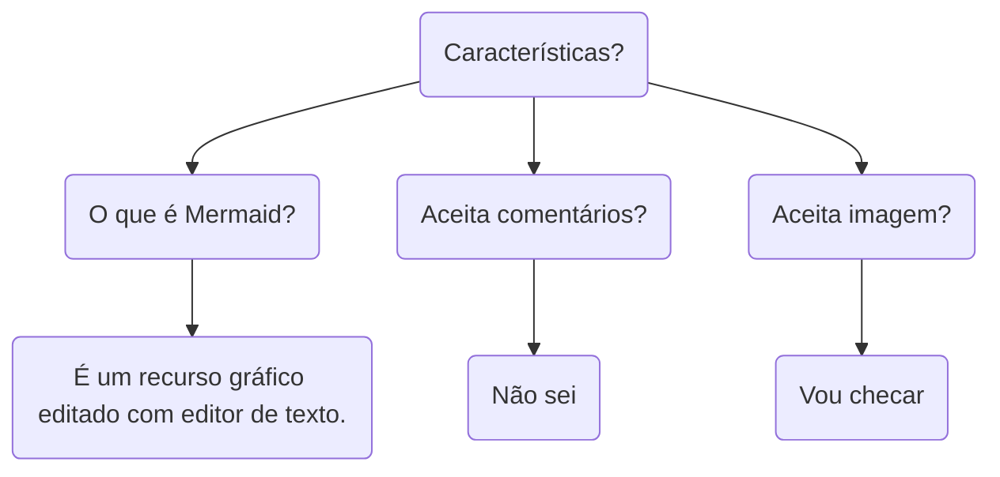

<!-- 

  
 

  
<main>
 -->

# teste markdown

```mermaid

graph TD;
    A(Características?)-->B(O que é Mermaid?);    
    A(Características?)-->C(Aceita comentários?); 
    A(Características?)-->D(Aceita imagem?); 

    B-->f1(É um recurso gráfico editado com editor de texto.);
    C-->f2(Não sei)
    D-->f3(Vou checar) 

    
```

<!-- </main>

[🔝🔝](#topo "Retorna ao topo") -->