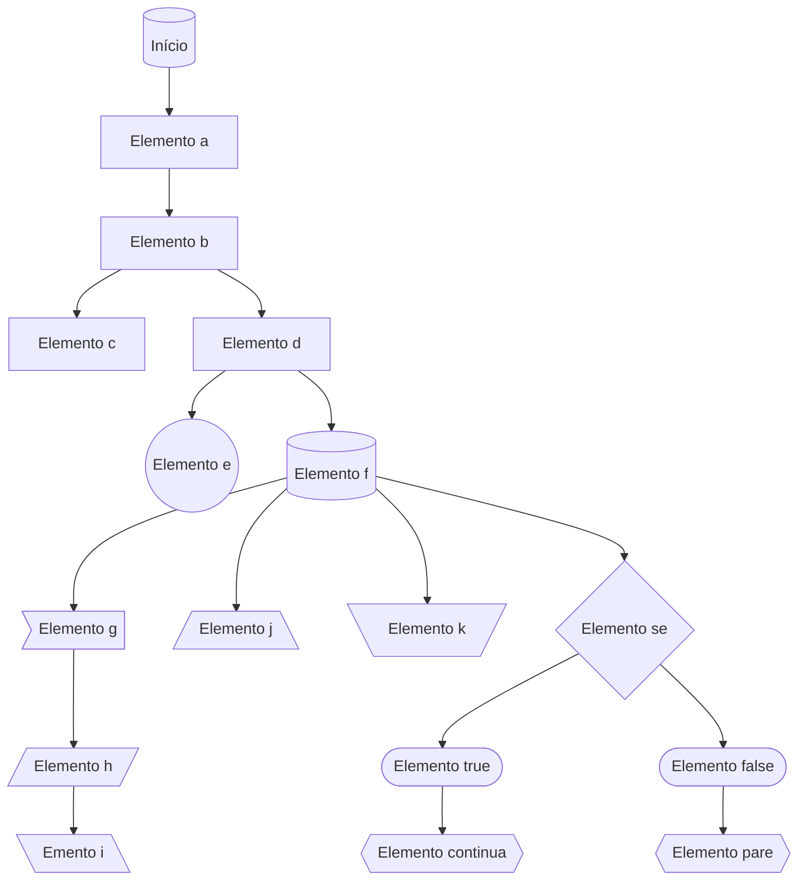

# [Mermaid flowchart](https://mermaid-js.github.io/mermaid/#/flowchart?id=graph)

graph TD - vertical

```mermaid

graph TD
    Start[(Início)] --> a[Elemento a]
    a --> b[Elemento b]
    b --> c[Elemento c]
    b --> d[Elemento d]
    d --> e((Elemento e))
    d --> f[(Elemento f)]
    f --> g>Elemento g]
    g --> h[/Elemento h/]
    h --> i[\Emento i\] 
    f --> j[/Elemento j\] 
    f --> k[\Elemento k/]
    f --> se{Elemento se}
    se --> true([Elemento true])   
    se --> false([Elemento false])   
    true --> continua{{Elemento continua}}
    false --> pare{{Elemento pare}}
    click b href "https://mermaid-js.github.io/mermaid/#/flowchart?id=interaction" "Titulo do link" _blank
    
   
```
