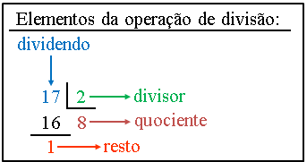

# <span id="topo"><span>Exemplo de Calculadora com TypeScript <a href="Calculator.html" target="_blank" title="Pressione aqui para expandir este documento em nova aba." >  ➚ </a>

## **1. INDEX**

---

   1. **Introdução**

      1. [Objetivo.](#id_objetivo)
      2. [Pre-requisitos.](#id_pre_requisitos)
      3. [benefícios.](#id_beneficios)

   2. [**Descrição.**](#id_Descricao)

   3. [**Exemplos.**](#id_exemplos)

   4. [**Conteúdo01**](#id_Conteudo01)

   5. [**Referências.**](#id_referencias)

   6. [**Histórico.**](#id_historico)

## **2. CONTEÚDO**

---

   1. **Introdução**

      1. <span id="id_objetivo"><span>**Objetivo:**
         1. Este documento tem como objetivo descrever todos os comandos typescript necessários para criar uma calculadora.

         2. <text onclick="goBack()">[🔙]</text>

      2. <span id="id_pre_requisitos"></span>**Pre-requisitos:**
         1. Programas abaixo devem estar instalados e configurados:
            1. nodejs;
            2. Vscode;
            3. Compilador typescript.
            4. tsc-init
         2. .

         3. <text onclick="goBack()">[🔙]</text>

      3. <span id="id_beneficios"></span>**Benefícios:**
         1. Aprender os comandos da linguagem typescript.

         2. <text onclick="goBack()">[🔙]</text>

   2. <span id=id_Descricao></span>**Descrição**
      1. Este documentos descreve todos os comandos usados para criar o módulo Calculator com seus respectivos exemplos.

      2. [**Operadores aritméticos**](https://developer.mozilla.org/pt-BR/docs/Web/JavaScript/Guide/Expressions_and_Operators#operadores_aritmeticos) tomam valores numéricos (sejam literais ou variáveis) como seus operandos e retornam um único valor numérico.

         1. [Aplicando os operadores aditivos aos números](https://262.ecma-international.org/6.0/#sec-applying-the-additive-operators-to-numbers)

            1. **Subtração (  \-  )**:
               1. Código exemplo:

                  ```typescript
                     var i :number = 10;
                     console.log(i-1);
                     //Imprime 9 no console
                  ```

            2. **Adição (  +  )**:
               1. Código exemplo:

                  ```typescript
                     var i :number = 10;
                     console.log(i+1);
                     //Imprime 11 no console
                  ```

            3. **Incremento (  ++  )**: Operador unário. Adiciona um ao seu operando. Se usado como operador prefixado (++x), retorna o valor de seu operando após a adição. Se usado como operador pós fixado (x++), retorna o valor de seu operando antes da adição.
               1. Código exemplo:

                  ```typescript
                     //Retorna o valor de seu operando após a adição
                     var i :number = 10;
                     console.log(  ++i );
                     //Imprime 11 no console

                     //Retorna o valor do operando antes da adição
                     var i :number = 10;
                     console.log(  i );
                     //Imprime 10 no console
                     console.log(  i++ );
                     //Imprime 10 no console
                  ```

            4. **Decremento (  --  )**: Operador unário. Subtrai um de seu operando. O valor de retorno é análogo àquele do operador de incremento.
               1. Código exemplo:

                  ```typescript
                     //Retorna o valor de seu operando após a subtração
                     var i :number = 10;
                     console.log(  --i );
                     //Imprime 9 no console

                     //Retorna o valor do operando antes da subtração
                     var i :number = 10;
                     console.log(  i );
                     //Imprime 10 no console
                     console.log(  i-- );
                     //Imprime 10 no console                     
                  ```

            5. **Negação (  -  )** : Operador unário. Retorna a negação de seu operando. Se x é 10, então -x retorna -10.
               1. Código exemplo:

                  ```typescript
                     var x :number = 10;
                     console.log(  -x );
                     //Imprime -10 no console
                  ```

            6. **Adição (  +  )** : Operador unário. Tenta converter o operando em um número, sempre que possível.
               1. Código exemplo:

                  ```typescript
                     console.log(+"3");
                     //Imprime 3 no console

                     console.log(+true);
                     //Imprime 1 no console
                  ```

         2. [Operadores multiplicativos:](https://262.ecma-international.org/6.0/#sec-multiplicative-operators)

            1. **Multiplicação (  *  )**:
               1. Código exemplo:

                  ```typescript
                     var x :number = 10;
                     console.log(  x * 3 );
                     //Imprime 30 no console
                  ```

            2. **Divisão (  /  )**: 
               1. Código exemplo:

                  ```typescript
                     var x :number = 17;
                     console.log(  x / 2 );
                     //Imprime 8,5 no console
                  ```

            3. [**Módulo — resto da divisão (  %  )**:](https://262.ecma-international.org/6.0/#sec-applying-the-mod-operator) é um operador binário. Retorna o inteiro restante da divisão dos dois operandos.
               1. Código exemplo:

                  ```typescript
                     var x :number = 17;
                     console.log(  x % 2 );
                     //Imprime 1 no console
                  ```

            4. **Exponenciação (  \*\*  )**: Calcula a base elevada á potência do expoente.
               1. Código exemplo:

                  ```typescript
                     var x :number = 10;
                     console.log(  x ** 3 );
                     //Imprime 1000 no console

                     console.log(  x ** -1 );
                     //Imprime 0,1 no console
                  ```

         3. Referência: [TypeScript: operadores aritméticos](https://medium.com/typescript/typescript-operadores-aritm%C3%A9ticos-20b28a1752d9)

      3. [**Operadores de comparação**](https://developer.mozilla.org/pt-BR/docs/Web/JavaScript/Guide/Expressions_and_Operators#operador_comparacao) compara seus operandos e retorna um valor lógico baseado em se a comparação é verdadeira. Os operandos podem ser numéricos, strings, lógicos ou objetos. Strings são comparadas com base em ordenação lexográfica utilizando valores Unicode. Na maioria dos casos, se dois operandos não são do mesmo tipo, o JavaScript tenta convertê-los para um tipo apropriado. Isto geralmente resulta na realização de uma comparação numérica. As únicas exceções a esta regra são os operadores === e o !==, que realizam comparações de igualdade e desigualdade "estritas". Estes operadores não tentam converter os operandos em tipos compatíveis antes de verificar a igualdade.

         1. **Igual (  ==  )**: Retorna verdadeiro caso os operandos sejam iguais.
            1. Código exemplo:

                  ```typescript
                     var x :number = 10;
                     console.log(  x == 3 );
                     //Imprime false no console

                     console.log(  x == 10 );
                     //Imprime true no console

                     var y :string = '10';
                     console.log(  y == 10 );
                     // A expressão console.log(  y == 10 ) vai gerar erro de sintaxe no type script e não compila.
                     
                  ```

         2. **Não igual (  !=  )**: Retorna verdadeiro caso os operandos não sejam iguais.
            1. Código exemplo:

               ```typescript
                  var x :number = 10;
                  console.log(  x != 3 );
                  //Imprime true no console

                  console.log(  x != 10 );
                  //Imprime false no console                   
                  ```

         3. **Estritamente igual (  ===  )**:Retorna verdadeiro caso os operandos sejam iguais e do mesmo tipo. Veja também [**Object.is**](https://developer.mozilla.org/pt-BR/docs/Web/JavaScript/Reference/Global_Objects/Object/is) e **igualdade em JS**.
            1. Código exemplo:

               ```typescript
                  var x :any = 10;
                  console.log(  x === 10 );
                  //Imprime true no console

                  var x: any = 10;
                  console.log(x === "10");
                  //Imprime false no console porque são tipos diferentes                 
               ```

         4. **Estritamente não igual (  !==  )**: Retorna verdadeiro caso os operandos não sejam iguais e/ou não sejam do mesmo tipo.
            1. Código exemplo:

               ```typescript
                  var x :any = 10;
                  console.log(  x !== 10 );
                  //Imprime false no console porque o número e o tipo é igual.

                  var x: any = 10;
                  console.log(x !== "10");
                  //Imprime true no console porque o número é igual mais o tipos diferentes.               
               ```

         5. **Maior que (  >  )**: Retorna verdadeiro caso o operando da esquerda seja maior que o da direita.
            1. Código exemplo:

               ```typescript
                  var x :number = 17;
                  console.log(  x > 24 );
                  //Imprime false no console porque 17 é menor que 24.
               ```

         6. **Maior que ou igual (  >=  )**: Retorna verdadeiro caso o operando da esquerda seja maior ou igual ao da direita.
            1. Código exemplo:

               ```typescript
                  var x :number = 17;
                  console.log(  x >= 17 );
                  //Imprime true no console porque 17 é igual a 17.
               ```

         7. **Menor que (  <  )**: Retorna verdadeiro caso o operando da esquerda seja menor que o da direita.
            1. Código exemplo:

               ```typescript
                  var x :number = 17;
                  console.log(  x < 17 );
                  //Imprime false no console porque 17 é igual a 17.
               ```

         8. **Menor que ou igual (  <=  )**: Retorna verdadeiro caso o operando da esquerda seja menor ou igual ao da direita.
            1. Código exemplo:

               ```typescript
                  var x :number = 17;
                  console.log(  x <= 17 );
                  //Imprime true no console porque 17 é igual a 17.
               ```

         9. **Indicador de arrow function (  =>  )**: não é um operador, mas a notação para função seta.
            1. Código exemplo:

               ```typescript
                  var x :number = 17;

                  // Arrow function = função seta.
                  var function_arrow = (ax:number) => {  return ax+1;}
                  console.log(function_arrow(x));                  
                  //Imprime 18 no console.              
               ```

      4. [**Operadores bit a bit**](https://developer.mozilla.org/pt-BR/docs/Web/JavaScript/Guide/Expressions_and_Operators#operadores_bit_a_bit) tratam seus operandos como um conjunto de 32 bits (zeros e uns), em vez de tratá-los como números decimais, hexadecimais ou octais.

         1. Operador **( AND  )** retorna um 1 para cada posição em que os bits da posição correspondente de ambos operandos sejam uns.
            1. A expressão  (a & b).

         2. Operador **( OR  )** retorna um 0 para cada posição em que os bits da posição correspondente de  ambos os operandos sejam zeros.
            1. Expressão **(a | b)**.
         3. Operador **( XOR  )**  retorna um 0 para cada posição em que os bits da posição correspondente são os mesmos e retorna um 1 para cada posição em que os bits da posição correspondente sejam diferentes.
            1. Expressão **(a ^ b)**
         4. Operador **( NOT  )** inverte os bits do operando.
            1. Expressão **(~ a)**
         5. Operador **( <<  )** desloca _**a**_ em representação binária _**b**_ bits à esquerda, preenchendo com zeros à direita.
            1. Expressão **(a << b)**
         6. Operador **( >>  )** Deslocamento à direita com propagação de sinal. Desloca _**a**_ em representação binária _**b**_ bits à direita, descartando bits excedentes.
            1. Expressão **(a >> b)**
         7. Operador **( >>>  )** deslocamento à direita com preenchimento zero. Desloca _**a**_ em representação binária _**b**_ bits à direita, descartando bits excedentes e preenchendo com zeros à esquerda.
            1. Expressão **(a >>> b)**
      5. [**Operadores lógicos**](https://developer.mozilla.org/pt-BR/docs/Web/JavaScript/Guide/Expressions_and_Operators#operadores_logicos)
         1. Operador AND lógico (&&) (E lógico) - Retorna _**expr1**_ caso possa ser convertido para falso; senão, retorna _**expr2**_. Assim, quando utilizado com valores booleanos, _**&&**_ retorna verdadeiro caso ambos operandos sejam verdadeiros; caso contrário, retorna falso.
            1. Expressão **(expr1 && expr2)**
         2. Operador OU lógico (||) (OU lógico) -  Retorna _**expr1**_ caso possa ser convertido para verdadeiro; senão, retorna _**expr2**_. Assim, quando utilizado com valores booleanos, _**||**_ retorna verdadeiro caso ambos os operandos sejam verdadeiro; se ambos forem falsos, retorna _**falso**_ .
            1. Expressão **(expr1 || expr2)**.
         3. Operador NOT lógico (!) (Negação lógica) Retorna _**falso**_ caso o único operando possa ser convertido para verdadeiro; senão, retorna verdadeiro.
            1. Expressão **(!expr)**.
      6. [**Operador condicional (ternário)**](https://developer.mozilla.org/pt-BR/docs/Web/JavaScript/Guide/Expressions_and_Operators#operador_condicional_tern%C3%A1rio) o operador condicional (  **?**  ) é o único operador JavaScript que utiliza três operandos. O operador pode ter um de dois valores baseados em uma condição. A sintaxe é:
         1. Expressão **(condição ? valor1 : valor2)**
            1. Se condição for verdadeira, o operador terá o valor de _**valor1**_. Caso contrário, terá o valor de _**valor2**_. Você pode utilizar o operador condicional em qualquer lugar onde utilizaria um operador padrão.
            2. Código javascript:

               ```typescript

                  var status = (idade >= 18) ? "adulto" : "menor de idade";

               ```

      7. [O operador vírgula (  **,**  )](https://js.plainenglish.io/comma-operator-in-javascript-cfe170f5b4d3)  é operador quando atua sobre duas expressões (exp1,exp2), onde expressão é algo que envolve outros operadores, variáveis ​​e funções.
         1. Exemplo 01:
            1. Código typescript

               ```typescript

                  const map = {[1 << 0]: "Batman",
                               [1 << 1]: "Superman",
                               [1 << 2]: "Flash",
                  };
                  console.log(map);
                  // { '1': 'Batman', '2': 'Superman', '4': 'Flash' }

                  var x = 0, y = 0, z = 0;
                  console.log(x, y, z);

                  const r = { min: 100, max: 200 };
                  console.log(r);

                  //objetos de desestruturação:
                  const { min, max } = { min: 0, max: 100 };
                  console.log({ min, max });

                  //elementos de lista em literais de matriz:
                  const matriz = [2, 4, 8, 10, 20, 32];
                  for (var i = 0; i < matriz.length; i++) console.log(matriz[i]);

                  //definir vários parâmetros de função:
                  function multiply(a: number, b: number) {
                  return a * b;
                  }

                  //chame uma função com vários argumentos:
                  console.log(multiply(2, 6));

                  //importe vários membros do módulo:
                  import { open, close } from "fs";


               ```

      8. .

      9.  
      10. ,
      11. ;
      12. :
      13. !==
      14. ()
      15. [].indexOf()
      16. {}
      17. &&
      18. `
      19. <=
      20. >=
      21. ${}
      22. case
      23. class
      24. console.log
      25. else
      26. Error
      27. export
      28. function
      29. if
      30. is
      31. new
      32. number
      33. private
      34. protected
      35. public
      36. return
      37. string
      38. switch
      39. this
      40. throw
      41. undefined

      42. <text onclick="goBack()">[🔙]</text>

   3. <span id=id_exemplos></span>**Exemplos.**
      1. Calculadora:
          1. Código typescript

            ```typescript

               export class Calculator {
               private current = 0;
               private memory = 0;
               private operator: string;
               protected processDigit(digit: string, currentValue: number) {
                     if (digit >= "0" && digit <= "9") {
                     return currentValue * 10 + (digit.charCodeAt(0) - "0".charCodeAt(0));
                     }
               }
               protected processOperator(operator: string) {
                     if (["+", "-", "*", "/"].indexOf(operator) >= 0) {
                     return operator;
                     }
               }
               protected evaluateOperator(
                     operator: string,
                     left: number,
                     right: number
               ): number {
                     switch (this.operator) {
                     case "+":
                        return left + right;
                     case "-":
                        return left - right;
                     case "*":
                        return left * right;
                     case "/":
                        return left / right;
                     }
               }
               private evaluate() {
                     if (this.operator) {
                     this.memory = this.evaluateOperator(
                        this.operator,
                        this.memory,
                        this.current
                     );
                     } else {
                     this.memory = this.current;
                     }
                     this.current = 0;
               }
               public handleChar(char: string) {
                     if (char === "=") {
                     this.evaluate();
                     return;
                     } else {
                     let value = this.processDigit(char, this.current);
                     if (value !== undefined) {
                        this.current = value;
                        return;
                     } else {
                        let value = this.processOperator(char);
                        if (value !== undefined) {
                        this.evaluate();
                        this.operator = value;
                        return;
                        }
                     }
                     }
                     throw new Error(`Unsupported input: '${char}'`);
               }
               public getResult() {
                     return this.memory;
               }
               }
               export function test(c: Calculator, input: string) {
               for (let i = 0; i < input.length; i++) {
                     c.handleChar(input[i]);
               }
               console.log(`result of '${input}' is '${c.getResult()}'`);
               }


            ```

      2. item 02.

      3. <text onclick="goBack()">[🔙]</text>

   4. <span id=id_Conteudo01></span>**Conteúdo01**
      1. item 01.
      2. item 02.

      3. <text onclick="goBack()">[🔙]</text>

   5. <span id=id_referencias></span>**REFERÊNCIAS**
      1. [TypeScript - Arrays](https://www.tutorialspoint.com/typescript/typescript_arrays.htm)
      2. [Palavras reservadas](https://bleepcoder.com/pt/react-spaces/64889300/list-of-reserved-keywords)
      3. [Expressions and operators by category](https://developer.mozilla.org/en-US/docs/Web/JavaScript/Reference/Operators#(Bitwise_AND))
      4. [#](##)
      5. [#](##)
      6. [#](##)
      7. [#](##)

      8. <text onclick="goBack()">[🔙]</text>

   6. <span id="id_historico"><span>**HISTÓRICO**

      1. 24/02/2021 <!--TODO: HISTÓRICO -->
         - [x] Criar este documento baseado no Calculator.md ;
         - [x] Escrever tópico Objetivos;
         - [x] Escrever tópico Pre-requisitos
         - [x] Escrever tópico Benefícios

         - <text onclick="goBack()">[🔙]</text>

      2. 25/02/2021 <!--FIXME: Falta fazer os item abaixo: -->
         - [ ] Escrever tópico Descrição
         - [ ] Escrever tópico Conteúdo 02
         - [ ] Escrever tópico Referências
         - [ ] Atualizar o histórico deste documento.
         - [ ] Ler no dia seguinte este documento para checar os erros de português.

         - <text onclick="goBack()">[🔙]</text>

[🔝🔝](#topo "Retorna ao topo")

 <script>    function goBack() {    window.history.back()}</script>
