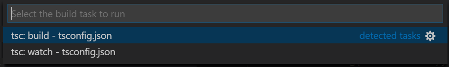

# <span id="topo"><span>Como instalar typescript no vscode<a href="instalar.html" target="_blank" title="Pressione aqui para expandir este documento em nova aba." >↵</a><a href="instalar.pdf" target="_blank" title="Pressione aqui para visualizar o PDF deste documento em nova aba.">℘</a>

 <!-- <details>
   <summary><b>1. INDEX </b></summary> -->

   1. **Introdução**

      1. [Objetivo.](#id_objetivo)
      2. [Pre-requisitos.](#id_pre_requisitos)
      3. [benefícios.](#id_beneficios)

   2. **Instalar**
      1. [Instalar o pacote NPM](#id_Instalar_npm)
      2. [Instalar o compilador TypeScript.](#id_Instalar_typescript)
      3. [Instalação do pacote npx](#id_Instalar_npx)
      4. [Instalação do pacote webpack](#id_webpack)
      5. [Instalar a ferramenta tsc-init](#id_tsc_init)
      6. [Instalar a ferramenta Eslint](#id_Eslint)
      7. [Instalar a ferramenta TypeDoc](#id_TypeDoc)
      8. [Instalar extensões vscode.](#id_Instalar_extensoes)
      9. [Instalar extensão better-comments](https://marketplace.visualstudio.com/items?itemName=aaron-bond.better-comments)
      10. [Instalar extensão codeMap = Visualizar classes](https://marketplace.visualstudio.com/items?itemName=oleg-shilo.codemap)
      11. [Auto Import](https://marketplace.visualstudio.com/items?itemName=steoates.autoimport)

   3. [**Configurar o compilador TypeScript**](#id_configurar)
      1. [Arquivo tsconfig.json](#id_tsconfig_json)
      2. [Compilador versus serviço de linguagem](#id_versoes_diferentes)
      3. [Como configurar compilador tsc (typescript) para executar e depurar com vscode?](#id_compilar_com_vscode)
         1. [Configuração do arquivo tsconfig.json](#id_cfg_tsconfig_json);
         2. [Configuração do arquivo tasks.json](#id_cfg_tasks)
         3. [Teclas de atalho do vscode](#id_teclasDeAtalhoVscode).

   4. [**Exemplos.**](#id_exemplos)

   5. [**Referências.**](#id_referencias)

   6. [**Histórico.**](#id_historico)

 <!-- </details>   -->

---

## **2. CONTEÚDO**

   1. **Introdução**

      1. <span id="id_objetivo"><span>**Objetivo:**
         1. Este documento descreve como instalar e configurar typescript no vscode.

         2. <text onclick="goBack()">[🔙]</text>

      2. <span id="id_pre_requisitos"></span>**Pre-requisitos:**
         1. VsCode precisa estar instalado e configurado o básico.
         2. Familiaridade com ide vscode.
         3. Nodejs precisa estar instalado e configurado.
         4. Conhecimento da linguagem typescript.
         5. Conhecimento da linguagem javascript.

         6. <text onclick="goBack()">[🔙]</text>

      3. <span id="id_beneficios"></span>**Benefícios:**
         1. Typescript permite criar código javascript isento de erros de sintaxe.

         2. <text onclick="goBack()">[🔙]</text>

   2. **Instalar**
      1. <span id=id_Instalar_npm></span>**Instalar gerenciador de pacotes npm**
         1. O programa [**npm**](https://nodejs.org/en/knowledge/getting-started/npm/what-is-npm/) é um gerenciador de pacotes do nodejs.

            ```sh

              #!/bin/sh
              # instalação global
              sudo apt install npm

            ```

      2. <span id=id_Instalar_typescript></span>**Instalar o compilador TypeScript**
         1. O Visual Studio Code inclui suporte à linguagem TypeScript, mas não inclui o compilador TypeScript **tsc**,. Você precisará instalar o compilador TypeScript globalmente ou em seu espaço de trabalho para transpilar o código-fonte do TypeScript para JavaScript ( **tsc HelloWorld.ts**).
            1. A maneira mais fácil de instalar typescript é através [**npm**](https://www.npmjs.com/)(Node.js Package Manager).
            2. Se você tiver o [**npm**](https://www.npmjs.com/) instalado, poderá instalar o TypeScript globalmente  (**opção -g**) em seu computador:
               1. ShellScript

                  ```sh
                     #!/bin/sh
                     // instalação global
                     sudo npm install -g typescript

                  ```

            3. <text onclick="goBack()">[🔙]</text>

         2. <span id=id_Instalar_npx></span>**Instalação do pacote** [**npx**](https://www.npmjs.com/package/npx)
            1. O programa [npx](https://www.npmjs.com/package/npx) executa programas da pasta local **node_modules/.bin** ou central, instalando todos os pacotes necessários para que o programa funcione.

            2. O npx é um package runner do NPM. Ele executa as bibliotecas que podem ser baixadas do site npmjs. Essas bibliotecas ficam em um banco de dados chamado NPM Registry, que também podem ser baixadas via CLI com npm ou yarn e com npx. [Veja mais...](https://blog.rocketseat.com.br/conhecendo-o-npx-executor-de-pacote-do-npm/).

            3. Código ShellScript

               ```sh

                  #!/bin/sh
                  sudo npm install -g npx

               ```

            4. <text onclick="goBack()">[🔙]</text>

         3. <span id=id_webpack></span>**Instalação do pacote** [**webpack**](https://webpack.js.org/guides/getting-started/).
            1. webpack é usado para compilar módulos JavaScript. Depois de instalado , você pode interagir com o webpack a partir de sua [CLI](https://webpack.js.org/api/cli/) ou [API](https://webpack.js.org/api/node/).

            2. Código ShellScript para instalação global:

               ```ShellScript
                  sudo npm install -g webpack
               ```

            3. Código ShellScript para instalação local por projeto:

               ```sh
                  #!/bin/sh   
                  mkdir webpack-demo // cria pasta do novo projeto
                  cd webpack-demo    // move-se para a pasta no novo projeto
                  npm init           // Cria o arquivo package.json do projeto.
                  npm install webpack webpack-cli --save-dev
               ```

            4. <text onclick="goBack()">[🔙]</text>

         4. <span id=id_tsc_init></span>
         **Instalar a ferramenta tsc-init**.
            1. O programa [**tsc-init**](https://www.npmjs.com/package/tsc-init) é uma ferramenta para inicializar TypeScript e [Webpack](https://en.wikipedia.org/wiki/Webpack) em seu projeto. Veja [webpack getting-started](https://webpack.js.org/guides/getting-started/).

            2. Código ShellScript para instalação global:

               ```ShellScript
                  npm install tsc-init -g
               ```

            3. Código ShellScript para instalação local por projeto:

               ```ShellScript
                  npm install tsc-init
               ```

            4. O programa **tsc-init** executa os seguintes comandos na pasta raiz do projeto:
               1. Execute [npm init](https://docs.npmjs.com/cli/v6/commands/npm-init) para criar o arquivo package.json;

               2. Execute [tsc --init](https://www.npmjs.com/package/tsc-init) para criar um arquivo tsconfig.json;

               3. Adicionar [webpack](https://webpack.js.org/), [ts-loader](https://github.com/TypeStrong/ts-loader) e TypeScript como dependências de desenvolvimento;
                  1. [Webpack - Curso rápido para iniciante](https://www.youtube.com/watch?v=sU3W2ZTt-8I)

               4. Adicione [Karma](http://karma-runner.github.io/6.1/intro/how-it-works.html), [karma-jasmine](https://www.npmjs.com/package/karma-jasmine), [Karma-webpack](https://www.npmjs.com/package/karma-webpack) como dependências de desenvolvimento;

               5. Crie um arquivo [webpack.config.js](https://webpack.js.org/configuration/) para incluir [ts-loader](https://github.com/TypeStrong/ts-loader);

               6. Crie um arquivo [karma.conf.js](http://karma-runner.github.io/6.1/config/configuration-file.html);

               7. Crie um arquivo [.gitignore](https://git-scm.com/docs/gitignore);

               8. Execute [git init](https://git-scm.com/docs/git-init);

               9. Adicione scripts [npm](https://docs.npmjs.com/cli/v7/commands/npm) para construir e agrupar;

            5. <text onclick="goBack()">[🔙]</text>

         1. <span id=id_Eslint></span>**Instalar a ferramenta** [**ESlint**](https://eslint.org/docs/user-guide/getting-started):
            1. O ESLint é uma ferramenta para identificar e relatar os padrões encontrados no código ECMAScript/JavaScript, com o objetivo de tornar o código mais consistente e evitar bugs.

            2. Código ShellScript para instalação local:

               ```ShellScript

                     npm install --save-dev eslint 
                     npm install --save-dev @typescript-eslint/parser
                     npm install --save-dev @typescript-eslint/eslint-plugin

               ```

            3. Veja como usar ESLint com TypeScript...
               1. [Configurando ESLint](https://eslint.org/docs/user-guide/configuring/)
               2. [Familiarize-se com as opções de linha de comando.](https://eslint.org/docs/user-guide/command-line-interface)
               3. [Integração do ESLint com editores de textos.](https://eslint.org/docs/user-guide/integrations)
               4. [Como usar ESLint com TypeScript](https://khalilstemmler.com/blogs/typescript/eslint-for-typescript/#:~:text=ESLint%20is%20a%20JavaScript%20linter%20that%20enables%20you%20to%20enforce,of%20TSLint%2C%20the%20TypeScript%20equivalent.)

            4. <text onclick="goBack()">[🔙]</text>

         2. <span id=id_TypeDoc></span>**Instalar a ferramenta TypeDoc**
            1. O programa [TypeDoc](https://typedoc.org/guides/installation/) converte comentários do código-fonte TypeScript em documentação HTML renderizada ou um modelo JSON.
            2. Código ShellScript:

               ```ShellScript
                  # Install
                  npm install typedoc

                  # Execute typedoc on your project
                  npx typedoc src/index.ts

                  # Use os argumentos --out ou --json para definir o formato e o destino de sua documentação.
                  typedoc --out docs src/index.ts
               ```

            3. <text onclick="goBack()">[🔙]</text>
         3. .

         4. <text onclick="goBack()">[[🔙🔙]</text>

      3. <span id=id_Instalar_extensoes></span>**Extensões do vscode**.
         1. A extensão [ESLint](https://marketplace.visualstudio.com/items?itemName=dbaeumer.vscode-eslint) usa a biblioteca **ESLint** instalada na pasta da área de trabalho aberta. Se a pasta não fornecer um, a extensão procurará uma versão de instalação global. Se você não instalou o ESLint local ou globalmente, faça-o executando **npm install eslint** na pasta do espaço de trabalho para uma instalação local ou **npm install -g eslint** global.

         2. A extensão [Visual Studio IntelliCode](https://marketplace.visualstudio.com/items?itemName=VisualStudioExptTeam.vscodeintellicode) fornece recursos de desenvolvimento assistido por AI para desenvolvedores Python, TypeScript / JavaScript e Java no Visual Studio Code, com insights baseados na compreensão do contexto do código combinado com o aprendizado de máquina.

         3. A extensão [JavaScript (ES6) code snippets](https://marketplace.visualstudio.com/items?itemName=xabikos.JavaScriptSnippets) contém trechos de código para JavaScript na sintaxe ES6 para o editor de código Vs (suporta JavaScript e TypeScript).

         4. A extensão [TypeScript Importer](https://marketplace.visualstudio.com/items?itemName=pmneo.tsimporter) procura automaticamente por definições de TypeScript em arquivos de espaço de trabalho e fornece todos os símbolos conhecidos como itens de preenchimento para permitir o preenchimento de código.

         5. A extensão [Latest TypeScript and Javascript Grammar](https://marketplace.visualstudio.com/items?itemName=ms-vscode.typescript-javascript-grammar) é o ramo de desenvolvimento da colorização VSCode JS/TS. Projeto gitHub: <https://github.com/Microsoft/TypeScript-TmLanguage/issues>.

         6. A extensão [Paste JSON as Code](https://marketplace.visualstudio.com/items?itemName=quicktype.quicktype) Copy JSON, paste as Go, TypeScript, C#, C++ and more.

         7. A extensão [TSDoc Comment](https://marketplace.visualstudio.com/items?itemName=kingsimba.tsdoc-comment) é uma extensão para converter comentários simples no estilo C/C++ em comentários no estilo TSDoc

         8. <text onclick="goBack()">[🔙]</text>

   3. <span id=id_configurar></span>**Configurar o compilador TypeScript:**

      1. <span id=id_tsconfig_json></span>Arquivo [**tsconfig.json**](https://www.staging-typescript.org/tsconfig) na raiz do projeto é usado para customizar o comportamento padrão do compilador [**tsc**](https://www.typescriptlang.org/docs/handbook/compiler-options.html):
         1. Ter um arquivo [TSConfig](https://www.staging-typescript.org/tsconfig) em uma pasta indica que esta pasta é a raiz de um projeto TypeScript ou JavaScript. O arquivo [TSConfig](https://www.staging-typescript.org/tsconfig) pode ser um _tsconfig.json_ ou um _jsconfig.json_, os dois possuem o mesmo comportamento e as mesmas variáveis de configuração.
            1. Arquivo [**tsconfig.json**](https://www.staging-typescript.org/tsconfig) criado pelo comando ShellScript [**tsc --init**](https://www.npmjs.com/package/tsc-init):

               ```json
                  {
                     "compilerOptions"  : 
                     {
                        "target": "es6", 
                        "module": "commonjs",
                        "strict": true,
                        "esModuleInterop": true,   
                        "skipLibCheck": true, 
                        "forceConsistentCasingInFileNames": true,
                        "outDir": "out",
                        "sourceMap": true //Permite compilar e depurar com vscode
                     }
                  }     
               ```

            2. Opções:
               1. A propriedade [**"target": "es6"**](https://www.staging-typescript.org/tsconfig#target) informa ao **tsc** a sintaxe javascript a ser gerada. Obs: Se sua aplicação depende de browser mais antigo informe a sintaxe apropriada.

               2. A propriedade [**"module": "commonjs"**](https://www.staging-typescript.org/tsconfig#module) define o [sistema de módulo](https://www.staging-typescript.org/docs/handbook/modules.html) para o programa. Consulte a página de referência dos módulos para obter mais informações. Muito provavelmente você deseja "CommonJS" para projetos de nó.
                  1. Os módulos podem ser:
                     1. [ "CommonJS", "AMD", "System", "UMD", "ES6", "ES2015", "ES2020", "ESNext", "None" ]

               3. A propriedade [**"strict": true**](https://www.staging-typescript.org/tsconfig#strict) ative todas as opções de verificação de tipo restrita.

               4. A propriedade [**"esModuleInterop": true**](https://www.staging-typescript.org/tsconfig#esModuleInterop) permite a interoperabilidade de emissão entre o módulo **CommonJS** e o módulos **ES** por meio da criação de objetos de **namespace** para todas as importações. Implica **'allowSyntheticDefaultImports'**.

               5. A propriedade [**"skipLibCheck": true**](https://www.staging-typescript.org/tsconfig#skipLibCheck), ignora a verificação de tipo de arquivos de declaração.

               6. A propriedade [**"forceConsistentCasingInFileNames": true**](https://www.staging-typescript.org/tsconfig#forceConsistentCasingInFileNames) proibi referências com capitalização inconsistente para o mesmo arquivo.

               7. A propriedade [**"outDir": "out"**](https://www.staging-typescript.org/tsconfig#outDir) informa a pasta de saída dos arquivos .js.

               8. A propriedade [**"sourceMap": true**](https://www.typescriptlang.org/tsconfig#sourceMap) permite a geração de arquivos **sourcemap**. Esses arquivos permitem que os depuradores e outras ferramentas exibam o **código-fonte TypeScript original** ao trabalhar realmente com os arquivos JavaScript emitidos.
                  1. Arquivos de mapa de origem são emitidos como .js.map(ou .jsx.map) arquivos próximos ao .js arquivo de saída correspondente.
                  2. Agora, ao criar um .ts arquivo como parte do projeto, ofereceremos experiências de edição e validação de sintaxe ricas
                  3. **ATENÇÃO: Após incluir essa propriedade no arquivo tsconfig.json o Vscode passa a compilar e depurar um arquivo com extensão .ts.**

            3. Por padrão, o TypeScript inclui todos os [_*.ts_](https://www.staging-typescript.org/tsconfig#Project_Files_0) arquivos na pasta e subpastas atuais se as propriedades [outDir](https://www.staging-typescript.org/tsconfig#outDir), [outfile](https://www.staging-typescript.org/tsconfig#outFile), [files](https://www.staging-typescript.org/tsconfig#files), [extends](https://www.staging-typescript.org/tsconfig#extends), [include](https://www.staging-typescript.org/tsconfig#include), [references](https://www.staging-typescript.org/docs/handbook/project-references.html) e  [exclude](https://www.staging-typescript.org/tsconfig#exclude),   não forem incluídas no arquivo [**tsconfig.json**](https://www.staging-typescript.org/tsconfig).

            4. A forma mais prática para criar o arquivo [**tsconfig.json**](https://www.staging-typescript.org/tsconfig) é executar o código abaixo:
               1. Código ShellScript

                  ```ShellScript

                     tsc --init

                  ```

            5. Agora, para construir a partir do terminal, você pode simplesmente digitar **tsc** e o compilador TypeScript saberá olhar [**tsconfig.json**](https://www.staging-typescript.org/tsconfig) para as configurações do seu projeto e opções do compilador e irá compilar o programa informado na propriedade [main](https://docs.npmjs.com/cli/v7/configuring-npm/package-json) do arquivo [package.js](https://docs.npmjs.com/cli/v7/configuring-npm/package-json).

      2. <span id=id_versoes_diferentes></span></span>**Compilador versus serviço de linguagem:**
         1. É importante ter em mente que o _serviço de linguagem TypeScript_ do VS Code é separado do _compilador TypeScript instalado_. Você pode ver a versão TypeScript do VS Code na barra de status ao abrir um arquivo TypeScript.
         2. Caso a versão do serviço de linguagem do vscode seja diferente da versão do comando "tsc --version" é necessário corrigir a diferença.
            1. O link ["Usando versões mais recentes do TypeScript"](https://code.visualstudio.com/docs/typescript/typescript-compiling#_using-newer-typescript-versions) encina como igualar as versões.

      3. <span id=id_compilar_com_vscode></span> **Como configurar compilador tsc (typescript) para executar e depurar com vscode**?.
         1. <span id=id_cfg_tsconfig_json></span>**Configuração do arquivo tsconfig.json**:
            1. Para permitir que o vscode (Visual Studio Code) compile e depure um arquivo **.ts** é necessário adicionar as propriedade **"outDir"** e **"sourceMap"** em **"compilerOptions"** do arquivo **tsconfig.json** conforme o código abaixo:
               1. Código json

                  ```json
                     {
                        "compilerOptions"  : 
                        {
                           "outDir": "out",  //Código compilado fica nesta pasta.
                           "sourceMap": true //Permite compilar e depurar com vscode
                        }
                     }
       
                  ```

         2. <span id=id_cfg_tasks></span> [**Configuração do arquivo tasks.json**](https://code.visualstudio.com/docs/editor/tasks)
            1. O vscode pode ser configurado para que ferramentas externas possam se executadas dentro do vscode e seus resultados são analisados pelo vscode.
            2. As tarefas específicas da área de trabalho ou pasta são configuradas a partir do arquivo _tasks.json_ na pasta _.vscode_ para uma área de trabalho.
            3. As extensões também podem contribuir com tarefas usando um [_Provedor de Tarefas_](https://code.visualstudio.com/api/extension-guides/task-provider) , e essas tarefas contribuídas podem adicionar configurações específicas do espaço de trabalho definidas no arquivo _tasks.json_.
            4. Enquanto que o _tasks.json_ permite que o usuário defina manualmente uma tarefa para uma pasta ou área de trabalho específica o [Provedor de Tarefas](https://code.visualstudio.com/api/extension-guides/task-provider) pode detectar detalhes sobre uma área de trabalho e então criar automaticamente uma Tarefa de Código VS correspondente.
            5. **Observação**:
               1. o suporte a tarefas está disponível apenas ao trabalhar em uma pasta do espaço de trabalho. Não está disponível ao editar arquivos individuais.
            6. As tarefas podem ser executadas a partir da opção _/terminal/Run Task_ ou _/terminal/Run Build Task_. Obs: Tecla de atalho _Crtl + shift + B_.
               1. Exemplo de como compilar um projeto typescript:
                  1. Selecione a arquivo principal do projeto (ex: index.ts);
                  2. Selecione a opção _/terminal/Run Task_
                  3. Selecione a opção **build tsc -pasta/config.json** se o arquivo _tasks.json_ não tiver configurado para executar um programa em particular.
               2. Exemplo de como executar o programa gerado pela opção anterior:
                  1. Selecione a opção **/Run/Start Debugging** ou pressione na tecla f9.

         3. [Transpile TypeScript para JavaScript](https://code.visualstudio.com/docs/typescript/typescript-compiling#_transpile-typescript-into-javascript) usando vscode.
            1. O VS Code se integra com o tsc nosso executor de tarefas integrado . Podemos usar isso para transpilar .ts arquivos em .js arquivos. Outro benefício de usar as tarefas do VS Code é que você obtém a detecção integrada de erros e avisos exibida no painel Problemas . Vamos transpilar um programa simples do TypeScript Hello World.
               1. Etapa 1: Criar um arquivo TS simples
                  1. Abra o VS Code em uma pasta vazia e crie um helloworld.ts arquivo, coloque o seguinte código nesse arquivo:

                     ```typescript

                        let message: string = 'Hello World';
                        console.log(message);

                     ```

                  2. Para testar se você tem o compilador TypeScript tsc instalado corretamente e um programa Hello World em funcionamento, abra um terminal e digite tsc helloworld.ts. Você pode usar o Terminal Integrado ( Ctrl + ` ) diretamente no VS Code.
                  3. Agora você deve ver o helloworld.js arquivo JavaScript transpilado , que pode ser executado se o Node.js estiver instalado, digitando:

                   ```ShellScript

                        node helloworld.js

                     ```

               2. Etapa 2: Execute o build # do TypeScript
                  1. Execute Executar Tarefa de Compilação ( **Ctrl + Shift + B** ) no menu Terminal global . Se você criou um tsconfig.json arquivo na seção anterior, ele deve apresentar o seguinte seletor:
                     1. 

                  2. Selecione a entrada **tsc: build** . Isso produzirá um arquivo HelloWorld.jse HelloWorld.js.map na área de trabalho.

                  3. Se você selecionou **tsc: watch**, o compilador TypeScript observará as alterações em seus arquivos TypeScript e executará o transpilador em cada alteração.

                  4. Nos bastidores, executamos o compilador TypeScript como uma tarefa. O comando que usamos é:tsc -p .

               3. Etapa 3: Tornar o TypeScript Build o padrão:
                  1. Você também pode definir a tarefa de construção do TypeScript como a tarefa de construção padrão para que seja executada diretamente ao acionar Executar Tarefa de Construção ( Ctrl + Shift + B ).

                  2. Para fazer isso, selecione **Configure Default Build Task (Ctrl + Shift + P)** no menu global Terminal . Isso mostra um seletor com as tarefas de construção disponíveis. Selecione TypeScript tsc : build , que gera o seguinte tasks.json arquivo em uma .vscode pasta:

                     ```jsom

                        {
                           // See https://go.microsoft.com/fwlink/?LinkId=733558
                           // for the documentation about the tasks.json format
                           "version": "2.0.0",
                           "tasks": [
                              {
                                 "type": "typescript",
                                 "tsconfig": "tsconfig.json",
                                 "problemMatcher": [
                                    "$tsc"
                                 ],
                                 "group": {
                                    "kind": "build",
                                    "isDefault": true
                                 }
                              }
                           ]
                        }
                        

                     ```

                  3. Observe que a tarefa tem um **objeto JSON "group"** que define a tarefa  **"kind": "build"** e torna o padrão na propriedade  **"isDefault": true**. Agora, ao selecionar o comando Executar Tarefa de Compilação ou pressionar ( Ctrl + Shift + B ), você não será solicitado a selecionar uma tarefa e sua compilação será iniciada.

                  4. **ATENÇÃO:**
                     1. Toda vez que alterar o arquivo .ts é necessário pressionar as teclas ( Ctrl + Shift + B ) para compilar o arquivo .ts e transformar e .js.
                     2. Após compilar o arquivo as opções de execução e debug do vscode podem ser usadas sem problema.
                     3. O [Node.js tutorial in Visual Studio Code](https://code.visualstudio.com/docs/nodejs/nodejs-tutorial#_debugging-your-node-application) encina como debugar os programas.

                  5. Mais detalhes pode ser visto em: <https://code.visualstudio.com/docs/typescript/typescript-compiling>.

         4. <span id=id_teclasDeAtalhoVscode></span> **Teclas de atalho do vscode**
            1. ...
            2. ...

      4. <text onclick="goBack()">[🔙]</text>

   4. <span id=id_exemplos></span>**Exemplos.**
      1. Exemplo 01 - Usa o terminal de comandos para compilar.
         1. Crie um arquivo de nome helloworld.ts e adicione o seguinte código TypeScript:
            1. Código typescript:

               ```typescript

                  let message: string = 'Hello World';
                  console.log(message);

               ```

            2. Olhe o código TypeScript acima e observe a palavra **let** e **string** são da linguagem TypeScript e não pertence ao javascript.

            3. Para compilar o arquivo **helloworld.ts** selecione o [terminal integrado ( Ctrl + ` )](https://code.visualstudio.com/docs/editor/integrated-terminal)  do vscode e execute o código abaixo:
               1. Código ShellScript:

               ```ShellScript
                
                  //Obs: tsc é o compilador  typescript
                  tsc helloworld.ts

               ```

               1. O comando acima irá compilar e gerar o arquivo **helloworld.js**.
               2. Para executar o arquivo JavaScript **helloworld.js**, selecione o [terminal integrado ( Ctrl + ` )](https://code.visualstudio.com/docs/editor/integrated-terminal)  do vscode e execute o código abaixo:
                  1. Código ShellScript:

                     ```ShellScript

                        // node é o interpretador javascript 
                        node helloworld.js

                     ```

                  2. Se você abrir **helloworld.js**, verá que não é muito diferente de **helloworld.ts**. A informação de tipo foi removida e **let** agora é **var**..
                     1. Código javascript:

                        ```javascript

                           var message = 'Hello World';
                           console.log(message);

                        ```

            4. .

      2. ...

      3. <text onclick="goBack()">[🔙]</text>

   5. <span id=id_referencias></span>**REFERÊNCIAS**
      1. [Tutorial do TypeScript no Visual Studio Code](https://code.visualstudio.com/docs/typescript/typescript-tutorial)

      2. [Compilando TypeScript](https://code.visualstudio.com/docs/typescript/typescript-compiling)

      3. [ESlint](https://eslint.org/docs/user-guide/getting-started)

      4. [Configurando ESLint](https://eslint.org/docs/user-guide/configuring/)

      5. [Familiarize-se com as opções de linha de comando.](https://eslint.org/docs/user-guide/command-line-interface)

      6. [Integração do ESLint com editores de textos.](https://eslint.org/docs/user-guide/integrations)

      7. [Como usar ESLint com TypeScript](https://khalilstemmler.com/blogs/typescript/eslint-for-typescript/#:~:text=ESLint%20is%20a%20JavaScript%20linter%20that%20enables%20you%20to%20enforce,of%20TSLint%2C%20the%20TypeScript%20equivalent.)

      8. A Microsoft criou o padrão de documentação [TSDoc](https://tsdoc.org/) - para a  linguagem typescript com objetivo de que vários aplicativos possam gerar documentos do código em que a tag de um atrapalhe a tag de outro. É parecido com jsDoc.

      9. O projeto [api-extractor.com](https://api-extractor.com/pages/tsdoc/doc_comment_syntax/) é um gerador de site typescript que espera a sintaxe **TSDoc** nos comentários do projeto. Reconhece também a linguagem markdown.

      10. O projeto [jsdoc.app](https://jsdoc.app/index.html) é um gerador de documentos baseados nos comentários do código javascript e usa sintaxe **jsdoc** na qual o tsdoc foi estendido. O vídeo [jsdoc](https://www.youtube.com/watch?v=8lXOckWqd2M) descreve com muita clareza o uso do jsdoc.

      11. O projeto [docstrap.github.io](http://docstrap.github.io/docstrap/themes/cosmo/index.html) gera site baseado nos comentários dos arquivos javascript e espera a sintaxe do jsdoc. Para instalar siga os passos descritos [aqui](http://docstrap.github.io/docstrap/themes/cosmo/index.html).

      12. [Como usar os módulos do Node.js com o npm e o package.json](https://www.digitalocean.com/community/tutorials/how-to-use-node-js-modules-with-npm-and-package-json-pt)
      13. [Use TypeScript para construir uma API de nó com Express](https://developer.okta.com/blog/2018/11/15/node-express-typescript)
      14. [Node.js and TypeScript Tutorial: Build a CRUD API](https://auth0.com/blog/node-js-and-typescript-tutorial-build-a-crud-api/)

      15. <text onclick="goBack()">[🔙]</text>

   6. <span id="id_historico"><span>**HISTÓRICO**

      1. 19/02/2021 <!--TODO: HISTÓRICO -->
         - [x] Criar este documento baseado no modelo02.md ;
         - [x] Escrever tópico Objetivos;
         - [x] Escrever tópico Pre-requisitos
         - [x] Escrever tópico Benefícios
         - [x] Escrever tópico Instalar o compilador TypeScript
         - [x] Configurar o compilador TypeScript
           - [x] Arquivo tsconfig.json
           - [x] Compilador versus serviço de linguagem
           - [x] Como configurar compilador tsc (typescript) para executar e depurar com vscode?

         - <text onclick="goBack()">[🔙]</text>

      2. 22/02/2021
         - [x] Instalar extensões vscode.
         - [x] Escrever tópico Referências
         - [x] Atualizar o histórico deste documento.
         - [x] Adiciona no index as tags: <details> <summary>
         - [x] Adicionar a extensões Gramática TypeScript e Javascript mais recente.
         - [x] TypeScript Importer

      3. 04/03/2021
         - [x] No tópico instalar com npm:
           - [x] Documentar instalação do pacote npx.

      4. 27/04/2021
         - [x] Atualizar o index adicionando todos os programas instalados por este documento:

      5. 28/04/2021 <!--FIXME: Falta fazer os item abaixo: -->
         - [ ] Ler no dia seguinte este documento para checar os erros de português.

         - <text onclick="goBack()">[🔙]</text>

[🔝🔝](#topo "Retorna ao topo")

 <script>  function goBack() {    window.history.back()}</script>
