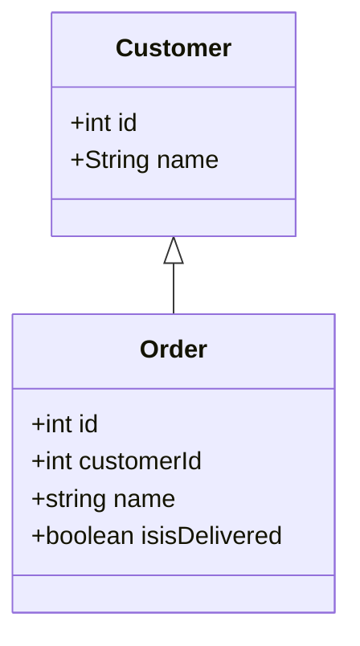
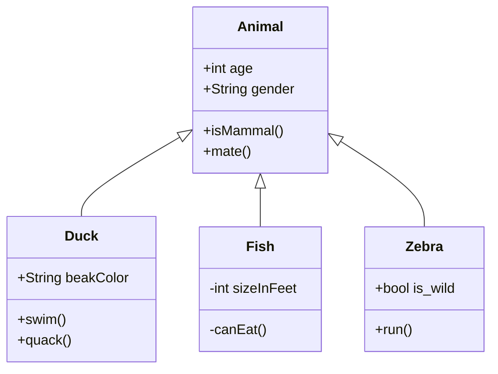

<span id="topo"><span>

# Framework LoopBack 4.0 <a href="loopback.4.html" target="_blank" title="Pressione aqui para expandir este documento em nova aba." >  ➚ </a>

## **1. INDEX**

---

   1. **Introdução**

      1. [Objetivo.](#id_objetivo)
      2. [Pre-requisitos.](#id_pre_requisitos)
      3. [benefícios.](#id_beneficios)

   2. **Descrição.**
      1. [Visão geral](#id_Visao_geral)
      2. [Convenções de nomes de classes, arquivos e variáveis lb4](#id_convencao)
      3. [lb4 - Aplicativo de linha de comando](#id_lb4)

   3. [Instalar](#id_instalar)

   4. [**Exemplos.**](#id_exemplos)
      1. [Criar um novo projeto de nome getting-started](#id_getting_started_1)
      2. [Iniciando o projeto getting-started](#id_getting_started_2)
      3. [Adicionando o controlador **hello**](#id_getting_started_3)
      4. Adicionar o modelo
      5. [Adicionando a entidade \<entity>  **Clientes** ao projeto getting-started](#id_getting_started_4)

   5. [**Conteúdo01**](#id_Conteudo01)

   6. [**Referências.**](#id_referencias)

   7. [**Histórico.**](#id_historico)

## **2. CONTEÚDO**

---

   1. **Introdução**

      1. <span id="id_objetivo"><span>**Objetivo:**
         1. [LoopBack 4.0](https://loopback.io/doc/en/lb4/index.html) é um framework [Node.js](../../nodejs/index.html) escrito na linguagem [TypeScript](https://www.typescriptlang.org/docs/), altamente extensível e de código aberto baseado no [Express](https://expressjs.com/). Ele permite que você crie rapidamente APIs e micros serviços compostos de sistemas de back-end, como bancos de dados e serviços SOAP ou REST.

         2. <text onclick="goBack()">[🔙]</text>

      2. <span id="id_pre_requisitos"></span>**Pre-requisitos:**
         1. O programa [**nodejs**](/programacao/nodejs/index.html) é um programa tipo browser que executa JavaScript fora de um navegador web, permitindo acesso a funções do sistema operacional no lado do servidor.

         2. O programa [**npm**](https://nodejs.org/en/knowledge/getting-started/npm/what-is-npm/) significa **Node Package Manager** e é uma ferramenta que nos permite instalar e gerenciar pacotes de nodejs como dependências.

         3. O programa [**npx**](https://www.educative.io/edpresso/what-is-npx) é um executor de pacote **NPM** que torna realmente fácil instalar qualquer tipo de executável de nodejs que normalmente teria sido instalado usando NPM.

         4. <text onclick="goBack()">[🔙]</text>

      3. <span id="id_beneficios"></span>**Benefícios:**
         1. Define seus [schemas](http://json-schema.org/) e [endpoints](https://smartbear.com/learn/performance-monitoring/api-endpoints) da API usando o padrão [OpenAPI](https://www.openapis.org/).
         2. Integra com bancos de dados, serviços web e outras plataformas usando [conectores](https://loopback.io/doc/en/lb4/Connectors-reference.html).
            1. Os conectores são uma espécie de api para acessar as seguintes tecnologias:
               1. Conectores de acesso a memória;
               2. [Conectores de acesso a banco de dados](https://loopback.io/doc/en/lb4/Database-connectors.html);
                  1. [mysql/mariadb](https://loopback.io/doc/en/lb4/MySQL-connector.html);
                  2. [Open api](https://loopback.io/doc/en/lb4/OpenAPI-connector.html)
               3. Conectores API [rest](https://loopback.io/doc/en/lb4/REST-connector.html) ou [soap](https://loopback.io/doc/en/lb4/SOAP-connector.html).
               4. Vários outros conectores construídos pela comunidade.
         3. Use seus [endpoints](https://smartbear.com/learn/performance-monitoring/api-endpoints/) e [schema](http://json-schema.org) como [“source of truth”](https://en.wikipedia.org/wiki/Single_source_of_truth) sem a necessidade de geração de código.

         4. <text onclick="goBack()">[🔙]</text>

   2. **Descrição**
      1. <span id=id_Visao_geral></span>**Visão geral.**
         1. Veja o [conceito do loopback 4](https://loopback.io/doc/en/lb4/Concepts.html) para ter uma visão geral do framework.
            1. **Application** : A classe central para configurar todos os componentes, controladores, servidores e ligações do seu módulo. A classe Application estende Context e fornece os controles para iniciar e parar seus servidores associados.

            2. **Server** : Classe responsável pela implementação para transportes / protocolos de entrada, como REST (http, https), gRPC (http2) e graphQL (http, https). Ele geralmente escuta em um endpoint (protocol/host/port), trata das solicitações de entrada e retorna as respostas apropriadas.

            3. **Controller** : Classe que implementa operações definidas pela API REST do aplicativo. Ele implementa a lógica de negócios de um aplicativo e atua como uma ponte entre a API HTTP/REST e os modelos (models) de domínio/database. Um controlador opera apenas em entradas processadas e abstrações de serviços de back-end /databases.

            4. **Interceptor** : É uma função que intercepta invocações de métodos estáticos ou de instância em uma classe ou objeto.

            5. **Route** : É o mapeamento entre sua especificação de API e uma operação. Ele diz ao LoopBack para qual Operação invoke() quando recebe uma solicitação HTTP.

            6. **Sequence** : É um agrupamento sem estado de ações que controlam como um servidor responde às solicitações.

            7. **DataSource** :  é um nome dado à configuração de conexão para um banco de dados de um servidor. O nome é normalmente utilizado quando cria-se uma consulta para o banco de dados. O DSN (Datasource Name) não tem que ser o mesmo que o nome do arquivo para o banco de dados. Por exemplo, um arquivo de banco de dados chamado "amigos.mdb" poderia ser definido com um DSN de "escola". O DSN "escola" seria então utilizado para referir-se ao banco de dados quando realizasse uma consulta.

            8. **Model** : São classes com a definição dos campos da fonte de dados. O @loopback/repository módulo fornece decoradores especiais para adicionar [metadados](https://pt.wikipedia.org/wiki/Metadados) às classes TypeScript/JavaScript para usá-los com o DataSource. Além disso, o@loopback/repository-json-schema módulo usa os [metadados](https://pt.wikipedia.org/wiki/Metadados) dos decoradores para construir um esquema JSON correspondente.

            9. **Repository** : é um tipo de serviço que representa uma coleção de dados em um DataSource.

            10. **Relation** : Um mapeamento entre dois modelos que descreve um link do mundo real entre eles e expõe APIs CRUD com base na configuração.

            11. **Decorator** : é o padrão usado para anotar ou modificar suas declarações de classe e seus membros com metadados.

         2. Aqui estão as infraestruturas que fazem todos os artefatos trabalharem juntos:
            1. **Context** : Uma abstração de estados e dependências em seu aplicativo que o LoopBack usa para gerenciar tudo. É um registro global para tudo em seu aplicativo (configurações, estado, dependências, classes e assim por diante).

            2. **Binding** : Uma abstração de itens gerenciados por um contexto. Cada ligação possui uma chave exclusiva dentro do contexto e um provedor de valor para resolver a chave para um valor.

            3. **Dependency injection** : A técnica usada para separar a construção de dependências de uma classe ou função de seu comportamento para manter o código fracamente acoplado.

            4. **Component** : é um pacote que reúne uma ou mais extensões LoopBack.
         3. Fluxograma dos componentes:
            1. [key-concepts-overview-diagram](img/key-concepts-overview-diagram.png)

         4. O loopback 4 possue o **cliente lb4** que cria a parte braçal do código loopback 4, porém para saber a sequência de quais opções devo executar primeiro, é necessário conhecer o documento abaixo:
            1. [Definindo a API usando abordagem de código primeiro](https://loopback.io/doc/en/lb4/Defining-the-API-using-code-first-approach.html).

         5. Os loopback 4.0 possuem cinco componentes para criar aplicativos back-end:
            1. Controles (Controllers)
               1. Os controles definem as rotas da plicação para que as mesmas possam ser acessadas pelo browser via http.

            2. [Fontes de dados](https://loopback.io/doc/en/lb4/Repository.html#configure-datasources) e [conectores de banco de dados](https://loopback.io/doc/en/lb4/Database-connectors.html) (DataSources and [Database connectors](https://loopback.io/doc/en/lb4/Database-connectors.html))
               1. As fontes de dados (DataSources) são usadas para conexão com banco de dados. As propriedades de configuração variam de acordo com os conectores. Por exemplo, uma fonte de dados para MySQL precisa definir o connector  [loopback-connector-mysql](https://loopback.io/doc/en/lb4/Connecting-to-MySQL.html) com as configurações a seguir:
                  1. Código javascript

                  ```javascript
                     {
                        const config = {
                           name: 'db',
                           connector: 'mysql',
                           url: '',
                           host: 'localhost',
                           port: 3306,
                           user: 'loopback',
                           password: 'pa55w0rd',
                           database: 'demo',
                        };

                     }
                  ```

               2. Os conectores são programas que conhecem vários tipos de banco de dados. Nota: Para cada banco de dados temos um conector.

            3. Modelos (Model e Entity)
               1. Os modelos são usados para mapear as tabelas dos bancos de dados.

            4. Repositórios (repositories) com os [metadados](https://www.youtube.com/watch?v=ySrHap_rbsg)
               1. Os repositórios são usados para criar [relacionamentos](https://loopback.io/doc/en/lb4/Relations.html) entre os modelos.
               2. Relacionamentos possíveis:
                  1. [Um para N (hasMany)](https://loopback.io/doc/en/lb4/HasMany-relation.html) (hasMany Relation), veja diagrama abaixo:
                     1. Exemplo:

                        ```mermaid
                        
                           erDiagram
                              Cliente ||--o{ Pedido : "1 para n"
                              Cliente {
                                 number id
                                 string razaoSocial
                              }        
                                                   
                              Pedido {
                                 number clienteId
                                 number Qt
                                 number valorUnit                                       
                              }                              
                        ```

                     2. [Relação pertence a (belongsTo Relation)](https://loopback.io/doc/en/lb4/BelongsTo-relation.html) essa relação funciona melhor com bancos de dados que suportam restrições de chave estrangeira (SQL).
                        1. Uma relação belongsTo denota uma conexão muitos-para-um de um modelo a outro modelo por meio da integridade referencial.
                        2. A integridade referencial é imposta por uma restrição de chave estrangeira no modelo de origem, que geralmente faz referência a uma chave primária no modelo de destino.
                        3. Essa relação indica que cada instância do modelo declarante ou de origem pertence a exatamente uma instância do modelo de destino. Por exemplo, em um aplicativo com clientes e pedidos, um pedido sempre pertence exatamente a um cliente, conforme ilustrado no diagrama abaixo.
                           1. Exemplo:

                              ```mermaid
                                 
                                 erDiagram
                                    Cliente ||--|{ Pedido : "n para 1"
                                    Cliente {
                                       int id
                                       string razaoSocial
                                    }        
                                                         
                                    Pedido {
                                       int clienteId
                                       int Qt
                                       int valor                                        
                                    }
                              

                              ```

                  2. .
            5. .

         6. <text onclick="goBack()">[🔙]</text>

      2. <span id=id_convencao></span>[Convenções de nomes de classes, arquivos e variáveis lb4](https://loopback.io/doc/en/lb4/Command-line-interface.html#naming-convention)
         1. Nome da [classe](https://www.typescriptlang.org/docs/handbook/classes.html#classes): PascalCase.
            1. **PascalCase** é uma convenção de nomenclatura em que a primeira letra de cada palavra em uma palavra composta é maiúscula. [Veja mais...](https://techterms.com/definition/pascalcase)
               1. Exemplo:

                   ```typescript
                      export class CadastroDeClientes extends Entity {}
                   ```

         2. O nome do arquivo: kebab-case.
            1. **kebab-case** - é uma convenção de nomenclatura de variável de programação onde um desenvolvedor substitui os espaços entre as palavras por um travessão e todas as letras devem ser minusculas ou maiúsculas. [Veja mais...](https://www.theserverside.com/definition/Kebab-case#:~:text=Kebab%20case%20%2D%2D%20or%20kebab,between%20words%20with%20a%20dash.&text=The%20term%20comes%20from%20the,together%20on%20a%20shish%20kebab.)
               1. Exemplo:
                  1. cadastro-de-clientes.ts
                  2. CADASTRO-DE-CLIENTES.TS
            2. Nota: O programa [lb4 convencionou o nome de arquivos](https://loopback.io/doc/en/lb4/Command-line-interface.html#naming-convention) da seguinte forma:
               1. |Entrada|Caso|Nome da Classe|Nome do arquivo
                  |-------|----|--------------|---------------
                  |MyModel|A entrada permanece a mesma|MyModel|my-model.model.ts
                  |my_model|Os sublinhados são removidos|MyModel|my-model.model.ts
                  |My-Model|O nome da classe não pode conter alguns símbolos|Inválido|Inválido

         3. Nome da [variável](https://www.typescriptlang.org/pt/docs/handbook/variable-declarations.html): camelCase.
            1. **camelCase** é uma convenção de nomenclatura na qual a primeira letra de cada palavra em uma palavra composta é maiúscula, exceto para a primeira palavra. [Veja mais...](https://techterms.com/definition/camelcase).
               1. Exemplo:

                   ```typescript
                      var nomeDoCliente = string;
                   ```

         4. <text onclick="goBack()">[🔙]</text>

      3. <span id=id_lb4></span>**[lb4 - Aplicativo de linha de comando:](https://loopback.io/doc/en/lb4/Command-line-interface.html#upgrading-loopback-dependencies)**
         1. **Usage:**
            1. lb4 app [\<name>] [options]
         2. **Options:**
            1. -h, --help _# Imprimir as opções e o uso do gerador_
            2. --skip-cache _# Não lembrar respostas do prompt Default:false_
            3. --skip-install _# Não instalar dependências automaticamente Default: false_
            4. --force-install _# Erro de falha na instalação de dependências Default: false_
            5. --ask-answered _# Show prompts for already configured options Default: false_
            6. --applicationName  _# Nome da classe do aplicativo_
            7. --docker _# Incluir Dockerfile e .dockerignore_
            8. --repositories _# Inclua importações de repositório e RepositoryMixin_
            9. --services _# Inclua importações de proxy de serviço e ServiceMixin_
            10. --apiconnect _# Incluir ApiConnectComponent_
            11. --description _# Descrição para o application_
            12. --outdir _# Diretório-raiz do projeto para o application_
            13. --eslint _# Ativar eslint_
            14. --prettier _# Ativar o Prettier_
            15. --mocha _# Ativar mocha_
            16. --loopbackBuild _# Use @loopback/build_
            17. --vscode _# Usar definições de VSCode pré-configuradas_
            18. --private _# Marque o projeto como privado (excluído da publicação npm)_
            19. -c,--config _# Nome ou valor do arquivo JSON para configurar opções_
            20. -y,--yes _# Ignore todos os prompts de confirmação com valor padrão ou fornecido_
            21. --format _# Formate o código gerado usando npm run lint:fix_
            22. -pm, --packageManager _# Mude o gerenciador de pacote padrão_

         3. **Arguments:**
             1. name # _Nome do projeto para o application  Type: String Required: false_

         4. **Available commands:**
             1. lb4 [app](https://loopback.io/doc/en/lb4/Application-generator.html) _# Cria um novo aplicativo LoopBack4 usando a API REST._

             2. lb4 [extension](https://loopback.io/doc/en/lb4/Extension-generator.html) _# Cria uma nova extensão LoopBack4._

             3. lb4 [controller](https://loopback.io/doc/en/lb4/Controller-generator.html) _# Adicionar um novo controlador a um aplicativo LoopBack 4._

             4. lb4 [datasource](https://loopback.io/doc/en/lb4/DataSource-generator.html) _# Adicionar uma nova fonte de dados a um aplicativo LoopBack 4._

             5. lb4 [import-lb3-models](https://loopback.io/doc/en/lb4/Importing-LB3-models.html) _# Importe um ou mais modelos LoopBack 3 para um aplicativo LoopBack 4._

             6. lb4 [model](https://loopback.io/doc/en/lb4/Model-generator.html) _# Adicionar um novo modelo a um aplicativo LoopBack 4._

             7. lb4 [repository](https://loopback.io/doc/en/lb4/Repository-generator.html) _# Adicionar novos repositórios para o (s) modelo (s) selecionado (s) a um aplicativo LoopBack 4._

             8. lb4 [service](https://loopback.io/doc/en/lb4/Service-generator.html) _# Adicionar um novo serviço remoto ou local a um aplicativo LoopBack 4._

             9. lb4 [example](https://loopback.io/doc/en/lb4/Examples.html) _# LoopBack 4 vem com vários projetos de exemplo._

             10. lb4 [openapi](https://loopback.io/doc/en/lb4/OpenAPI-generator.html) _# Gerar controladores e modelos a partir de especificações OpenAPI._

             11. lb4 [observer](https://loopback.io/doc/en/lb4/Life-cycle-observer-generator.html) _# Gerar observadores de ciclo de vida para iniciar / parar o aplicativo._

             12. lb4 [interceptor](https://loopback.io/doc/en/lb4/Interceptor-generator.html) _# Gerar interceptores._

             13. lb4 [discover](https://loopback.io/doc/en/lb4/Discovering-models.html) _# Descubra modelos de bancos de dados relacionais._

             14. lb4 [relation](https://loopback.io/doc/en/lb4/Relation-generator.html) _# Adicione uma relação entre dois modelos em um aplicativo LoopBack 4._

             15. lb4 [update](https://loopback.io/doc/en/lb4/Update-generator.html) _# O lb4 update comando é executado dentro de um projeto LoopBack 4 e verifica as dependências em relação à versão atual do @loopback/cli. Por padrão, ele verifica a correspondência exata. Use a --semver opção para verificar a compatibilidade usando semver semântica._

             16. lb4 [rest-crud](https://loopback.io/doc/en/lb4/Rest-Crud-generator.html) _# Gerar configurações restantes para endpoints do modelo._
             17. lb4 [_copyright_](https://loopback.io/doc/en/lb4/Copyright-generator.html) _# O lb4 copyright comando é executado dentro de um projeto Node.js package.json para adicionar ou atualizar o cabeçalho de copyright / licença para arquivos JavaScript e TypeScript com base em um package.json histórico git.<br> O comando também oferece suporte a [lerna](https://github.com/lerna/lerna) monorepos. Ele atravessa todos os pacotes dentro do monorepo e aplica cabeçalhos de copyright/licença._
             18. install-completion
             19. lb4 uninstall-completion

      4. <text onclick="goBack()">[🔙]</text>

   3. <span id=id_instalar></span>[**Instalar loopback**](https://strongloop.com/strongblog/loopback4-cli-express-mode)
      1. O LoopBack 4 CLI é uma interface de linha de comando que estrutura um projeto ou uma extensão gerando o código básico. A CLI fornece a maneira mais rápida de começar com um projeto LoopBack 4 que segue as melhores práticas.
      2. Instalar **loopback CLI toolkit**.
         1. Código shellscript:

            ```shellscript
               
               sudo npm i -g @loopback/cli

            ```

      3. <text onclick="goBack()">[🔙]</text>

   4. <span id=id_exemplos></span>**Exemplos.**
      1. Passo a passo para criar projeto usando o programa [lb4](https://loopback.io/getting-started.html):
         1. <scan id=id_getting_started_1></scan> Criar um novo projeto de nome [**getting-started**](https://loopback.io/doc/en/lb4/Getting-started.html#create-a-new-project):
            1. Criar projeto **getting-started**:
               1. Código shellscript

                  ```shellscript
                     
                     lb4 app 

                  ```

                  1. Responda a pegunta do comando **lb4 app**:
                     1. ? Nome do projeto: _getting-started_
                     2. ? Descrição do projeto: _Getting started tutorial_
                     3. ? Diretório-raiz do projeto: _getting-started_
                     4. ? Nome da classe do aplicativo: _StarterApplication_
                     5. ? Select project build settings:  (Press \<space> to select, \<a> to toggle all, \<i> to invert selection):
                           1. ◉ Ativar [services](https://loopback.io/doc/en/lb4/Service.html#generate-services-using-cli): _Incluir importações de proxy de serviço e o ServiceMixin_

                           2. ◉ Ativar [eslint](https://www.npmjs.com/package/eslint): _Incluir um linter com regras de lint pré-configuradas_

                           3. ◉ Ativar [prettier](https://www.npmjs.com/package/prettier): _Instalar Prettier para formatar código em conformidade com as regras_

                           4. ◯ Ativar [mocha](https://www.npmjs.com/package/mocha): _Instale o mocha para executar testes_

                           5. ◉ Ativar [loopbackBuild](https://www.npmjs.com/package/@loopback/build): _use os auxiliares @loopback/build (por exemplo, lb-eslint)_

                           6. ◉ Ativar [vscode](https://loopback.io/doc/en/lb4/Troubleshooting.html): _Inclua arquivos de configuração de VSCode_

                           7. ◉ Ativar [repositories](https://loopback.io/doc/en/lb4/Repository.html): _Incluir importações de repositório e o RepositoryMixin_

                           8. ◯ Ativar [docker](https://www.digitalocean.com/community/tutorials/como-construir-uma-aplicacao-node-js-com-o-docker-pt): _Incluir Dockerfile e .dockerignore_

                     6. **(Mova para cima e para baixo para revelar mais opções)**
            2. Nota: O projeto **getting-started** criado pelo comando **lb4 app** possui arquivos e diretórios no diretório raiz do aplicativo . Dentro desse diretório, a estrutura do aplicativo LB4 padrão tem estes subdiretórios:
               1. **src** - Código-fonte TypeScript e arquivos de configuração.
               2. **public** - Ativos do lado do cliente (arquivos JavaScript, HTML e CSS) para a página inicial.
               3. **dist/** -
               4. [Veja mais...](https://loopback.io/doc/en/lb4/Loopback-application-layout.html)

            3. <text onclick="goBack()">[🔙]</text>

         2. <scan id=id_getting_started_2></scan>Iniciando o projeto [**getting-started**](https://loopback.io/doc/en/lb4/Getting-started.html#starting-the-project):
            1. Código shellscript

            ```shellscript
               
               cd getting-started
               npm start

            ```

            1. Digite no browser o comando: <http://localhost:3000/ping>
               1. A resposta será o objeto jsom:
                  1. Código jsom

                     ```json

                        /**
                        Response headers
                           access-control-allow-credentials: true 
                           access-control-allow-origin: * 
                           connection: keep-alive 
                           content-length: 779 
                           content-type: application/json 
                           date: Wed,10 Mar 2021 14:04:19 GMT 
                           keep-alive: timeout=5 
                           x-powered-by: Express
                        */            

                        /**Response body */
                        {
                           "greeting": "Hello from LoopBack - 01",
                           "date": "2021-03-10T14:04:19.400Z",
                           "url": "/ping",
                           "headers": {
                              "host": "localhost:3000",
                              "connection": "keep-alive",
                              "sec-ch-ua": "\"Google Chrome\";v=\"89\", \"Chromium\";v=\"89\", \";Not A Brand\";v=\"99\"",
                              "accept": "application/json",
                              "sec-ch-ua-mobile": "?0",
                              "user-agent": "Mozilla/5.0 (X11; Linux x86_64) AppleWebKit/537.36 (KHTML, like Gecko) Chrome/89.0.4389.82 Safari/537.36",
                              "sec-fetch-site": "same-origin",
                              "sec-fetch-mode": "cors",
                              "sec-fetch-dest": "empty",
                              "referer": "http://localhost:3000/explorer/",
                              "accept-encoding": "gzip, deflate, br",
                              "accept-language": "pt-BR,pt;q=0.9,en-US;q=0.8,en;q=0.7,en-CA;q=0.6,de-DE;q=0.5,de;q=0.4,fr;q=0.3,es;q=0.2,zh-CN;q=0.1,zh;q=0.1,fr-CA;q=0.1,en-GB;q=0.1,ja;q=0.1,af;q=0.1",
                              "cookie": "io=kpnuqyjQiI7YMGdNAAAG"
                           }
                        }                              
                       
                     ```

            2. Finaliza a execução do programa pressiona **Ctrl C** no terminal onde o programa getting-started está executando.

            3. <text onclick="goBack()">[🔙]</text>

         3. <scan id=id_getting_started_3></scan>[Adicionando o controlador **hello**](https://loopback.io/doc/en/lb4/Getting-started.html#adding-your-own-controller) ao projeto [**getting-started**](#id_getting_started_1):
            1. Agora que temos um projeto básico criado, é hora de adicionar  controladores.
               1. Adicionar o controlador **“Hello”** simples da seguinte maneira:
                  1. Código shellscript

                     ```shellscript

                        lb4 controller

                     ```

                  2. Responda as peguntas do comando **lb4 controller**:
                     1. ? Nome da classe do controlador: _hello_
                     2. ? Que tipo de controlador você gostaria de gerar? (Use arrow keys ↕)
                        1. _Controlador vazio_
                        2. _Controlador de REST com funções de CRUD_

                        3. Resposta a essa pergunta:
                           1. **Controlador vazio**

                     3. Mensagens após o término das respostas:
                        1. Criou: _src/controllers/hello.controller.ts_
                        2. Atualizou: _src/controllers/index.ts_
                        3. O controlador **"hello"** foi criado em: _src/controllers/._

                  3. Cole o seguinte código typescript no arquivo **/src/controllers/hello.controller.ts**:
                     1. Código typescript

                        ```typescript
                         import {get} from '@loopback/rest';

                         export class HelloController {
                           @get('/hello')
                           hello(): string {
                              return 'Hello world!';
                           }
                         }
                        ```

                  4. Para testar se o controller **hello** está funcionando execute o comando abaixo:
                     1. Código shellscript

                        ```shellscript
                           npm start
                        ```

                     2. Digite no browser o comando: <http://localhost:3000/hello>
                        1. Resposta: **Hello world!**

                  5. Finaliza a execução do programa pressiona **Ctrl C** no terminal onde o programa **getting-started** está executando.

            2. <text onclick="goBack()">[🔙]</text>

         4. <scan id=id_getting_started_4>Adicionando a entidade \<entity>  **cliente** ao projeto **getting-started**.
            1. Entidade \<entity> é um modelo que possue a propriedade **id** único conforme o exemplo abaixo:

            2. Código ShellScript

               ```shellscript
                  lb4 model
               ```

            3. Responda as perguntas do comando **lb4 model**:
               1. ? Nome da classe Model: _cliente_
               2. ? Selecione a classe base do modelo **Entity** (_Entity é uma **classe model** com a propriedade **id**_)
               3. ? Permitir propriedades adicionais (formato livre)? _Yes_
                  1. Resposta do comando **lb4 model**:
                     1. Model Cliente será criado em: _src/models/cliente.model.ts_
                     2. Vamos incluir uma propriedade em Cliente
                     3. Insira um nome de propriedade vazio quando estiver pronto:
                  2. Pergunta do comando lb4 model:
                     1. ? Insira o nome da propriedade: _nomeDoCliente_
                     2. ? Tipo de propriedade: _string_
                     3. ? É necessário? _Yes_
                     4. Vamos incluir outra propriedade no modelo **Cliente**:
                     5. ? Insira o nome da propriedade (enter para finalizar): \<enter>
                     6. Resposta do comando **lb4 model**
                        1. Criou arquivo: _src/models/cliente.model.ts_
                        2. Atualizou arquivo: _src/models/index.ts_
                        3. O _Model Cliente_ foi criado em _src/models_

            4. Arquivo criado **src/models/cliente.model.ts**  com a entidade <entity>Cliente.
               1. Código typescript

                  ```typescript
                     import {Entity, model, property} from '@loopback/repository';

                     @model({settings: {strict: false}})
                     export class Cliente extends Entity {
                        @property({
                           type: 'number',
                           id: true,
                           generated: true,
                        })
                        id?: number;

                        @property({
                           type: 'string',
                           required: true,
                        })
                        nomeDoCliente: string;

                        // Define well-known properties here

                        // Indexer property to allow additional data
                        // eslint-disable-next-line @typescript-eslint/no-explicit-any
                        [prop: string]: any;

                        constructor(data?: Partial<Cliente>) {
                           super(data);
                        }
                     }

                     export interface ClienteRelations {
                     // describe navigational properties here
                     }

                     export type ClienteWithRelations = Cliente & ClienteRelations;
                     
                  ```

               2. .

         5. Adicionar o controlador **crud01** da seguinte maneira:
            1. Código shellscript

               ```shellscript

                  lb4 controller

               ```

            2. Responda as peguntas do comando lb4 controller:
               1. ? Nome da classe do controlador: _crud01_
               2. ? Que tipo de controlador você gostaria de gerar? (Use arrow keys ↕)
                  1. Controlador vazio
                  2. Controlador de REST com funções de CRUD

                  3. Resposta a essa pergunta:
                     1. Controlador de REST com funções de CRUD

               3. Mensagens após o término das respostas:
                  1. Criou: src/controllers/hello.controller.ts
                  2. Atualizou: src/controllers/index.ts
                  3. O controlador **hello** foi criado em: src/controllers/.
            3. ,

         6. [**Referência dos passos criados acima...**](https://loopback.io/doc/en/lb4/Getting-started.html).

         7. .
         8. .

      2. Exemplo criado por cli lb4:
         1. [getting-started (Começando)](https://loopback.io/getting-started.html)

         2. [@loopback/example-hello-world](https://github.com/strongloop/loopback-next/tree/master/examples/hello-world)

         3. [@loopback/example-todo](https://github.com/strongloop/loopback-next/blob/master/examples/todo/README.md).

         4. Creating CRUD REST APIs from a model

         5. [MySQL Connector Tutorial](https://loopback.io/doc/en/lb4/Connecting-to-MySQL.html)

         6. .

      3. .

      4. <text onclick="goBack()">[🔙]</text>

   5. <span id=id_Conteudo01></span>**Conteúdo01**
      1. item 01.
      2. item 02.

      3. <text onclick="goBack()">[🔙]</text>

   6. <span id=id_referencias></span>**REFERÊNCIAS**
      1. [#](##)
      2. [#](##)
      3. [#](##)
      4. [#](##)
      5. [#](##)

      6. <text onclick="goBack()">[🔙]</text>

   7. <span id="id_historico"><span>**HISTÓRICO**

      1. dd/mm/2021 <!--TODO: HISTÓRICO -->

         - <text onclick="goBack()">[🔙]</text>

      2. dd/mm/2021 <!--FIXME: Falta fazer os item abaixo: -->
         - [ ] Criar este documento baseado no loopback.4.md ;
         - [ ] Escrever tópico Objetivos;
         - [ ] Escrever tópico Pre-requisitos
         - [ ] Escrever tópico Benefícios
         - [ ] Escrever tópico Descrição
         - [ ] Escrever tópico Conteúdo 02
         - [ ] Escrever tópico Referências
         - [ ] Atualizar o histórico deste documento.
         - [ ] Ler no dia seguinte este documento para checar os erros de português.

         - <text onclick="goBack()">[🔙]</text>

[🔝🔝](#topo "Retorna ao topo")

 <script>    function goBack() {    window.history.back()}</script>




