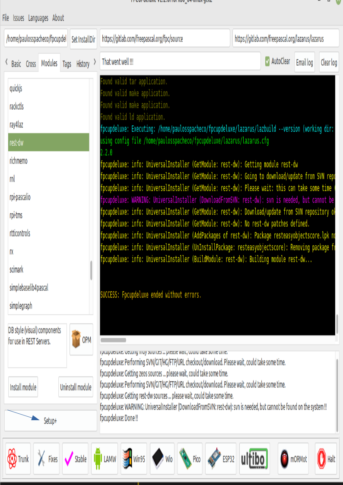
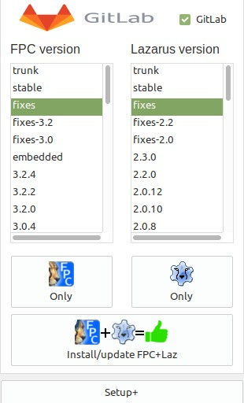
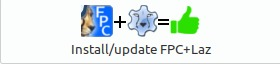

# <span id="topo"><span>O que é IDE Lazarus <a href="modelo03.html" target="_blank" title="Pressione aqui para expandir este documento em nova aba." >↵</a><a href="modelo03.pdf" target="_blank" title="Pressione aqui para visualizar o PDF deste documento em nova aba.">℘</a>

## **1. INDEX**

---

   1. [Resumo do conteúdo](#id_resumo)

   2. **Introdução**
      1. [Objetivo.](#id_objetivo)
      2. [Pre-requisitos.](#id_pre_requisitos)
      3. [Benefícios.](#id_beneficios)
      4. [Desvantagens.](#id_desvantagens)

   3. [**Conteúdo estudado.**](#id_Conteudo)
      1. [Como instalar o Lazarus](#id_assunto01)
      2. [Assunto 02](#id_assunto02)
      3. [Assunto 03](#id_assunto03)
      4. [Assunto 04](#id_assunto04)
      5. [Assunto 05](#id_assunto05)
      6. [Assunto 06](#id_assunto06)
      7. [Assunto 07](#id_assunto07)
      8. [Assunto 08](#id_assunto08)
      9. [Assunto 09](#id_assunto09)
      10. [Assunto 10](#id_assunto10)

   4. [**Referências globais.**](#id_referencias)

   5. [**Histórico.**](#id_historico)

## **2. CONTEÚDO**

---

   1. <span id="id_resumo"><span>**Resumo do conteúdo:**
      1. Descreve um resumo de como foi feito esse documento com as facilidade encontradas para produzi-lo e dificuldade encontrada.

   2. **Introdução**

      1. <span id="id_objetivo"><span>**Objetivo:**
         1. Este documento foi criado com objetivo de registrar tudo que preciso lembrar sobre a IDE Lazarus e o compilador FreePascal.

         2. <text onclick="goBack()">[🔙]</text>

      2. <span id="id_pre_requisitos"></span>**Pre-requisitos:**
         1. Conhecimento do sistema operacional onde a IDE Lazarus  e o compilador FreePascal serão instalados.
         2. Conhecimento da linguagem pascal.

         3. <text onclick="goBack()">[🔙]</text>

      3. <span id="id_beneficios"></span>**Benefícios:**
         1. O FreePascal permite criar aplicativo nativos para vários sistemas operacionais.
         2. A IDE Lazarus permite criar formulários visualmente, compila-los e executa-los ao pressionar a tela f9.
         3. A IDE possui o programa **FPDebug** que permite executar o programa passo a passo pressionado a tecla F7.

         4. <text onclick="goBack()">[🔙]</text>

      4. <span id="id_desvantagens"></span>**Desvantagens**.
         1. Essa pergunta é difícil responder porque é relativa.

         2. <text onclick="goBack()">[🔙]</text>

   3. <span id=id_Conteudo></span>**Conteúdo estudado**
      1. <span id=id_assunto01></span>**Como instalar o Lazarus e FreePascal**
         1. Instalar o aplicativo **FPCupDeLuxe** no Linux Debian ou derivados.
            1. Instalando as dependências:

               ```sh

                sudo apt-get install libx11-dev
                sudo apt-get install libgtk2.0-dev 
                sudo apt-get install libcairo2-dev  
                sudo apt-get install libpango1.0-dev 
                sudo apt-get install libxtst-dev 
                sudo apt-get install libgdk-pixbuf2.0-dev 
                sudo apt-get install libatk1.0-dev  
                sudo apt-get install libghc-x11-dev 
                sudo apt-get install libgl1-mesa-dev
                sudo apt-get install git
                sudo apt-get install mercurial

               ```

            2. Criar pasta **~/Download/FpCupDeLuxe**

                 ```sh

                   mkdir ~/Downloads/FpCupDeLuxe
                   
                 ```

            3. Baixar o programa **FpCupDeLuxe** para a pasta **~/Downloads/FpCupDeLuxea** :
               1. [Download do FpCupDeLuxe](https://github.com/LongDirtyAnimAlf/fpcupdeluxe/releases).

            4. Executar programa  **fpcupdeluxe-x86_64-linux**

               ```sh

                cd ~/Downloads/FpCupDeLuxe
                ./fpcupdeluxe-x86_64-linux
                   

               ```

            5. Configurar **FpCupeDeLuxe** para instalar o **FPC** com opção de debug de todos os pacotes, inclusive a FCL, LCL etc...
               1. Selecionar a opção Setup+ do FpCupDeLuxe:
                  1. 
                  2. 

               2. Pressione o botão [**Setup+**](img/Opcoes_Avancadas.jpeg) do **FpCupDeLuxe**, para editar o formulário de **Opções Avançadas**:
                  1. Adicione os comandos **-g -gl -O-** no campo "FPC Options".

         2. **Instalar Lazarus com o programa FPCupDeLuxe:**
            1. Executar programa **FpCupDeLuxe**

            2. No painel **GitLab** selecione a versão **Fixed** para o compilador **FPC** e para IDE **Lazarus**.
               1. .

            3. Pressionar o botão:
               1. .

         3. **Instalar pacotes opcionais**.
            1. Na área de trabalho seleciona o ícone **Lazarus_fpcupdeluxe**.
            2. Selecione a opção [**/Pacotes/instalar/disponíveis para instalação/**](img/form_instalar_pacotes.jpeg):
               1. No painel **Disponíveis para instalar** selecione os seguintes pacotes:
                  1. Para transformar em janela única:
                     1. [**AnchorDockingDsgn**](https://wiki.freepascal.org/AnchorDockingDsgn);
                     2. [**Sparta_DockedFormEditor**](https://github.com/alrieckert/lazarus/blob/master/components/sparta/dockedformeditor/sparta_dockedformeditor.pas).

                  2. Instalar a opção de grupo de projetos.
                     1. [**LazProjectGroups**](https://wiki.freepascal.org/Project_Groups).

               2. No painel **Disponíveis para instalar** pressione o botão **Instalar pacotes selecionados**.
               3. No painel de botões abaixo do painel **Disponíveis para instalar** pressione o botão **Salvar e reconstruir a IDE**

         4. **Referências:**
            1. [usando-como-instalador-o-fpcupdeluge-nivel-medio](https://gladiston.net.br/programacao/lazarus-ide/usando-como-instalador-o-fpcupdeluge-nivel-medio/)
            2. [Download do FpCupDeLuxe](https://github.com/LongDirtyAnimAlf/fpcupdeluxe/releases)

         5. <text onclick="goBack()">[🔙]</text>

      2. <span id=id_assunto02></span>**Assunto 02**
         1. Descrição do conteúdo.
         2. **Exemplo do assunto 02**.
            1. Descrição do exemplo

               ```ts
               ```

         3. **Referências:**
            1. [title](link)
            2. [title](link)

         4. <text onclick="goBack()">[🔙]</text>

      3. <span id=id_assunto03></span>**Assunto 03**
         1. Descrição do conteúdo.
         2. **Exemplo do assunto 03**.
            1. Descrição do exemplo

               ```ts
               ```

         3. **Referências:**
            1. [title](link)
            2. [title](link)

         4. <text onclick="goBack()">[🔙]</text>

      4. <span id=id_assunto04></span>**Assunto 04**
         1. Descrição do conteúdo.
         2. **Exemplo do assunto 04**.
            1. Descrição do exemplo

               ```ts
               ```

         3. **Referências:**
            1. [title](link)
            2. [title](link)

         4. <text onclick="goBack()">[🔙]</text>

      5. <span id=id_assunto05></span>**Assunto 05**
         1. Descrição do conteúdo.
         2. **Exemplo do assunto 05**.
            1. Descrição do exemplo

               ```ts
               ```

         3. **Referências:**
            1. [title](link)
            2. [title](link)

         4. <text onclick="goBack()">[🔙]</text>

      6. <span id=id_assunto06></span>**Assunto 06**
         1. Descrição do conteúdo.
         2. **Exemplo do assunto 06**.
            1. Descrição do exemplo

               ```ts
               ```

         3. **Referências:**
            1. [title](link)
            2. [title](link)

         4. <text onclick="goBack()">[🔙]</text>

      7. <span id=id_assunto07></span>**Assunto 07**
         1. Descrição do conteúdo.
         2. **Exemplo do assunto 07**.
            1. Descrição do exemplo

               ```ts
               ```

         3. **Referências:**
            1. [title](link)
            2. [title](link)

         4. <text onclick="goBack()">[🔙]</text>

      8. <span id=id_assunto08></span>**Assunto 08**
         1. Descrição do conteúdo.
         2. **Exemplo do assunto 08**.
            1. Descrição do exemplo

               ```ts
               ```

         3. **Referências:**
            1. [title](link)
            2. [title](link)

         4. <text onclick="goBack()">[🔙]</text>

      9. <span id=id_assunto09></span>**Assunto 09**
         1. Descrição do conteúdo.
         2. **Exemplo do assunto 09**.
            1. Descrição do exemplo

               ```ts
               ```

         3. **Referências:**
            1. [title](link)
            2. [title](link)

         4. <text onclick="goBack()">[🔙]</text>

      10. <span id=id_assunto10></span>**Assunto 10**
          1. Descrição do conteúdo.
          2. **Exemplo do assunto 10**.
             1. Descrição do exemplo

                  ```ts
                  ```

          3. **Referências:**
             1. [title](link)
             2. [title](link)

          4. <text onclick="goBack()">[🔙]</text>

      11. <text onclick="goBack()">[🔙]</text>

   4. <span id=id_referencias></span>**REFERÊNCIAS GLOBAIS**
      1. [Site oficial para produzir este documento](#1)
      2. [#](##)
      3. [#](##)
      4. [#](##)
      5. [#](##)

      6. <text onclick="goBack()">[🔙]</text>

   5. <span id="id_historico"><span>**HISTÓRICO**

      1. dd/mm/2021 <!--TODO: HISTÓRICO -->

         - <text onclick="goBack()">[🔙]</text>

      2. dd/mm/2021 <!--FIXME: Falta fazer os item abaixo: -->
         - [ ] Criar este documento baseado no modelo03.md ;
         - [ ] Escrever tópico Objetivos;
         - [ ] Escrever tópico Pre-requisitos
         - [ ] Escrever tópico Benefícios
         - [ ] Escrever tópico desvantagens
         - [ ] Escrever tópico Conteúdo
         - [ ] Escrever tópico Exemplos
         - [ ] Escrever tópico Referências
         - [ ] Atualizar o histórico deste documento.
         - [ ] Testar este documento depois após uma semana de concluído.

         - <text onclick="goBack()">[🔙]</text>

[🔝🔝](#topo "Retorna ao topo")

 <script>    function goBack() {    window.history.back()}</script>
