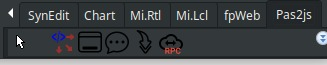
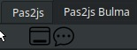

# Design-time components for pas2js

Design-time components for pas2js
Michaël Van Canneyt
September 1, 2022

## Resumo
  
Neste artigo, apresentamos uma maneira visual de usar alguns componentes que foram
introduzidos em artigos anteriores: Embora WYSIWYG ainda não seja possível para aplicativos HTML, é perfeitamente possível usar o inspetor de objetos no Lazarus para projetos pas2js, acelerando consideravelmente o desenvolvimento de aplicativos pas2js.

## Introdução

Nos artigos anteriores sobre programação com pas2js, tudo sempre foi feito em código: com exceção de alguns assistentes para gerar ou atualizar código, tudo tinha que ser feito no editor de código-fonte. No entanto, Delphi e Lazarus são ambientes RAD. Não há nenhuma razão intrínseca pela qual o desenvolvimento RAD não deva ser possível para aplicativos pas2js.

O mecanismo RAD no Delphi e no Lazarus é baseado em um mecanismo de streaming:
um arquivo de formulário contém definições para todos os componentes colocados em um formulário ou DataModule. No tempo de execução, os componentes são criados pelo mecanismo de streaming, e as propriedades publicadas que você manipula usando o inspetor de objetos são definidas a partir dos valores encontrados no arquivo .dfm ou  .lfm.

O mecanismo de streaming também existe no pas2js. Isso torna possível criar um arquivo de formulário no IDE e usá-lo para recriar em tempo de execução - no ambiente Javascript - a definição de formulário que você criou no IDE. De fato, todas as classes apresentadas nos artigos anteriores - em particular, os widgets - foram criadas como descendentes de TComponent, com a intenção de que um dia elas seriam utilizáveis ​​no Object Inspector do IDE.

Há apenas um problema: os componentes no mundo pas2js assumem um navegador
e fazem seu trabalho com as classes do navegador. Então, como podemos compilar esses componentes para instalação no IDE, onde o ambiente do navegador não está disponível
?, no momento, isso não é diretamente possível. Mas, um truque pode ser usado que irá
nos permitir manipular componentes destinados ao pas2js no IDE.

## Componentes stub

Para usar o inspetor de objetos para um componente, o IDE precisa apenas das propriedades publicadas de um componente. Ele não precisa de (todas) as funcionalidades reais dos componentes para poder exibi-los no inspetor de objetos.

Tendo isso em mente, é possível criar um componente 'stub': este é um componente
(uma classe nativa) que tem as mesmas propriedades publicadas que a classe pas2js, e
código suficiente para definir as várias propriedades e fazê-las se comportar como fariam em tempo de execução: se alterar o valor de uma propriedade altera outra propriedade, então o código stub deve refletir isso.

O componente stub pode ser criado de pelo menos 2 maneiras:

1. Pegando a classe real e colocando todo o código que de alguma forma se refere ao navegador
em uma definição condicional:

   ```pascal
        Procedure TMyLabel.SetCaption(aCaption : string);
        begin
        FCaption:=aCaption;
        {$IFDEF PAS2JS}
        // FElement is a TJSHTMLElement instance
        if Assigned(FElement) then
        FElement.InnerText:=FCaption;
        {$ENDIF}
        end;   
   ```

    Essa abordagem tem a vantagem de que apenas 1 conjunto de arquivos de origem é necessário: um
    para no navegador, um para no IDE. A desvantagem é que dá muito
    trabalho manter o código compilável em ambas as plataformas.

2. Pegando uma cópia da classe e removendo todo o código que não está diretamente envolvido no tratamento da propriedade publicada: todos os métodos públicos, privados e
protegidos podem ser removidos. Obviamente, propriedades que descendem de TPersistent ainda devem ser criadas. A vantagem é que o código é simples, a desvantagem é que há 2 conjuntos de arquivos a serem mantidos.

O Pas2js vem com uma ferramenta (makestub) que ajuda a criar uma classe stub usando
o segundo método: ele escaneia o arquivo original em busca de classes e gera uma nova classe com apenas as propriedades publicadas. Não é perfeito, mas pode ser usado para fazer uma primeira versão de um stub.

Uma vez que o componente stub é feito, o componente pode ser instalado no IDE,
editores de propriedade e componente podem ser registrados e ele pode ser solto em um
módulo de dadO pacote pas2jscomponents.os ou um formulário.

Atualmente, a versão trunk do IDE **lazarus** vem com **15 componentes** que
foram feitos dessa forma. Eles serão apresentados abaixo.

## Data Modules and Forms

Um módulo de dados é um contêiner para componentes que não é visível: ele pode ser criado como um formulário, componentes podem ser soltos nele, mas em tempo de execução ele existe apenas na memória, não tem contrapartida visível. Não deve ser uma surpresa então que usar um **TDatamodule** é possível no pas2js: você pode criar um **datamodule** no IDE, soltar alguns componentes nele e compilá-lo. Se os componentes forem suportados pelo Pas2JS (ou tiverem um stub), o módulo de dados pode ser criado em tempo de execução, o arquivo de formulário será lido, e tudo será como em um aplicativo nativo.

Mas como fazer formulários?, Os formulários são profundamente incorporados no VCL ou LCL, e não há uma contrapartida HTML para esse conceito. De fato, o que constituiria um formulário no navegador?, A área completa da janela HTML do navegador ou apenas uma parte dela? Várias respostas são possíveis.

Seria possível imitar o **TForm** e a maioria de suas propriedades no navegador, mas
isso estaria impondo um conceito estranho no navegador: Visualmente, o navegador é simplesmente um mecanismo poderoso para exibir HTML em uma janela. Tentar esconder o uso de HTML em componentes do tipo LCL talvez não seja a melhor ideia: em vez disso, o poder do HTML e do CSS deve ser adotado. A internet está cheia de belas estruturas, muitos componentes que renderizam HTML diretamente. Faz sentido nos permitir usar esse rico ecossistema.

Então, como podemos representar visualmente uma parte da janela do navegador no IDE como se fosse um formulário e permitir que o usuário use o inspetor de objetos e a paleta de componentes? A resposta é o componente _THTMLFragment_ ”_form_”. No IDE, este é atualmente simplesmente um descendente do TDataModule, então você pode criá-lo com o menu 'File-New'; e soltar componentes nele e manipulá-los no IDE: ele tem um arquivo de formulário como um _DataModule_ ou formulário, então ele pode ser transmitido.
Você notará a diretiva de recurso familiar no código-fonte: _{$R *.lfm}_

O Pas2js reconhecerá essa diretiva e vinculará o recurso (mais sobre isso mais adiante neste artigo).
Com o componente _THTMLFragment_, você pode associar um fragmento de HTML. No tempo de execução, esse fragmento de HTML será inserido na árvore DOM do navegador, em um
local que você especificar: muito parecido com as classes _'form'_ apresentadas nos
artigos anteriores.

Ao mesmo tempo, foi desenvolvido um componente que permite associar elementos HTML
a um identificador pascal e anexar manipuladores de eventos para os eventos HTML
mais comuns a essa tag de forma visual usando o inspetor de objetos. Esse componente é
chamado de THTMLElementActionList e pode ser encontrado na paleta de componentes.
Seu funcionamento é análogo à classe TActionList encontrada no LCL e VCL.

## O pacote pas2jscomponents

Os conceitos apresentados nas seções anteriores foram implementados em um pacote _pas2jscomponents_. O pacote está disponível na versão trunk do Lazarus no diretório Components/Pas2js/Components. Quando instalado no IDE, (atualmente) 15 componentes são instalados na paleta de componentes em 4 abas diferentes:

### Pas2js

Alguns componentes de uso geral, além de alguns componentes de interface de usuário baseados em CSS Bootstrap.



Os componentes são (em ordem de aparição na aba da paleta de componentes):

   1. _THTMLElementActionList_ um componente para acessar as tags HTML e associar manipuladores de eventos a vários eventos de forma visual.
   2. _TBootstrapModal_ um componente de diálogo modal bootstrap.
   3. _TBootstrapToastWidget_ um componente de mensagem de toast bootstrap.
   4. _TPas2JSRPCClient_ O RPC Client apresentado no artigo _pas2js anterior_. O nome foi alterado para evitar um conflito com a classe nativa _TRPCClient_.
   5. _THTMLEditor_ um componente para um editor HTML simples.

### Pas2js Bulma

 Um componente de diálogo e toast baseado em _Bulma CSS_:



## REFERÊNCIAS

1. [Design-time components for pas2js](https://www.freepascal.org/~michael/articles/pas2js5/pas2js5.pdf)
2. 